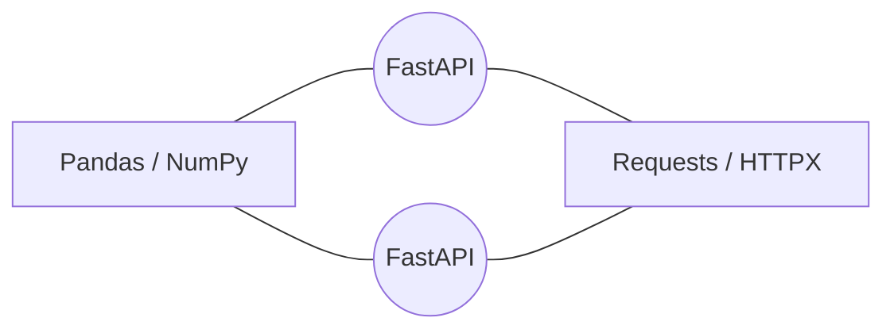

# Documento: 4.1_PYTHON_PARA_IA.pdf

## Fuente

Parseado con LlamaCloud y almacenado para recuperación RAG.

## Markdown

# PYTHON PARA IA

## El motor detrás de la revolución de los Agentes

Module: Desarrollo Avanzado de Sistemas Multiagente


Instructor: Rubén Juárez Cádiz

---

# ¿Qué aprenderemos hoy?

1.  ¿Por qué Python domina la IA?

2.  Conceptos clave para desarrolladores de agentes

3.  Entornos virtuales y dependencias

4.  Asincronía: el superpoder de los agentes

5.  Seguridad: manejo de API Keys

6.  Caso práctico: Chatbot con memoria

7.  Entregable y próximos pasos

---

```description
Background featuring stylized Python code snippets on the left and right sides, with a dark blue gradient background.
```

# Python: El lenguaje nativo de la Inteligencia Artificial


Más del 90% de los frameworks de IA modernos están escritos en Python o tienen soporte prioritario.

## ¿Por qué no otros lenguajes?

Python combina legibilidad, velocidad de prototipado y un ecosistema sin rival frente a JS, Java o Go.

## Frameworks principales

*  **LangChain** (Orquestación)

*  **LlamaIndex** (Indexación)

*  **OpenAI SDK** (Acceso a modelos)

*  **AutoGen / CrewAI** (Sistemas multiagente)

---


```python
import Pythons.it
import owb.Python:
import Sitiopa.ooel:.sbdrema
```

# De la idea al prototipo en horas, no en semanas

## Comparativa de velocidad

<table>
  <thead>
    <tr>
        <th>Lenguaje</th>
        <th>Tiempo de desarrollo (Líneas de código)</th>
    </tr>
  </thead>
  <tbody>
    <tr>
        <td>Python</td>
<td>1-2 horas (~25 líneas)</td>
    </tr>
<tr>
        <td>Java</td>
<td>1-2 días (~150 líneas)</td>
    </tr>
<tr>
        <td>C++</td>
<td>1 semana (~300+ líneas)</td>
    </tr>
  </tbody>
</table>

## Principio clave: Sintaxis similar al pseudocódigo

```python
def agente_logica(datos):
    if datos.es_valido():
        resultado = procesar(datos)
        return resultado
    else:
        return None
# Foco en la lógica, no en la sintaxis.
```

## Ecosistema integrado




---

# venv y Conda: El primer paso antes de escribir código


```bash
$ python -m venv .venv

$ source .venv/bin/activate

$ pip install openai python-dotenv

$ pip freeze > requirements.txt
```

**¿Por qué son vitales en IA?:** Las librerías de IA se actualizan constantemente (ej. LangChain v0.1 vs vs 0.2). Sin entornos virtuales, los proyectos se rompen.

**Regla de oro:** Un proyecto = Un entorno virtual. Siempre.

---

# Asincronía con asyncio: El Superpoder de los Agentes

Los agentes esperan. El código asíncrono no desperdicia ese tiempo.


* **Sin asyncio (Secuencial):**
2s + 3s + 2s = 7 segundos

* **Con asyncio (Paralelo):**
max(2s, 3s, 2s) = 3 segundos
(¡57% más rápido!)

```python
import asyncio

async def main():
    # Ejecución paralela
    await asyncio.gather(
        tarea_a(),
        tarea_b(),
        tarea_c()
    )

# Ejecutar
asyncio.run(main())
```

---

# python-dotenv: Protege tus credenciales como un profesional


**❌ El error más común (y peligroso): Hardcodear la API Key en el código.**

```python
import openai

# ❌ INCORRECT: Hardcoded Key
openai.api_key = "sk-proj-..."

response = openai.Completion.create(
    engine="davinci",
    prompt="Translate...",
    max_tokens=60
)
```

<mark>Consecuencia: Una API Key expuesta puede generar facturas de miles de dólares.</mark>

**✅ La forma correcta: Usar python-dotenv y cargar desde un archivo .env.**

```python
from dotenv import load_dotenv
import os
import openai

# ✅ CORRECT: Load from .env
load_dotenv()
openai.api_key = os.getenv("OPENAI_API_KEY")

response = openai.Completion.create(
    engine="davinci",
    prompt="Translate...",
    max_tokens=60
)
```

<mark>Las credenciales se mantienen seguras fuera del código fuente.</mark>

### .env (NUNCA subir a Git)

```text
OPENAI_API_KEY=sk-proj-...
```

### .gitignore (siempre incluir)

```text
.env
.venv/
__pycache__/
```

---

# Arquitectura del Caso Práctico

Chatbot con Memoria: Entendiendo la arquitectura antes de codificar

## ¿Qué es la "memoria" en un LLM?

Los LLMs son stateless (sin estado).
La "memoria" se implementa enviando el historial completo de mensajes en cada llamada a la API.

### messages[]


```mermaid
graph TD
    A[Usuario escribe] --> B[Se añade a lista messages[]]
    B --> C[Se envía TODA la lista a OpenAI API]
    C --> D[OpenAI responde con contexto completo]
    D --> E[Respuesta se añade a messages[] y se muestra]
    E --> A
    
    subgraph Contexto_de_Mensajes [ ]
        direction TB
        S[System: "Eres un asistente sarcástico"]
        U[User: "Hola, ¿cómo estás?"]
        AS[Assistant: "Sobreviviendo..."]
    end
    
    Contexto_de_Mensajes -.-> C
```

Bucle: volver al inicio

---

# Mi primer Script Conversacional con Memoria

## Menos de 30 líneas de código

* Importaciones y configuración (.env)

* Inicialización de memoria (messages = [{"role": "system", ...}])

* Bucle principal (while True)

* Captura de input y actualización de memoria

* Llamada a la API (client.chat.completions.create)


```python
import os
from dotenv import load_dotenv
from openai import OpenAI

load_dotenv()
client = OpenAI(api_key=os.getenv("OPENAI_API_KEY"))

# Inicialización de memoria
messages = [{"role": "system", "content": "Eres un asistente útil y amigable."}]

print("¡Hola! Soy tu asistente. Escribe 'salir' para terminar.")

while True:
    user_input = input("Tú: ")
    if user_input.lower() == 'salir':
        break

    # Actualización de memoria
    messages.append({"role": "user", "content": user_input})

    # Llamada a la API
    response = client.chat.completions.create(
        model="gpt-4o",
        messages=messages,
        max_tokens=150
    )

    assistant_response = response.choices[0].message.content
    print(f"Asistente: {assistant_response}")
    messages.append({"role": "assistant", "content": assistant_response})
```

**Instructor**: Rubén Juárez Cádiz


---


# Desglose del Código: Línea por Línea

Entendiendo cada componente del chatbot


<table>
  <thead>
    <tr>
        <th>Componente</th>
        <th>Línea(s)</th>
        <th>Descripción</th>
    </tr>
  </thead>
  <tbody>
    <tr>
        <td>Importaciones</td>
<td>1-6</td>
<td>Carga librerías y credenciales desde .env</td>
    </tr>
<tr>
        <td>Memoria</td>
<td>8-13</td>
<td>Define la personalidad con "system"</td>
    </tr>
<tr>
        <td>Bucle principal</td>
<td>17-35</td>
<td>Mantiene la conversación activa</td>
    </tr>
<tr>
        <td>Input</td>
<td>18</td>
<td>input() bloquea hasta que el usuario escribe</td>
    </tr>
<tr>
        <td>Gestión de memoria</td>
<td>22, 31</td>
<td>messages.append() acumula historial</td>
    </tr>
<tr>
        <td>Llamada API</td>
<td>24-28</td>
<td>Envía TODO el historial</td>
    </tr>
<tr>
        <td>Respuesta</td>
<td>30</td>
<td>Extrae el mensaje de OpenAI</td>
    </tr>
  </tbody>
</table>

### Puntos de extensión

* Cambiar personalidad

* Límite de tokens

* Guardar historial en .json


---


# Entregable y Criterios

## **Tu misión:** Un asistente funcional en menos de **30 líneas**

## Criterios de Evaluación

**Funcionalidad (40%)** 40%
El chatbot inicia, responde y mantiene contexto

**Seguridad (20%)** 20%
API Key cargada desde .env, no hardcodeada

**Entorno virtual (20%)** 20%
Proyecto con venv y requirements.txt

**Personalización (20%)** 20%
Personalidad del agente modificada creativamente

## Entregables Requeridos

* [x] 1. Archivo chatbot_memoria.py (máx. 30 líneas)
* [x] 2. Archivo requirements.txt generado con pip freeze
* [x] 3. Archivo .env.example (sin la key real)
* [x] 4. Captura de pantalla de una conversación de prueba

>  **Deadline:** Próxima sesión del módulo

---

# Próximos Pasos y Recursos

### Python es la base. Los agentes son el destino.


**LangChain**
Encadenar LLMs, herramientas y memoria

**LlamaIndex**
RAG para agentes con conocimiento propio


**CrewAI / AutoGen**
Sistemas multiagente colaborativos

## Recursos recomendados

*    **Documentación oficial de OpenAI:** platform.openai.com/docs
*    **Curso gratuito:** "Python for Everybody" — Dr. Chuck
*    **Repositorio del módulo:** Disponible en el aula virtual

> "Un agente de IA es tan bueno como el código Python que lo orquesta. Dominar Python no es es opcional; es el punto de partida."
>
> — Rubén Juárez Cádiz

## Texto Plano

PYTHON PARA IA
    El motor detrás de la revolución de los Agentes

Module: Desarrollo Avanzado de Sistemas Multiagente

    DitO1.Su SnCR
                 ron3
                 priel

    ppotave(IuevcourilI

    Sumulidnan.dipuitt&)


    Instructor: RubénJuárez Cádiz
    Juárez

---

Qué aprenderemos hoy?
 S

1. iPor qué Python domina la IA?     Kad_iostri(kdsefnnost(pl, !leo Dynunl!i
 2. Conceptos clave para desarrolladores de agentes
 3. Entornos virtuales y dependencias
4. Asincronía: el superpoder de los agentes
5. Seguridad: manejo de API Keys
     r1
 6. Caso práctico: Chatbot con memoria
7. Entregable y próximos pasos

---

 alraeFain()                                                                    import RobtoorHomd
 for python.iinta()
                                                                                def GBBCONODtU8:):
                       1818   legetry n3; Python: El lenguaje nativode la       import = eeLamete.python : hedl]
                                                                                 capciltorpuee(leesf=us.dram
                                                                                 eenenaname = @>2
   fie(°ettap. 0.22 0)            Inteligencia Artificial                        if fae.& i2lstreat[]l
                                                                                 judelenellits:spenolll]:
 for footof Bitel, spadBl:                                                       if foropi: optonall,

lass tsoesestaprrepet()           Frameworks
 fer # srm.uteFsnuorepcBe.url;
 return                90%                                    s principales
                                                              LangChain
                                                             (Orquestación)

                   Más del 90% de los frameworks de IA        Llamalndex
                   modernos están escritos en Python 0        (Indexación)
                                  O
                              tienen
                              tienen soporte prioritario.     OpenAI SDK

                   Por qué no otros lenguajes?                (Acceso a modelos)
                   Python combina legibilidad, velocidad     AutoGen / CrewAl
                   de prototipado y un ecosistema sin rival
                   frente a JS, Java o Go.                    (Sistemas multiagente)

---

                                                                                      import Pythons.it
                                                                                      import owb.Piythoon:
                                                                                      import   Sitiopa.ooel:.sbdrema
De la idea al prototipo en horas, no en semanas
                                                                                      def agente(datos):
                                                                                         if datos.es_valido():
                                                                                               resultado = procesar(d
                                                                                         resultado= procesar[i]
                                                                                         return resultado
Comparativa de velocidad                                                                       resultado
             Principio clave: Sintaxis similar al pseudocódigo

             def agente_logica(datos):
                                                          if datos.es_valido():
         1-2 horas (~25 líneas)                            resultado = procesar(datos)
                                                           return resultado                        t(O
Python   1-2 horas (~25 líneas)                           else:                                    [derecng
             # Foco                                        return None
                                                          en la lógica, no enla sintaxis.

             1-2 días (~150 líneas)  Ecosistema integrado

 Java    1-2 días (~150 líneas)                                                          agented_tm.adda():

                                                          1:       FastAPI
 C++     1 semana (~300 líneas)    1 semana (~300+ líneas)
             Pandas / NumPy                                            Requests / HTTPX

                                                                   FastAPI

---

venv y Conda: El primer paso antes de escribir código

      PROJECT A

       50
  PROJECT B
  (Al Model)   0 PROJECT C
      (Web App)                                                                        om.thei
                                                          python -m                     Iment)
                                                      $python -m venv .venv

  No connectio   django <17                               nt)
   isolaución        Djngo                            $                                at.iasb
                                                      S    source .venv/bin/activate    Lark|0

                                                     $ pip install openai python-dotenv
                                                      $                                xt = ou
 iPor qué son vitales en IA?: Las librerías de IA                                       (7$101
 se actualizan constantemente (ej. LangChain v0.1    $ pip freeze > requirements.txt
vs vs 0.2). Sin entornos virtuales, los proyectos     $        >
 se rompen.                                           >

 Regla de oro: Un proyecto = Un entorno virtual.
 Siempre.

---

Asincronía con asyncio: El Superpoder de los Agentes
Los agentes esperan. El código asíncrono no desperdicia ese tiempo.

                                                                   Sin asyncio (Secuencial):
Sin asyncio (Secuencial)                                           Sin
                                                                    2s + 3s + 2s = 7 segundos
                                                                     +

Tarea A: 2s  Tarea B: 3s    Tarea C: 2s Total: 7 segundos          Con asyncio (Paralelo):
                                                                    max(2s, 3s, 2s) = 3 segundos
                                                                    (i57% más rápido!)
Con asyncio (Paralelo)                                               import asyncio

Tarea A: 2s                                                         async def
                            Total: max(2s, 3s, 2s) = 3 segundos        main():
                                                                      # Ejecución paralela
Tarea B: 3s                                                           await asyncio.gather(
                                                                       tarea_a()
                                                                       tarea_b(),
    Tarea C: 2s             Total: max(2s, 3s, 2s) = 3 segundos        tarea_c()
                            i57% más rápido!                         # Ejecutar
                                                                     asyncio.run(main())

---

python-dotenv: Protege tus credenciales como un profesional


  El error máscomun (y peligroso):
       (y                                         La forma correcta:
  Hardcodear laAPI Key en                              correcta: Usar python-dotenv y
       el código.                                 cargar desde
                                                   cargar     un archivo .env.

 import openai                                  fromdotenv import load_dotenv
                                                importoS
 # X INCORRECT:Hardcoded Key                    importopenai
 openai.api_key=    "sk-proj-                   #  CORRECT:Load from .env
 response= openai.Completion.create(            load__dotenv()
   engine="davinci"                             openai.api_key= os.getenv("OPENAI_API_KEY"
   prompt="Translate.                           response = openai.Completion.create(
   max_tokens=60                                   engine="davinci"
                                                   prompt="Translate..
                                                   max_tokens=60

Consecuencia: Una APl Key expuesta puede generar
facturas de miles de dólares.                      Las credenciales se mantienen seguras fuera del código
       fuente.

   .env (NUNCA subir a Git)                                     .gitignore (siempre incluir)

 OPENAI_API_KEY=sk-proj-                         .env
                                                 .venv/
                                                  pycache

---

                           Senver2RO0IOrenAI:
     Arquitectura del Caso
                           Caso Práctico
                                             Memoria:                                                            counteou
                                            Chatbot con Memoria: Entendiendo la arquitectura antes de codificar  return
                                                                                         _cdaiene(liart.aogatI
                                                                                         zatcentconteoteepll:
iQué                   la        LLM?                    Flujodel Chatbot
 Qué es la "memoria" en un
                                             estado).
 Los LLMs son stateless (sin estado).
                       seimplem
                           menta                                    Usuario          Se añade a lista
 La "memoria" se implementa enviando el historial
 completo de mensajes en cada llamada a la API.                     escribe             messages[]

                                    messages[]       System: "Eres un asistente sarcástico"    Se envía TODA la
                                                                                             lista a OpenAl API
                       System: 'Eres unasistente sarcástico    User: "Hola, icómo estás?"
                                                          Assistant: "Sobreviviendo..'
                          User:"Hola ;cómoestás?"              Respuesta se añade    OpenAl responde
                                                                 a messages[] y        con contexto
                                                                   se muestra            completo
                       Assistant: Sobreviviendo..

uuLEdak.9nopers())                                   Bucle: volver al inicio
1omm.mtLBs = soevBorans

---

Mi primer Script
 t Conversacional con Memoria
 Menos de 30 lineas de código


 Importaciones y                      cocil.py ×
                                      import os
 configuración (.env)             2   from dotenv import load_dotenv
                                      from openai import OpenAI
                                      load_dotenv()
 Inicialización de memoria        8   client = OpenAI(api_key=os.getenv("OPENAI_API_KEY"))
 (messages = [["role":                # Inicialización de memoria
                                 10   messages =[{"role": "system" "content": "Eres un asistente útil y amigable."}]
 "system", ..}))                 11   print(";Hola! Soy tu asistente. Escribe 'salir' para terminar.")
                                 12
                                 13   while True:
                                 14    user_input = input("Tú: ")
 Bucle principal (while True)    15     if user input.lower() == 'salir':
                                 16     break
                                 17
                                 18     # Actualización de memoria
                                 19    messages.append({"role": "user" "content": user_input})
 Captura de input y              20
                                 21    # Llamada a la API
 actualización de memoria     2         response = client.chat.completions.create(
                                         model="gpt-40"
                                        messages=messages,
                                         max_tokens=150
 Llamada a la API                      assistant_response = response.choices[0].message.content
 (client.chat.completions.create)      print(f"Asistente: {assistant response}")
                                       messages.append({"role": "assistant", "content": assistant_response})

                                            Instructor: Rubén Juárez Cádiz

---

Desglose del Código: Línea por Línea
Entendiendo cada componente del chatbot C


Componente     Línea(s)       Descripción

Importaciones        1-6      Carga librerías y credenciales desde .env          Puntos de extensión

Memoria              8-13     Define la personalidad con "system'
                                                                            10
                                                                            11
Bucle principal      17-35    Mantiene la conversación activa               1     Cambiar personalidad
                                                                                  Límite
Input                18       input() bloquea hasta que el usuario escribe  30    Límite de tokens

Gestión de memoria   22, 31   messages.append()acumula historial            22    Guardar historial en .json
                                                                            24
                                                                            25
                                                                            26
Llamada API          24-28    Envía TODO el historial                       27
                                                                            39
                                                                            30   &tctbatrchoppear = tamesesonslp.
Respuesta            30       Extrae el mensaje de OpenAl                   32   if dtarw.append("fcot
                                                                            34

---

    Entregable y Criterios
Tu misión: Un asistente funcional en menos de 30 líneas

Criterios deEvaluación                            Entregables Requeridos
(40%)                                         40%     1. Archivo chatbot_memoria.py (máx. 30 líneas)
Funcionalidad (40%)
El chatbot inicia, responde y mantiene contexto       2. Archivo requirements.txt generado con pip freeze
Seguridad (20%)                               20%     3. Archivo .env.example (sin la key real)
API Key cargada desde .env, no hardcodeada            4. Captura de pantalla de una conversación de
Entorno virtual (20%)                         20%     prueba
Proyecto con venv y requirements.txt
Personalización (20%)                         20%
Personalidad del agente modificada creativamente                 Deadline: Próxima sesión del módulo

---

Próximos Pasos y Recursos
Python es la base. Los agentes son el destino.
                                     LangChain
                                     Encadenar LLMs,
Python                              herramientas y memoria    CrewAl / AutoGen
                                     Llamalndex        Lpgt   Sistemas multiagente
                                    RAG para agentes con    →0 colaborativos
                                     conocimiento propio

Recursos recomendados
Documentación oficial de OpenAl:     "Un agente de IA es tan bueno como el código
platform.openai.com/docs     OF       Python que lo orquesta. Dominar Python no
Curso gratuito:                                        el punto de partida."
"Python for Everybody" — Dr. Chuck    es es opcional;es
Repositorio del módulo:                   — Rubén Juárez Cádiz
Disponible en el aula virtual