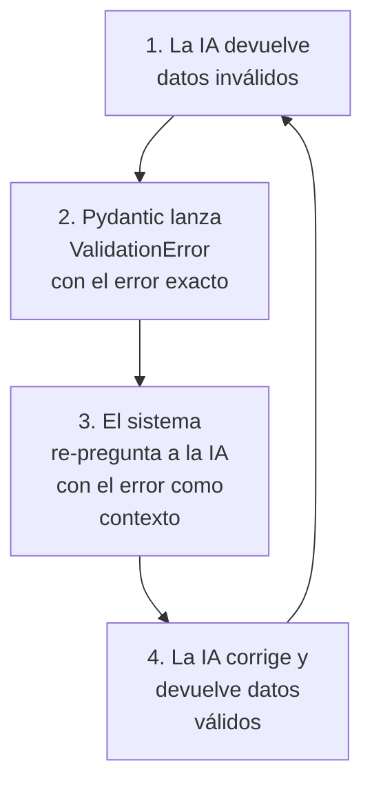

# Documento: 4.2_PYDANTIC.pdf

## Fuente

Parseado con LlamaCloud y almacenado para recuperación RAG.

## Markdown


# PYDANTIC

## Forzando a la <mark>IA</mark> a <mark>hablar</mark> en <mark>estructuras</mark>, no en prosa

Module: Desarrollo Avanzado de Sistemas Multiagente

**Instructor**: Rubén Juárez Cádiz

---

# ¿Qué aprenderemos hoy?


1. El problema del "texto libre" en los LLMs


2. ¿Qué es Pydantic y por qué es esencial?


3. Cómo Pydantic define contratos de datos


4. Integración con OpenAI Structured Outputs


5. Validación y manejo de errores automático


5. Validación y manejo de errores automático


6. Caso práctico: Extractor de entidades de soporte


7. El modelo TicketSoporte en acción


8. Entregable y criterios de evaluación


9. Próximos pasos y recursos

---

# Los LLMs devuelven <mark>prosa</mark>. Los sistemas de producción necesitan <mark>datos</mark>.

## Key Points

* **El problema real:** Un LLM responde en lenguaje natural. Perfecto para chat, desastre para automatización.

* **¿Cómo insertas texto libre** en tu base de datos? No puedes. Rompe con cualquier cambio de formato.

* Las tres preguntas sin respuesta:

1. ¿Qué campos exactos va a devolver la IA?

2. ¿Qué tipo de dato tendrá cada campo?

3. ¿Qué pasa si la IA decide omitir un campo?


---

# Pydantic define el contrato de datos que la IA debe cumplir

## Key Points:

### ¿Qué es Pydantic?

Librería de validación de datos más popular de Python (200M+ descargas/mes).

### ¿Cómo funciona?

Defines clases ("Modelos") que especifican campos y tipos.

### La magia:

Legible para humanos, ejecutable por Python, comprensible por LLMs.

```python
class TicketSoporte(BaseModel):
    nombre_cliente: str
    nivel_urgencia: Literal["Baja",
    "Media", "Alta", "Crítica"]
    categoria_problema: str
    requiere_reembolso: bool
```


Texto caótico

Pydantic Model

JSON estructurado perfecto

---

# Pydantic garantiza que cada campo tenga el tipo correcto

<table>
  <tbody>
    <tr>
        <td>str</td>
<td>Nombre del cliente<br/>(Texto de cualquier longitud)</td>
<td>nombre: str = "Ana López" ✅</td>
    </tr>
<tr>
        <td>int / float</td>
<td>Número de ticket, precio<br/>(Solo valores numéricos)</td>
<td>precio: float = 99.99 ✅ ticket_id: int = 12345 ✅</td>
    </tr>
<tr>
        <td>bool</td>
<td>¿Requiere reembolso?<br/>(True/False, no "sí" o "no")</td>
<td>reembolso: bool = True ✅ reembolso = "sí" ❌</td>
    </tr>
<tr>
        <td>list[str]</td>
<td>Lista de productos afectados<br/>(Array de strings)</td>
<td>productos: list[str] = ["item1", "item2"] ✅</td>
    </tr>
<tr>
        <td>Literal[...]</td>
<td>Nivel de urgencia predefinido<br/>(Solo valores permitidos)</td>
<td>nivel: Literal["Baja", "Media"] ✅</td>
    </tr>
<tr>
        <td>Optional[str]</td>
<td>Campo que puede ser nulo<br/>(Permite None)</td>
<td>comentario: Optional[str] = None ✅</td>
    </tr>
  </tbody>
</table>

> ### El poder de Literal
> `nivel_urgencia: Literal["Baja", "Media", "Alta", "Crítica"]`
>
> La IA no puede devolver "urgente" o "5/10". Solo puede devolver exactamente uno de los cuatro valores definidos.

---

# Integración con OpenAI Structured Outputs

OpenAI lee tus modelos Pydantic y obliga al LLM a respetarlos

```python
response = client.beta.chat.completions.parse(
    model="gpt-4o-mini",
    messages=[...],
    response_format=TicketSoporte # ← La magia ocurre aquí
)

ticket = response.choices[0].message.parsed

print(ticket.nombre_cliente)
```


* El parámetro `response_format=TicketSoporte` convierte el modelo Pydantic en un JSON Schema.

* OpenAI usa este esquema para restringir la respuesta del LLM.

---

# Si la IA se equivoca, Pydantic detecta el error y permite corregirlo

Validación Automática y Recuperación de Errores

```python
try:
    ticket = TicketSoporte(~~**datos_incorrectos~~) ❌

except ValidationError as e:
    print(e) ✅ Corrected: nivel_urgencia: 'Alta'
    # → 2 validation errors for TicketSoporte
    # → nivel_urgencia: Input should be 'Baja',
    #   'Media', 'Alta' or 'Crítica'
```



7


---

# Extractor Automático de **Entidades de Soporte**

## Caso Práctico: El Correo Caótico

**El Reto:** Transformar este correo real en datos estructurados para Jira/Zendesk

> [Correo Caótico]
> **De:** pedro.martinez@empresa.com
> **Asunto:** ESTO ES <mark>INACEPTABLE!!!</mark>
>
> Hola, soy Pedro Martínez y llevo 3 días sin poder acceder a mi cuenta. Ya llamé dos veces y nadie me soluciona nada. El sistema me cobra doble en la factura de este mes. Necesito que me devuelvan el dinero <mark>YA</mark>. Esto es <mark>urgente</mark>, tengo una presentación mañana y sin acceso no puedo trabajar. Espero respuesta <mark>INMEDIATA</mark>.
> Pedro


### Lo que necesitamos extraer

<table>
  <tbody>
    <tr>
        <td>- nombre_cliente:</td>
<td>Pedro Martínez</td>
    </tr>
<tr>
        <td>- nivel_urgencia:</td>
<td>Crítica</td>
    </tr>
<tr>
        <td>- categoria_problema:</td>
<td>Acceso a cuenta / Facturación</td>
    </tr>
<tr>
        <td>- requiere_reembolso:</td>
<td>True</td>
    </tr>
  </tbody>
</table>


---

# El script completo: del correo caótico al JSON perfecto

## El Código del Extractor

```python
1.  import os
2.  from dotenv import load_dotenv
3.  from pydantic import BaseModel, Field
4.  import openai
5.  
6.  # Importaciones y configuración (.env)
7.  load_dotenv()
8.  openai.api_key = os.getenv("OPENAI_API_KEY")
9.  
10. # Definición del modelo Pydantic (TicketSoporte)
11. class TicketSoporte(BaseModel):
12.     cliente_id: str = Field(..., description="ID único del cliente")
13.     asunto: str = Field(..., description="Resumen del problema")
14.     prioridad: str = Field(..., description="Nivel de urgencia (Baja, Media, Alta)")
15.     descripcion: str = Field(..., description="Detalle completo del problema")
16. 
17. # Definición del correo de entrada
18. correo_caotico = """
19. De: Juan Pérez <juan.perez@email.com>
20. Asunto: ¡Ayuda! No puedo acceder a mi cuenta
21. Hola soporte,
22. Mi ID de cliente es C12345. Desde ayer no logro iniciar sesión.
23. Es muy urgente, necesito acceder para trabajar.
24. Gracias, Juan.
25. """
26. 
27. # Llamada a la API con response_format=TicketSoporte
28. response = openai.chat.completions.create(
29.     model="gpt-4-turbo",
30.     messages=[{"role": "user", "content": f"Extrae la información del
31.     siguiente correo:\n{correo_caotico}"}],
32.     response_format={"type": "json_object", "schema": TicketSoporte.model_json_schema()}
33. )
34. 
35. # Impresión del resultado en formato JSON
36. print(response.choices[0].message.content)
```

```json
{
  "cliente_id": "C12345",
  "asunto": "No puedo acceder a mi cuenta",
  "prioridad": "Alta",
  "descripcion": "Desde ayer no logro iniciar sesión. Es muy urgente, necesito acceder para trabajar."
}
```

---

# El Resultado: JSON Perfecto para Cualquier API

De texto caótico a datos listos para producción en segundos

```json
{
  "nombre_cliente": "Pedro Martínez",
  "nivel_urgencia": "Crítica",
  "categoria_problema": "Acceso a cuenta y facturación duplicada",
  "requiere_reembolso": true
}
```

<table>
  <thead>
    <tr>
        <th colspan="2">Destinations</th>
    </tr>
  </thead>
  <tbody>
    <tr>
        <td>Jira</td>
<td>Crear issue con prioridad "Critical"</td>
    </tr>
<tr>
        <td>Zendesk</td>
<td>Abrir ticket con urgencia y categoría</td>
    </tr>
<tr>
        <td>Base de datos</td>
<td>INSERT directo sin parseo manual</td>
    </tr>
<tr>
        <td>Slack</td>
<td>Alerta al equipo de soporte</td>
    </tr>
<tr>
        <td>CRM</td>
<td>Actualizar ficha del cliente</td>
    </tr>
  </tbody>
</table>

Un proceso que antes requería un agente humano leyendo correos ahora se ejecuta en milisegundos, con datos perfectamente estructurados y sin errores.

---

# Entregable y Criterios

Tu misión: Un extractor de entidades funcional con Pydantic

## Criterios de Evaluación

**Modelo Pydantic (30%)** 30%

Definición correcta con tipos y Literal

**Integración OpenAI (30%)** 30%

Uso de **response_format** con el modelo

**Validación (20%)** 20%

Manejo de **ValidationError** con **try/except**

**Personalización (20%)** 20%

Modelo extendido con al menos 2 campos extra

## Entregables Requeridos

*   [x] 1. Archivo **extractor_soporte.py**
*   [x] 2. Al menos 3 correos de prueba distintos (incluir uno en inglés)
*   [x] 3. Salida JSON documentada para cada correo
*   [x] 4. Archivo requirements.txt y .env.example

### Extensión sugerida

Añadir campos como **idioma_correo**, **productos_afectados**: list[str], o **numero_contacto**: Optional[str].

---

# Próximos Pasos y Recursos

Pydantic es el puente. Los agentes estructurados son el destino.


*   **LangChain + Pydantic**
    Output Parsers para cadenas complejas

*   **LlamaIndex**
    Extracción estructurada de documentos

*   **FastAPI + Pydantic**
    Desplegar extractores como microservicios REST

> Un agente que **no puede estructurar su salida no puede integrarse con el mundo real.** **Pydantic es el lenguaje común entre la IA y los sistemas de producción.**
>
> > — Rubén Juárez Cádiz

## Recursos recomendados

*    Documentación oficial de Pydantic v2: docs.pydantic.dev

*    OpenAI Structured Outputs: platform.openai.com/docs/guides/structured-outputs

*    Repositorio del módulo: Disponible en el aula virtual


## Texto Plano

asrardt1maaceAccess(O.h'){     var databataJmb = dagria
                     data:ac.getstand();            dato hsb = 0;
                                                     stireet -> rose() {
                                        PYDANTIC il
                                                     sHEeatema.hello ==
                                                     "a.tsb.dapsulli

Forzando a la
a la IA a hablar
en estructuras,no en prosa                      LTJ

Module: Desarrollo Avanzado de
Sistemas Multiagente ter_surtileType(){              rense_runti lcot

Instructor: Rubén Juárez Cádiz                       if (cenlsad functior
                                                     anstapement.main

---

      Qué aprenderemos hoy?                                  return sal
                                                    var databatajmb = digris
                                                    data hsb = 0;
                                                    atireer -> rese() {
                                                     aBCentama.hello ==
 1. El problema del "texto      5. Validación y manejo de N a.teb.depaulit
                                5.                      N pynentis
      libre'
      libre" en los LLMs        errores automático

2. iQué es Pydantic y por      6. Caso práctico: Extractor de
          ll                   6.
      qué es esencial?          entidades de soporte
      qué
3. Cómo Pydantic define       7. El modelo TicketSoporte     o
      contratos de datos      en acción

4. Integración con OpenAl
 4                            8. Entregable y criterios de
      Structured Outputs      evaluación

5. Validación y manejo de     9. Próximos pasos y recursos
errores automático

---

Los LLMs devuelven prosa. Los sistemas de             return sela
producción necesitan datos.                    var databataJmb = digria
                                               daia nsb
                                               daia nsb = θ;
                                               ahreer -> rose() {
                                               SDEentema.hello ==
                                                             sull
Key Points
   Points
   El problema real: Un LLM responde en
   lenguaje natural. Perfecto para chat,       DATABASE
   desastre para automatización.
   iCómo insertas texto libre en tu base de    CRM
   datos? No puedes. Rompe con cualquier
   cambio de formato.                            CRM
  Las tres preguntas sin respuesta:        ERROR DE INTEGRACIÓN:
       FORMATO NO VÁLIDO
  iQué campos exactos va a devolver la IA?
   1.
 2. iQué tipo de dato tendrá cada campo?
  2.        con ID 12345,                      1
 3. iQué pasa si la lA decide omitir un campo?
  3.        CRM     JIRA / ZENDESK

---

     Pydantic define el contrato de JSON

Key Points:     datosque la IA debe cumplir                         {}
 Points:
Qué es Pydantic?
Librería de validación de datos más popular de Python           TicketSoporte(BaseModel):
 (200M+ descargas/mes).        class TicketSoporte
 Cómo funciona?                                                 nombre cliente: str
 Defines clases ("Modelos") que especifican campos y tipos.     nivel urgencia  Literal[ Baja"
La magia:        'Media                                         II Alta     'Crítica 1
 Legible para humanos, ejecutable por Python, comprensible          Lema : str
por LLMs.                                                       categoria_ probl
                                                                requiere_reembolso bool

     "nombre_cliente": "..."
       38COig. 13                   "nivel_urgencia":"..."
 pontion coinu ut

        Texto caótico
              caótico  Pydantic Model JSON estructurado
                                           perfecto

---

Pydantic garantiza que cada campo
tenga el tipo correcto

     str        Nombre del cliente             nombre: str =
                (Texto de cualquier longitud)   nombre:     "AnaLópez"
int float       Número de ticket, precio        precio:     =99.99      ticket_id: int 12345
                (Solo valores numéricos)       precio: float
bool            Requiere reembolso?
                (True/False, no "si" o "no")    reembolso:bool = True       reembolso  si
list[str]       Lista de productos afectados   productos:
                (Array de strings)                  list[str]           ["item1' "item2"]
 Literal[ ..]   Nivel de urgencia predefinido
                (Solo valores permitidos)       nivel: Literal["Baja'   "Media"]
Optional[str]   Campo que puede ser nulo
                (Permite None)                  comentario: Optional[str] = None

                    El poder de Literal
                nivel_urgencia: Literal["Baja", "Media'  "Alta" 'Crítica'"]
                La IA no puede devolver "urgente" o "5/10". Solo puede devolver
                exactamente uno de los cuatro valores definidos

---

           Integración conOpenAl Structured Outputs
        databatain
    OpenAl
OpenAl lee tus modelos Pydantic y obliga al LLM a respetarlos
        yobliga


                                                          Pydantic Model        Parsed Object
    response = client.beta.chat.completions.parse(    (e.g., TicketSoporte)     (Python Object)
    model=" -40-miniᴵᴵ
    'gpt-
    messages=[...],        OpenAl Structured Outputs
        _format=TicketSoporte# ← La magia ocurre aqui
    response_        & JSON Schema Conversion


    ticket =response.choices[0].message.parsed     El parámetro
                                                    response_format=TicketSoporte
    print(ticket.nombre_cliente)                   convierte el modelo Pydantic en un
                                                    JSON Schema.    if (canlandfunctio
                                                                      anstapement.main
         OpenAl usa este esquema para
                                                   restringir la respuesta del LLM.

---

Si la IA
Si la   se equivoca, Pydantic detecta el
error y permite corregirlo
    Recuperación
Validación Automática y Recuperación de Errores


try:                              1. La IA devuelve             2. Pydantic lanza
                                                                 ValidationError
 ticket = TicketSoporte(**datos_incorrectos)  datos inválidos  con el error exacto

except ValidationError as e:
 print(e) Corrected    nivel urgencia: Alta
 # → 2 validation errors for TicketSoporte
 # → nivel urgencia Input should be Baja'        3. El sistema
 #     'Media Alta  or Crítica    4. La IA corrige y
                                    devuelve datos      re-pregunta a la IA
                                       válidos                  con el error como
                                                                     contexto

---

Extractor Automático de Entidades de Soporte
Caso Práctico: El CorreoCaótico     A5.getStand();              var databatajmb = digris
                                                                data nsb = 0;
                                                                 sureer -> rese()
                                                                 sPEentema.hello a=
                                                                     " a.tab.depeulit
El Reto: Transformar este correo real en              Lo que         pynentis
datos estructurados para Jira/Zendesk                 Lo que necesitamos extraer


[Correo Caótico]
De: pedro.martinez@empresa.com
ASUntO: ESTO ES INACEPTABLE!!!              nombre_cliente:     "Pedro Martínez

Hola, soy Pedro Martínez y llevo 3 días     nivel_urgencia:     "Crítica"
sin poder acceder a mi cuenta. Ya llamé
dos veces y nadie me soluciona nada. El
sistema me cobra doble en la factura de     categoria_problema: Acceso a cuenta
este mes. Necesito que me devuelvan el                          Facturación"
dinero YA. Esto es urgente, tengo una
presentación mañana y sin acceso no         requiere_reembolso: True
puedo trabajar. Espero respuesta                                         nction
INMEDIATA.                                                                 main
Pedro

---

  El script completo: del correo caótico al jsoN perfecto
                                                     El Código del Extractor                                                                                 var databatajnb = dagris
                                                                                                                                                             data nsb = 0;
  2    import os                                                                         17.   # Definición del correo de entrada                                         pse(){
                                                                                                                                                                          ello ==
       from dotenv import load_dotenv                                                    18.   correo_caotico= IIIl                                                       dopeulti
       from pydantic import BaseModel, Field                                             19.   De: Juan Pérez <juan.perez@email.com>
       import openai                                                                     20.   Asunto: jAyuda! No puedo acceder a mi cuenta
       # Importaciones y configuración (.env)                                            21.   Hola soporte,
       load_dotenv()                                                                     22.   Mi ID de cliente es C12345. Desde ayer no logro iniciar sesión
       openai.api_key = os.getenv("OPENAI_API_KEY")                                      23.   Es muy urgente, necesito acceder para trabajar.
                                                                                         24.   Gracias, Juan.
                                                                                               III
 10    # Definición del modelo Pydantic (TicketSoporte)
 11    class TicketSoporte(BaseModel):                                                         # Llamada a la API con response_format=TicketSoporte
 12     cliente_id: str = Field(.., description="ID único del cliente")                        response = openai.chat.completions.create(
 H      asunto: str = Field(..., description="Resumen del problema")                              model="gpt-4-turbo",
        prioridad: str = Field(.., description="Nivel de urgencia (Baja, Media, Alta'             messages=["role": "user", "content": f"Extrae la información del
        descripcion: str = Field(.., description="Detalle completo del problema          31.      siguiente correo:\n{correo_caotico}"}],

 18    # Definición del correo de entrada                                                3.       response_format={"type": "json_object", "schema": TicketSoporte.mode
29.    correo_caotico =ᴵᴵᴵ
       De: Juan Pérez <juan.perez@email.com>                                             34.   # Impresión del resultado en formato JSON
  21.  Asunto: jAyuda! No puedo acceder a mi cuenta                                      35.   print(response.choices[0].message.content)                                 functior
22.    Mi ID de cliente es C12345. Desde ayer no logro iniciar sesión.                   36.
       Hola soporte.                                                                                                                                                      ent.main

                                                 "cliente_id": "C12345"
                                                 "asunto": "No puedo acceder a mi cuenta"
                                                 prioridad": "Alta"
                                                 descripcion": "Desde ayer no logro iniciar sesión. Es muy urgente, necesito acceder para trabajar."

---

  El Resultado: JSON Perfecto para Cualquier API return sele
                                         De texto caótico a datos listos para producción en segundos  var databatajmb = dsgris
                                                         data nsb = θ;
                                                                            shreer -> rose() {
      lofrops, ashsasons;                                                   SXEentems.hello ==
                                                                                 a.teb.depaull
                                                         Destinations

  nombre clienteᴵᴵ "Pedro Martínez",     Jira            Crear issue con prioridad "Critical"
  'nivel_urgencia  'Critica'             Zendesk         Abrir ticket con urgencia y categoría
  categoria_problema    Acceso a
cuenta y facturación duplicada",         Base de datos   INSERT directo sin parseo manual
  e_reembolso     true                   Slack           Alerta al equipo de soporte
  requiere

      CRM CRM                                            Actualizar ficha del cliente
      tor_surtileType(){
                                                                                                          if (conland functior
                                                                                                              anstapement.main
                                   Un proceso que antes requería un agente humano leyendo correos ahora se
                                ejecuta en milisegundos, con datos perfectamente estructurados y sin errores.

---

     Entregable y Criterios
                                                y
 Tu misión: Un extractor de entidades funcional con Pydantic                        var databatajmb = dagris
                                                                                    data nsb = 0;
                                                                                    stirect -> rose() {
                                                                                     IVEentama.hello ==
                                                                                         a.tsb.dopeulii
CriteriosdeEvaluación                              Entregables Requeridos            pynantis

Modelo Pydantic (30%)                       30%     1. Archivo extractor_soporte.py
                                                    1.
                                                    2.  3
Definición correcta con tipos y Literal             2. Al menos 3 correos de prueba
Integración OpenAl (30%)                    30%     distintos (incluir uno en inglés)
                                                    3. Salida JSON documentada para
                                                    3.
                                                    cada correo
 Uso de response_format con el modelo                   correo
 (20%)                                      20%     .env.example
 Validación (20%)                                   4. Archivo requirements.txt y

Manejo de ValidationError con try/except           Extensión sugerida                (conlsod functior
                                                                                     anstapement.main
Personalización (20%)                       20%    Añadir campos como idioma_correo,
                                                   productos_afectados: list[str], 0
Modelo extendido con al menos 2 campos extra       numero_contacto: Optional[str].

---

Próximos Pasos y Recursos
                              ess(0,h')                                                                   digris
Pydantic es el puente. Los agentes estructurados son el destino.
                                                                                                          O
                                                                                 agente   eno
                                                                                           no      naulit
                          LangChain + Pydantic                                  Un agente que
                          Output Parsers para                                    puede estructurar
                          cadenas complejas                                       su salidanopuede
                          Llamalndex                                             integrarse con el
                          Extracción estructurada de                             mundo real.
                          documentos                                             mundo
                                                                                     cesel
Pydantic                  FastAPI + Pydantic                                    Pydantices
                          Desplegar extractores                                 lenguaje común entre
                          como microservicios REST                              laIAy los
Recursos recomendados                                                            y     sistemas de
Documentación oficial de Pydantic v2: docs.pydantic.dev surtileType()               producción.     unctior
                                                                                   — Rubén Juárez Cádiz   .main(
OpenAl Structured Outputs:
                              atertan()
platform.openai.com/docs/guides/structured-outputs sllertevitn(da account{);         JJ
Repositorio del módulo: Disponible en el aula virtual