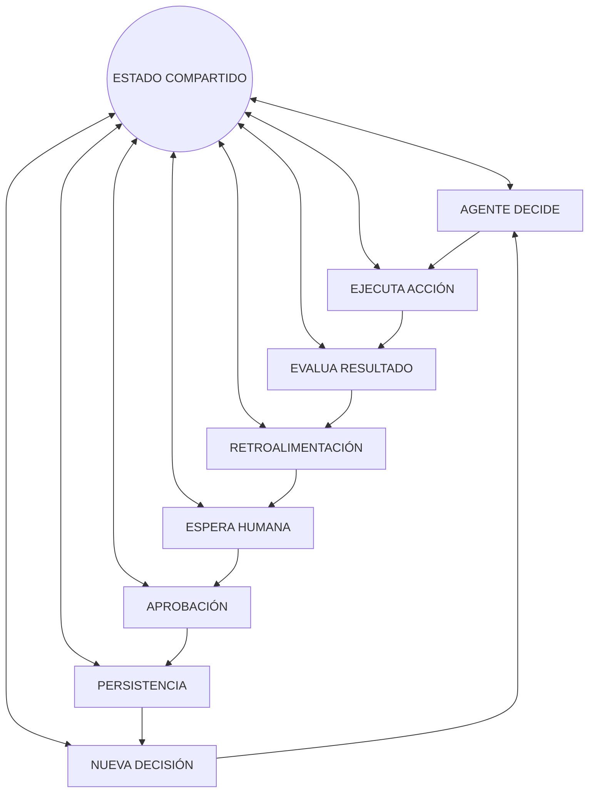
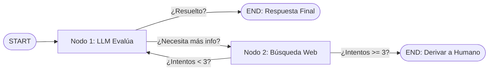
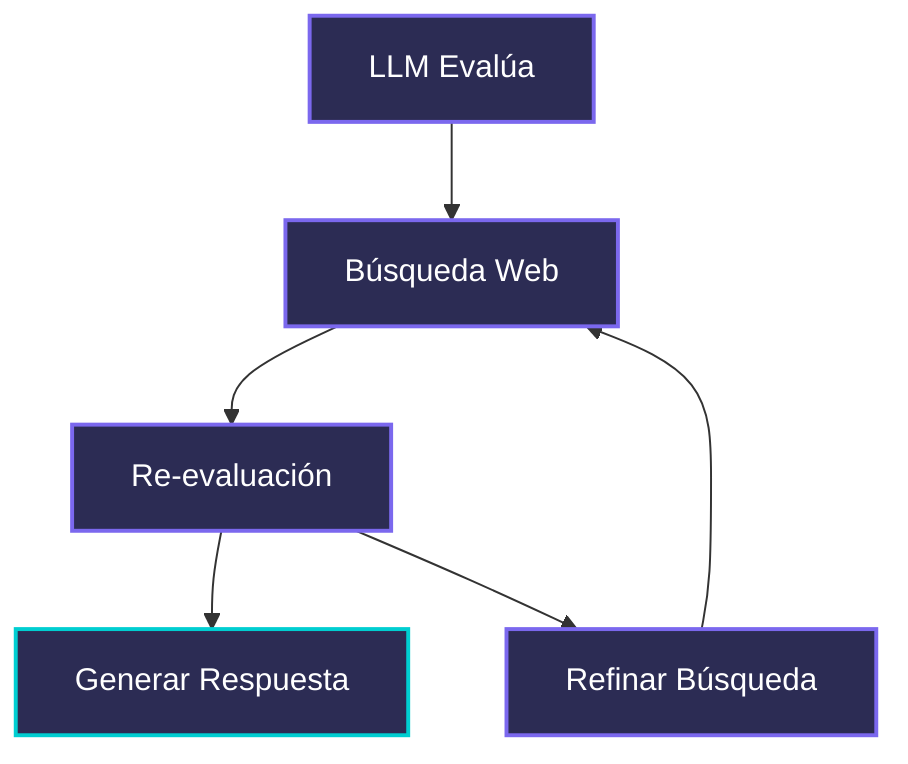
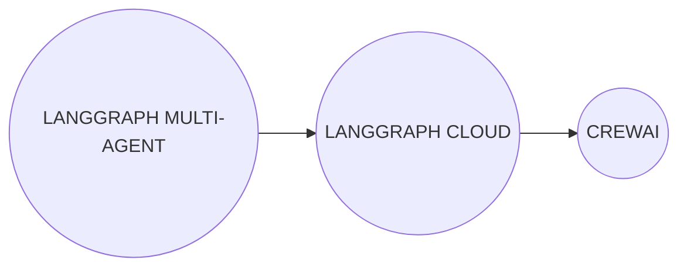

# Documento: 4.3_LANGGRAPH.pdf

## Fuente

Parseado con LlamaCloud y almacenado para recuperación RAG.

## Markdown

# LANGGRAPH

## De cadenas lineales a arquitecturas cognitivas cíclicas


**Module**: Desarrollo Avanzado de Sistemas Multiagente

**Instructor**: Rubén Juárez Cádiz

---

# ¿Qué aprenderemos hoy?

1. La limitación de las cadenas lineales (DAGs)

2. El comportamiento no lineal de los agentes reales

3. LangGraph: flujos cíclicos con estado

4. El Estado (State): el cerebro compartido del grafo

5. Nodos (Nodes): las unidades de trabajo

6. Aristas condicionales (Conditional Edges): el enrutamiento inteligente

7. Caso práctico: El Agente de Triage Recursivo

8. Diseño del grafo y ejecución en consola

9. Entregable y criterios de evaluación

10. Próximos pasos y recursos

---

# Las cadenas lineales son recetas, no razonamiento

## El Problema de las Cadenas

## Arquitectura Cognitiva Humana


* **¿Qué es un DAG?:** Flujo rígido A → B → C. Sin vuelta atrás.

* **El problema:** Errores se propagan, iteración imposible, autonomía nula.


* **Comportamiento humano:** Piensa → actúa → observa → reintenta (bucle).

* **Pregunta clave:** ¿Cómo construimos IA que haga lo mismo?

---

# LANGGRAPH PERMITE QUE LA IA APRENDA DE SUS PROPIOS INTENTOS FALLIDOS

## LangGraph: Flujos Cíclicos con Estado Compartido

**¿Qué es LangGraph?:** Extensión de LangChain para construir flujos como grafos con ciclos (stateful loops).

**¿Por qué es revolucionario?:**

* **Agentic Workflows:** el agente decide su flujo
* **Human-in-the-Loop:** pausar y esperar aprobación
* **Multi-Agent Orchestration:** múltiples agentes
* **Persistencia de estado integrada**

**Casos de uso:**


**Agentes de soporte**


**Pipelines de análisis**


**Revisión de código**



---

# El Estado (State): El Cerebro Compartido del Grafo

La memoria de trabajo que todos los nodos comparten y actualizan


```python
class EstadoAgente(TypedDict):
    messages: Annotated[List, add_messages]
    intentos_busqueda: int
    resuelto: bool
    derivar_a_humano: bool
```

**¿Qué es el State?:** Un diccionario tipado (TypedDict o Pydantic) que actúa como la 'memoria de trabajo'. Cada nodo lo lee, lo modifica y lo pasa al siguiente.

*  Inmutabilidad parcial
*  Acumulación automática (add_messages)
*  Tipado estricto

---


# Los Nodos ejecutan trabajo; las Aristas Condicionales deciden el siguiente paso

## Nodos y Aristas: Las Reglas del Grafo

* **Nodos (Nodes):** Funciones de Python puras que reciben el estado completo y devuelven una actualización parcial del estado.

* **Aristas Condicionales (Conditional Edges):** Reglas de enrutamiento que deciden el siguiente nodo basado en el estado actual.


### [Nodos]

```python
1 def nodo_llm(state: EstadoAgente) -> dict:
2     response = llm.invoke(state["messages"])
3     return {"messages": [response]}
```

### [Aristas Condicionales]

```python
1
2 def enrutador(state: EstadoAgente) -> str:
3     if state["resuelto"]: return "fin"
4     elif state["intentos"] >= 3:
5         return "derivar_humano"
6     else:
7         return "buscar_mas"
```

Module: Desarrollo Avanzado de Sistemas Multiagente
Instructor: Rubén Juárez Cádiz


---

# El Agente de Triage Recursivo: diseñando el grafo antes de codificar
## Arquitectura del Caso Práctico

### El reto:
Un bot que evalúa una consulta. Si no tiene clara la respuesta, busca en la web. Si no resuelve, reintenta o deriva a un humano.

Los tres posibles desenlaces:
* **Resuelto:** Respuesta con confianza suficiente.
* **Bucle de búsqueda:** Itera hasta 3 veces.
* **Escalado humano:** Tras 3 intentos fallidos.



---

# De la arquitectura al código: construyendo el grafo en LangGraph

## Construyendo el Grafo

```python
1   from langgraph.graph import StateGraph, END
2   from my_module import EstadoAgente, nodo_llm, nodo_busqueda_web, enrutador
3
4   # Crear el grafo
5   grafo = StateGraph(EstadoAgente)  # Define the state and graph structure
6
7   # Añadir nodos
8   grafo.add_node("llm_evalua", nodo_llm)
9   grafo.add_node("busqueda_web", nodo_busqueda_web)
10
11  # Punto de entrada
12  grafo.set_entry_point("llm_evalua")
13
14  # Aristas condicionales
15  grafo.add_conditional_edges(
16      "llm_evalua",
17      enrutador,
18      {                               # Define logic for dynamic paths
19          "continuar": "busqueda_web",
20          "fin": END
21      }
22  )
23
24  # El bucle
25  grafo.add_edge("busqueda_web", "llm_evalua")
26
27  # Compilar
28  app = grafo.compile()             # Builds the executable application
```

---

# Ejecución en Consola: <span style="color: #4A90E2">El Bucle en Acción</span>

El agente da vueltas en el bucle hasta estar seguro o escalar

```text
[Intento 1] LLM evalúa: "¿Cuál es la dosis máxima de
ibuprofeno?"
→ Confianza baja. Iniciando búsqueda web...
→ Resultado: Información parcial encontrada.

[Intento 2] LLM re-evalúa con nuevo contexto.
→ Confianza media. Refinando búsqueda...
→ Resultado: Información completa encontrada.

[Intento 3 - NO necesario] LLM re-evalúa.
→ Confianza ALTA. Respuesta generada.
→ Estado: resuelto = True

[FIN] Respuesta: "La dosis máxima de ibuprofeno para
adultos es de 1200mg/día..."
→ Estado: resuelto = True
```



---

# LangGraph no es una mejora incremental, es un cambio de paradigma

## Cadena vs. Grafo en Producción

<table>
  <thead>
    <tr>
        <th>Métrica</th>
        <th>Cadena Lineal</th>
        <th>LangGraph (Cíclico)</th>
    </tr>
  </thead>
  <tbody>
    <tr>
        <td>Tasa de resolución autónoma</td>
<td>45%</td>
<td>78%</td>
    </tr>
<tr>
        <td>Escalados a humano innecesarios</td>
<td>55%</td>
<td>22%</td>
    </tr>
<tr>
        <td>Capacidad de auto-corrección</td>
<td>Ninguna</td>
<td>Hasta N intentos</td>
    </tr>
<tr>
        <td>Adaptación al contexto</td>
<td>Fija</td>
<td>Dinámica</td>
    </tr>
  </tbody>
</table>

## ¿Cuándo usar LangGraph?

*  Decisiones basadas en resultados intermedios
*  Reintentos con nueva información
*  Supervisión humana en puntos críticos
*  Sistemas multiagente con roles

---

# ENTREGABLE Y CRITERIOS

## Tu misión: Un agente cíclico que demuestre autonomía real

## Criterios de Evaluación

<table>
  <tbody>
    <tr>
        <td>Diseño del Estado</td>
<td>20% <br/> **20%:** TypedDict o Pydantic con campos relevantes</td>
    </tr>
<tr>
        <td>Nodos implementados</td>
<td>25% <br/> **25%:** Al menos 2 nodos funcionales (LLM + Tool)</td>
    </tr>
<tr>
        <td>Aristas condicionales</td>
<td>25% <br/> **25%:** Enrutamiento con al menos 3 caminos posibles</td>
    </tr>
<tr>
        <td>Bucle demostrado</td>
<td>20% <br/> **20%:** Ejecución en consola mostrando al menos 2 iteraciones</td>
    </tr>
<tr>
        <td>Diagrama del grafo</td>
<td>10% <br/> **10%:** Generado con draw_mermaid_png()</td>
    </tr>
  </tbody>
</table>

## Entregables Requeridos

* [x] Archivo **agente_triage.py** con el grafo completo
* [x] Captura de consola mostrando el bucle en acción
* [x] Imagen del diagrama del grafo generado
* [x] Archivo **requirements.txt** y **.env.example**

## Extensión Sugerida

* [x] Añadir un nodo de "memoria persistente" con **MemorySaver**.

---

# Próximos Pasos y Recursos

LangGraph es la arquitectura. Los sistemas multiagente son el horizonte.

## Roadmap



*   **LANGGRAPH MULTI-AGENT**: Supervisores que orquestan subagentes especializados

*   **LANGGRAPH CLOUD**: Despliegue de grafos como APIs con persistencia

*   **CREWAI**: Framework de alto nivel para equipos de agentes

> "Una cadena ejecuta instrucciones. Un grafo toma decisiones. La diferencia entre un script automatizado y un agente autónomo real está en los bucles."
>
> — Rubén Juárez Cádiz

## Recursos Recomendados

*    **Documentación oficial de LangGraph**

*    **Tutoriales oficiales: LangGraph Academy**

*    **Repositorio del módulo en el aula virtual**

## Texto Plano

LANGGRAPH

De cadenas lineales a arquitecturas cognitivas cíclicas


    return prowin.netwant()    configuaute = detayeof
                                   astent: "Voliaget"
        tain"ramd2: "Rostrad de asteuta()")


    }L5b messagesptdu(nvessage


    Module: Desarrollo Avanzado de Sistemas Multiagente

    Instructor: Rubén Juárez Cádiz

---

Qué aprenderemos hoy?     ol.Iol

 1. La limitación de las cadenas lineales (DAGs)
 1.
2.
2. El comportamiento no lineal de los agentes reales
 3. LangGraph: flujos cíclicos con estado
4. El Estado (State): el cerebro compartido del grafo
 4.
 5. Nodos (Nodes): las unidades de trabajo
 6. Aristas condicionales (Conditional Edges): el enrutamiento inteligente
 7. Caso práctico: El Agente de Triage Recursivo
8. Diseño del grafo y ejecución en consola
 8.
9. Entregable y criterios de evaluación
 9.
10. Próximos pasos y recursos

---

O

Las cadenas lineales son recetas, no razonamiento

El Problema de las Cadenas    Arquitectura Cognitiva Humana


A     Qué es un DAG?:                          Comportamiento
      Flujo rígido A →       Piensa    humano: Piensa
      B → C.
      B →C. Sin vuelta                         → actúa
      atrás.                                   observa
B     El problema:        Reintenta    Actua   reintenta (bucle).
      Errores se                               Pregunta clave:
      propagan, iteración                      iCómo        O
      imposible,                               construimos IA
      autonomía nula.        Observa           que haga lo
                                               mismo?

---

           PERMITE QUE LA
    LANGGRAPH PERMITE QUE
                    PROPIOS
    IA APRENDA DE SUS
    INTENTOS FALLIDOS        AGENTE DECIDE
    LangGraph:Flujos
           Flujos Cíclicos con Estado Compartido
     Qué es LangGraph?: Extensión de LangChain para        NUEVA         EJECUTA      ©
     construir flujos como grafos con ciclos (stateful    DECISION       ACCION
     loops).                           ESTADO
    O Por qué es revolucionario?:    COMPARTIDO
       Agentic Workflows: el agente decide su flujo      PERSISTENCIA    EVALUA RESULTADO
      Human-in-the-Loop: pausar y esperar aprobación     O
       Multi-Agent Orchestration: múltiples agentes
       Persistencia de estado integrada
     Casos de uso:        APROBACION                                     RETROALIMENTACIÓN


Agentes de Pipelines de Revisión de    ESPERA HUMANA
 soporte análisis          código

---

El Estado (State): El Cerebro Compartido del Grafo
La memoria de trabajo que todos los nodos comparten y actualizan


  P    class EstadoAgente(TypedDict):
  s$
   messages: Annotated[List, add_messages]
   intentos_busqueda: int
   resuelto: bool
   derivar_a_humano: bool


   O                                                        Inmutabilidad parcial

   Qué es el State?: Un diccionario tipado (TypedDict o     Acumulación automática (add_messages)
   Pydantic) que actúa como la 'memoria de trabajo'.        Tipado estricto
   Cada nodo lo lee, lo modifica y lo pasa al siguiente.

---

    Los Nodos ejecutan trabajo; I
    n trabajo; lasAristas
    Condicionales deciden el
        siguientepaso
    Nodos y Aristas: Las Reglas del Grafo        [Nodos]

    Nodos (Nodes): Funciones de Python puras que reciben el estado
    completo y devuelven una actualización parcial del estado.          1 def nodo_llm(state: EstadoAgente) -> dict:
                                                                          l'messages"])
    Aristas Condicionales (Conditional Edges): Reglas de enrutamiento   2 response = llm.invoke(state["
    que deciden el siguiente nodo basado en el estado actual.           3 return {"messages' [response]}


                           fin    [Aristas Condicionales]
                          Solved
    Node A
(Input)                                 1
                                        2  def enrutador(state: EstadoAgente)
                                                                          -> str:

                      derivar_humano    3   if state["resuelto"]: return  fin"
            Enrutador  3+ attempts      4   elif state intentos' >= 3:
       (Conditional Router)             5   return derivar humano
 Node B  Decide next step               6   else:
(Input)                                     return "buscar_mas"
                        buscar_mas
        Continue search


    Module: Desarrollo Avanzado de Sistemas Multiagente    Instructor: Rubén Juárez Cádiz

---

EI Agente de Triage Recursivo: disenando
elgrafo antes de codificar
Arquitectura del Caso
     Caso Práctico

El reto:
     evalúa        Si no
Un bot que evalúa una consulta. Si no tiene
clara la respuesta, busca en la web. Si no    [START]  [Nodo 1:   Resuelto?  [END:
resuelve, reintenta o deriva a un humano.
     O     a                                         LLM Evalúa]           Respuesta
                                                                             Final]

Los tres posibles desenlaces:                          iNecesita
                                                       más info?
 Resuelto: Respuesta con confianza
 suficiente.        iIntentos < 3?                                [Nodo 2:
                                                                  Búsqueda Web]
 Bucle de búsqueda: Itera hasta 3 veces.                          iIntentos >= 3?
 Escalado humano: Tras 3 intentos
 fallidos.                                                                   [END:
                                                                           Derivar a
                                                                            Humano]

---

De la arquitectura al código: construyendo el grafo en LangGraph

            Construyendo el Grafo

I from langgraph.graph import StateGraph, END
      frommy_module importEstadoAgente, nodo_llm, nodo_busqueda_web, enrutador
O     # Crear el grafo
      grafo =StateGraph(EstadoAgente)      D  Define the state
      # Añadir nodos                          and graph structure
      grafo.add_node("llm_evalua",nodo_llm)
      grafo.add_node("busqueda_web", nodo_busqueda_web)
      # Punto de entrada
      grafo.set_entry_point("llm_evalua")
      # Aristas condicionales
      grafo.add_conditional_edges(
       "llm_evalua"
       enrutador,
        "continuar": "busqueda_web"     Define logic for dynamic paths
        "fin": END


# El bucle
grafo.add_edge("busqueda_web", "llm_evalua")
Compilar
app = grafo.compile()  Builds the executable application

---

Ejecución en Consola: El Bucle en Acción
      agente        seguroᴼ
  El agente da vueltas en el bucle hasta estar seguro o escalar

[Intento 1] LLM evalúa: "iCuál es la dosis máxima de
      1]        iCuál
ibuprofeno?"
  Confianza baja. Iniciando búsqueda web
  Resultado: Información parcial encontrada.        LLM Evalúa

 [Intento 2] LLM re-evalúa con nuevo contexto.
  Confianza media.Refinando búsqueda.
  Resultado: Información completa encontrada.       Búsqueda    Generar
      Web        Re-evaluación     Respuesta
 [Intento 3 - NO necesario] LLM re-evalúa.
→ Confianza ALTA. Respuesta generada.
  Estado: resuelto = True    Refinar
                             Búsqueda
[FIN] Respuesta: "La dosis máxima de ibuprofeno para
adultos     1200mg/
      /día.. II
adultos es de 1200mg/día...
  Estado: resuelto = True

---

        a incremental
    LangGraph no es una mejora
                                es un cambio deparadigma
                             Cadena vs. Grafo en Producción

        Cuándo usar LangGraph?
    Métrica       Cadena LangGraph     iCuándo
                  Lineal  (Cíclico)           Decisiones basadas en

Tasade resolución  45%    78%                 resultados intermedios
     autónoma

Escaladosa humano 55%     22%                 Reintentos con nueva
   innecesarios                               información

   Capacidadde   Ninguna Hasta N intentos     Supervisión humana en
 auto-corrección                              puntos críticos

  Adaptación al  Fija      Dinámica           Sistemas multiagente con
     contexto                                 roles

---

                                     ENTREGABLE Y CRITERIOS
                    ciclico
                   Tu misión: Un agente cíclico que demuestre autonomía real

Criterios de Evaluación                                                   Entregables Requeridos

                                                                           Archivo agente_triage.py con el grafo completo
Diseño del      20%                                                        Archivo
Estado          20%: TypedDict o Pydantic con campos relevantes

Nodos           25%                                                        Captura de consola mostrando el bucle en acción
implementados   25%: Al menos 2 nodos funcionales (LLM + Tool)             Imagen del diagrama del grafo generado

Aristas         25%
condicionales   25%: Enrutamiento con al menos 3 caminos posibles          Archivo requirements.txt y .env.example

Bucle           20%                                                       Extensión Sugerida
demostrado      20%: Ejecución en consola mostrando al menos 2 iteraciones

Diagrama del    10%                                                        Añadir un nodo de "memoria persistente" con
grafo           10%: Generado con draw_mermaid_png()                       MemorySaver.

---

        Próximos Pasos yRecursos
    LangGraph es la arquitectura. Los sistemas multiagente son el horizonte.
    Roadmap
                                                66
                                                                 Una cadena ejecuta
    LANGGRAPH       LANGGRAPH                 CREWAI        instrucciones. Un grafo
    MULTI-AGENT       CLOUD                                     toma decisiones. La
Supervisores que    Despliegue de      Framework de
   orquestan         grafos como    alto nivel para        diferencia entre un
   subagentes          APIs con             equipos de         scriptautomatizado y
 especializados      persistencia            agentes        y
                                                un agente autónomo
                                                los
    Recursos Recomendados                       real esta en                bucles.
    Documentación   Tutoriales oficiales:   Repositorio del    - Rubén Juárez Cádiz
    oficial de      LangGraph               módulo en el
    LangGraph       Academy                 aula virtual