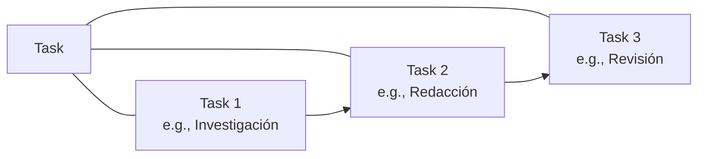

# Documento: 4.4_CREWAI.pdf

## Fuente

Parseado con LlamaCloud y almacenado para recuperación RAG.

## Markdown


# CREWAI

## Orquestación de Sistemas Multiagente — Tus empleados digitales

<!-- layout: page_1_image_1_v2.jpg -->


Module:

### Desarrollo Avanzado de Sistemas Multiagente

**Instructor**: Rubén Juárez Cádiz

---

# ¿Qué aprenderemos hoy?

*    ¿Por qué un solo agente no es suficiente? ¿Por qué un solo agente noy?
*    El principio de especialización en IA El principio de especialización en IA
*    La arquitectura de un Crew: Agents, Tasks La arquitectura de un crew Tasks y Crew
*    4. Agents: los mini-expertos con roles de Agentt: los mini-expertos con roles definidos
*    5. Tasks: las instrucciones de trabajo Tasks: las instrucciones de trabajo detalladas
*    6. Crew: el proceso de orquestación Crew: el proceso de orquestación (secuencial vs. jerárquico)
*    7. Caso práctico: Agencia Automatizada Caso práctico: Agencia de Contenido y SEO
*    8. Los tres agentes en acción
*    9. Ejecución y flujo de trabajo en consola
*    10. Entregable y criterios de evaluación
*    11. Próximos pasos y recursos

---

# Un "Súper Prompt" largo genera resultados mediocres y alucinaciones

## El Problema: Un Solo Agente No Puede con Todo

### El error más común y la analogía


**La analogía:** Contratar a una sola persona para ser CEO, diseñador, programador y contador

### Problemas de un Solo Agente

<table>
  <thead>
    <tr>
        <th>Icon</th>
        <th>Problema</th>
        <th>Descripción</th>
    </tr>
  </thead>
  <tbody>
    <tr>
        <td>[icon]</td>
<td>Contexto sobrecargado</td>
<td>Contexto sobrecargado, con responsabilidad sobrecargada</td>
    </tr>
<tr>
        <td>[icon]</td>
<td>Roles en conflicto</td>
<td>Roles en conflicto, roles en personas y programador</td>
    </tr>
<tr>
        <td>[icon]</td>
<td>Falta de especialización</td>
<td>Falta de especialización, en preferencias a profesores</td>
    </tr>
<tr>
        <td>[icon]</td>
<td>Alucinaciones</td>
<td>Alucinaciones y alucinando con extrañamientos</td>
    </tr>
  </tbody>
</table>

### La solución: Divide el trabajo entre especialistas


---

# CrewAI crea mini-expertos que trabajan juntos como un equipo humano real

## La Solución: Divide y Vencerás con CrewAI

* **¿Qué es CrewAI?:** Framework para orquestar agentes con roles especializados.

* **Principio de especialización:**

    - Un agente con rol claro produce resultados 3-5x mejores.

    - Reduce alucinaciones al acotar el dominio.

    - Los agentes se pasan el trabajo como en una cadena de montaje.

![Diagrama de una oficina virtual mostrando el flujo de trabajo entre agentes: [Investigador] (icono de lupa), [Redactor] (icono de pluma) y [SEO Auditor] (icono de gráfica de barras). En la parte inferior se muestra el comando de instalación: pip install crewai crewai-tools](page_4_image_2_v2.jpg)

---

# **Agents:** Los Mini-Expertos con Identidad Propia

Cada Agent tiene un rol, un objetivo y una historia que define su comportamiento

### Attributes

<table>
    <tr>
        <td></td>
<td>**role:** El título del puesto (ej. "Senior Data Analyst")</td>
    </tr>
<tr>
        <td></td>
<td>**goal:** El objetivo personal del agente</td>
    </tr>
<tr>
        <td></td>
<td>**backstory:** La historia que moldea su comportamiento</td>
    </tr>
</table>

```python
investigador = Agent(
    role="Investigador Senior de Contenido",
    goal="Encontrar las últimas noticias verificadas...",
    backstory="Eres un periodista de investigacion...",
    backstory="Eres un periodista de investigación...",
    tools=[serper_tool],
    llm=ChatOpenAI(model="gpt-4o")
)
```

Cada agente es único y autónomo


---

# Una Task bien definida es la diferencia entre un resultado mediocre y uno excepcional

Tasks: Las Instrucciones de Trabajo Detalladas

## Anatomía de una Task

*    **description**: Qué debe hacer el agente
    $\rightarrow$ Define el alcance

*    **expected_output**: Cómo debe ser el resultado
    $\rightarrow$ Garantiza la calidad

*    **agent**: Quién ejecuta la tarea $\rightarrow$ Asigna responsabilidad

*    **context**: Tasks previas como input $\rightarrow$ Permite encadenamiento

```python
tarea_investigacion = Task(
    description="Investiga las últimas noticias sobre IA en educación...",
    expected_output="Informe estructurado en Markdown...",
    agent=investigador
)
```



> **Regla de oro**: El expected_output debe ser tan específico que no haya ambigüedad sobre qué constituye un resultado exitoso.

---

# El proceso de orquestación define cómo los agentes colaboran y se supervisan
## Crew: Secuencial vs. Jerárquico

![Diagrama del Proceso Secuencial mostrando un flujo lineal: [Investigador] → [Redactor] → [Auditor SEO]](page_7_image_2_v2.jpg)

Los agentes trabajan uno detrás de otro. Simple y predecible.

----

![Diagrama del Proceso Jerárquico mostrando un [Manager AI] supervisando a [Investigador], [Redactor] y [Auditor SEO] con flechas de retroalimentación](page_7_image_1_v2.jpg)

Un 'Manager AI' evalúa el trabajo de cada agente. Más robusto, más costoso.

### Key Points:

* **Proceso Secuencial:** Los agentes trabajan uno detrás de otro. Simple y predecible.
[Investigador] → [Redactor] → [Auditor SEO]

* **Proceso Jerárquico:** Un 'Manager AI' evalúa el trabajo de cada agente. Más robusto, más costoso.
[Manager AI] supervisa a [Investigador, Redactor, Auditor]

```python
crew = Crew(
    agents=[investigador, redactor, auditor_seo],
    tasks=[t1, t2, t3],
    process=Process.sequential, # o Process.hierarchical
    verbose=True
)
```

---

# Tres agentes especializados producen en minutos lo que tomaría horas a un humano

### Caso Práctico: Agencia Automatizada de Contenido y SEO

## El reto

Generar un artículo de blog completo (investigado, redactado y optimizado) con un solo comando.

## 1. Investigador Senior


Usa Serper (Google Search) -> Entrega informe con 5 fuentes.

## 2. Redactor Creativo


Usa solo LLM -> Entrega borrador de 1000 palabras.

## 3. Auditor SEO


Usa solo LLM -> Entrega artículo final optimizado.

## El flujo de trabajo

![Diagrama del flujo de trabajo: [INPUT: "Impacto de IA en educación"] -> [Agente 1: Investiga] -> [Agente 2: Redacta] -> [Agente 3: Optimiza] -> [OUTPUT: blog_post.md]](page_8_image_4_v2.jpg)

---

# La Agencia de Contenido en menos de 60 líneas de código

## El Código Completo de la Agencia

```python
1   from crewai import Agent, Task, Crew, Process                           32  # --- TASKS ---
2   from langchain_openai import ChatOpenAI                                 33  t1 = Task(
3   from langchain.tools import SerperDevTool                               34      description='Investiga las tendencias actuales en IA para empresas.',
4                                                                           35      expected_output='Un informe con 5 puntos clave y fuentes.',
5   # --- IMPORTACIONES Y CONFIGURACIÓN ---                                 36      agent=investigador
6   llm = ChatOpenAI(model="gpt-4-turbo", temperature=0.7)                  37  )
7   serper_tool = SerperDevTool()                                           38
8                                                                           39  t2 = Task(
9   # --- AGENTES ---                                                       40      description='Redacta un artículo de blog basado en la investigación.',
10  investigador = Agent(                                                   41      expected_output='Un artículo de 800 palabras, atractivo y claro.',
11      role='Investigador de Tendencias',                                  42      agent=redactor,
12      goal='Descubrir las últimas tendencias y datos clave.',             43      context=[t1]
13      backstory='Eres un analista experto en encontrar información fresca.', 44  )
14      tools=[serper_tool],                                                45  t3 = Task(
15      llm=llm,                                                            46      description='Revisa el artículo para SEO, coherencia y tono.',
16      verbose=True                                                        47      expected_output='Una versión final y optimizada del artículo.',
17  )                                                                       48      agent=auditor,
18  redactor = Agent(                                                       49      context=[t2]
19      role='Redactor Creativo',                                           50  )
20      goal='Crear contenido atractivo basado en investigación.',          51
21      backstory='Transformas datos en historias cautivadoras.',           52  # --- CREW ---
22      llm=llm,                                                            53  crew = Crew(
23      verbose=True                                                        54      agents=[investigador, redactor, auditor],
24  )                                                                       55      tasks=[t1, t2, t3],
25  auditor = Agent(                                                        56      process=Process.sequential,
26      role='Auditor de Calidad',                                          57      verbose=True
27      goal='Revisar y optimizar el contenido para SEO y claridad.',       58  )
28      backstory='Garantizas que el contenido sea perfecto antes de publicar.', 59
29      llm=llm,                                                            60  # --- EJECUCIÓN ---
30      verbose=True                                                        61  result = crew.kickoff()
31  )                                                                       62  print(result)
```

---

# Ejecución en Consola: Los Agentes Hablando Entre Sí

En la consola se puede ver a los agentes "pensando" y pasándose el trabajo


```description
Una ventana de consola estilizada con un borde azul neón sobre un fondo de circuitos tecnológicos. El texto dentro de la consola detalla la ejecución de una "Agencia de Contenido y SEO".
```

> [2024] Iniciando Crew: Agencia de Contenido y SEO
>
> 🔍 **Agente: Investigador Senior**
> **Tarea:** Investigar impacto de IA en educación
> Pensando... Usando herramienta: `SerperDevTool`
> → Búsqueda: "IA impacto educación 2024"
> [x] **Entregable:** Informe de 5 hallazgos con fuentes
>
> ✍️ **Agente: Redactor Creativo**
> **Tarea:** Redactar artículo de 1000 palabras
> Leyendo investigación del Agente 1...
> [x] **Entregable:** Borrador de 1043 palabras en Markdown
>
> 📊 **Agente: Auditor SEO**
> **Tarea:** Optimizar para SEO
> Analizando borrador del Agente 2...
> [x] **Entregable:** Artículo final optimizado
>
> [x] Crew completado en 47 segundos. Archivo generado: `blog_post.md`

---

# Entregable y Criterios

Tu misión: Una agencia de 3 agentes que produzca un entregable real

## Evaluation Criteria

**Definición de Agents (25%)** 25%
3 agentes con role, goal y backstory únicos

**Definición de Tasks (25%)** 25%
3 tasks con description y expected_output detallados

**Encadenamiento (20%)** 20%
Uso correcto de context=[task_anterior]

**Ejecución funcional (20%)** 20%
El Crew genera un archivo de salida real

**Proceso elegido (10%)** 10%
Justificación de Sequential vs. Hierarchical

## Required Deliverables

1. Archivo **agencia_contenido.py** con el Crew completo
2. Archivo **blog_post.md** generado por el Crew (mínimo 500 palabras)
3. Captura de consola mostrando los 3 agentes en acción
4. Archivo **requirements.txt** y **.env.example**

## Extensión sugerida:

* [ ] Añadir un cuarto agente "Traductor" que traduzca el artículo final al inglés.

CREWAI – Desarrollo Avanzado de Sistemas Multiagente


---

# Próximos Pasos y Recursos

CrewAI es el equipo. La automatización empresarial real es el objetivo.


**CrewAI + LangGraph:** Combinar orquestación con grafos cíclicos

**CrewAI Flows:** Pipelines de eventos para automatización

**LangSmith:** Observabilidad y trazabilidad en producción

> "No construyas un agente que lo haga todo. Construye un equipo donde cada agente sea el mejor en su especialidad. Así es como funciona el talento humano, y así es como debe funcionar la IA." — **Rubén Juárez Cádiz**

## Recursos recomendados:

*  Documentación oficial de CrewAI: <u>docs.crewai.com</u>

*  Repositorio oficial en <u>GitHub</u>

*  Repositorio del módulo en el <u>aula virtual</u>

## Texto Plano

CREWAI
    Orquestación de Sistemas
    s Multiagente
    Tus
    empleados digitales


    Module:
    Desarrollo Avanzado de Sistemas Multiagente

                  JuárezCádiz
Instructor: RubénJuárez Cádiz

---

 Qué aprenderemos hoy?

   iPor qué un solo agente no es suficiente?  Por qué un solo agente noy?
 El principio de especialización en IA        El principio de especialización en IA

0□ La arquitectura de un Crew: Agents, Tasks  La arquitectura de un crew Tasks y Crew
 4. Agents: los mini-expertos con roles de    Agentt: los mini-expertos con roles definidos
 5. Tasks: las instrucciones de trabajo       Tasks: las instrucciones de trabajo detalladas

 o1 6. Crew: el proceso de orquestación       Crew: el proceso de orquestación (secuencial vs. jerárquico)
      7. Caso práctico: Agencia Automatizada  Caso práctico: Agencia de Contenido y SEO

 888 8. Los tres agentes en acción
  9. Ejecución y flujo de trabajo en consola
 10. Entregable y criterios de evaluación
 11. Próximos pasos y recursos

---

                                                          y
                                            Un "Súper Prompt" largo genera resultados mediocres y alucinaciones
    El Problema: Un Solo Agente No Puede con Todo

El error más común y la analogía                        Problemas de un Solo Agente

                                                                                 responsartilidad sobrenagortes
Analista                      Escritor                Contexto sobrecargado      Contexto sobrecargado , on
                                                      Roles en conflicto         Roles en conflicto, irsoles en
                                                                                 pevonas y programador
Escritor     Corrector                                Falta de especialización   Falta de especialización , en
                                                                                 prefecias a professoreot
                                                      Alucinaciones              Alucinaciones y aliorandos
Corrector    Estratega                                                           con extanamentos
                                                             La solución: Divide el trabajo entre especialistas
    CEO     Diseñador
                                                                                   Escritor

Contador     Programador                              M Analista
    Analista
La analogía: Contratar a una sola persona para ser                                 Corrector
CEO, diseñador, programador y contador                  Corrector                Estratega

---

CrewAl crea mini-expertos
que trabajanjuntos como
un equipohumano real

       Divide        virtual office
La Solución: Divide y Vencerás con CrewAl
 iQué CrewAI?:
iQué es CrewAl?: Framework para orquestar
 agentes
 agentes con roles especializados.
 Principio de especialización:        [Investigador] [Redactor] [SEO Auditor]
  Un agente con rol claro produce resultados
   O
    3-5x mejores.
   O Reduce alucinaciones al acotar el dominio.
  Los agentes se pasan el trabajo como en
   O
    una cadena de montaje.                pip install crewai crewai-tools

---

Agents: Los Mini-Expertos con Identidad Propia
Cada Agent tiene un rol, un objetivo y una historia que define su comportamiento
    V

Attributes

    puesto (ej.        investigador = Agent(
role: El título del
"SeniorDataAnalyst")               role 'Investigador Senior de Contenido
                                   goal= 'Encontrar las últimas noticias
                                   verificadas
goal: El objetivo personal del     backstory="
                                       "Eres un periodista de
agente                             investigacion
                                   backstory "Eres un periodista de
backstory: La historia que         investigación II
                                   tools=[serper
moldea su comportamiento               _tool],
                                   11m=ChatOpenAI(model= gpt-4o")

Cada agente es único y autónomo

---

Una Taskbien definida es la diferencia entre un
   resultado mediocre y
       y uno excepcional
       A

                                                Trabajo
       Tasks: Las Instrucciones de Trabajo Detalladas
Anatomía de una Task
   description: Qué debe hacer el agente        tarea investigacion = Task(
              alcance                                description=''Investiga las últimas
    Define el alcance
                                                             ión
   expected_output: Cómo debe ser el resultado      noticias sobre IA en educaci
                                                     nforme estructurado
   → Garantiza la calidad                            expected output= In
O  agent:Quién ejecuta la tarea → Asigna        en  Markdown
  responsabilidad                                    agent=investigador
   context: Tasks previas como input → Permite
   encadenamiento

                     Regla de oro: EI expected_output debe ser tan    Task 1                  Task 2  Task 3
                       específicoque no hayaambigüedad sobre qué (e.g., Investigación)  (e.g., Redacción)  (e.g., Revisión)
   constituye un resultado
       resultado exitoso.

---

El proceso de orquestación define cómo los
agentes colaboran y se supervisan
Crew: Secuencial vs. Jerárquico

     Proceso Secuencial        Key Points:
                                                                 Proceso Secuencial: Los agentes trabajan uno detrás de
 [Investigador]  [Redactor]  [Auditor SEO]                       otro. Simple y predecible.
                                                                 [Investigador] → [Redactor] → [Auditor SEO]
 Los agentes trabajan uno detrás de otro. Simple y predecible.   Proceso Jerárquico: Un 'Manager Al' evalúa el trabajo de
                                                                 cada agente. Más robusto, más costoso.

     Proceso Jerárquico                                          [Manager Al] supervisa a [Investigador, Redactor, Auditor]

     [Manager AI]                                                crew = Crew(
                                                                  agents=[investigador, redactor, auditor_seo],
                                                                  tasks=[t1, t2, t3],
                                                                  process=Process.sequential, # o Process.hierarchical
 [Investigador]  [Redactor]  [Auditor SEO]                        verbose=True
       ↑

 Un 'Manager Al' evalúa el trabajo de cada agente. Más
 robusto, más costoso.

---

                          Tres agentes especializados producen en
    minutos lo que tomaría horas a un humano
                              a
        Caso Práctico: Agencia Automatizada de Contenido y SEO

    El reto        1. Investigador Senior   2. Redactor Creativo      3. Auditor SEO

 Generar un artículo de
    blog completo
    (investigado,
redactado y optimizado)   Usa Serper (Google  Usa solo LLM ->     Usa solo LLM
  con un solo comando.    Search) -> Entrega  Entrega borrador de Entrega artículo final
                   informe con 5 fuentes.      1000 palabras.          optimizado.

                              El flujo de trabajo
[INPUT: "Impacto   [Agente 1:    [Agente 2:           [Agente 3:    [OUTPUT:
    de IA en
  educación"]      Investiga]             Redacta]    Optimiza]  blog_post.md]

---

La Agencia de Contenido en menos de 60 líneas de código
El Código Completo de la Agencia

     from crewai import Agent, Task, Crew, Process                           32  # --- TASKS
     from langchain_openai import ChatOpenAI                                 33  t1 = Task(
     from langchain. tools import SerperDevTool                                   description='Investiga las tendencias actuales en IA para empresas.
    # --- IMPORTACIONES Y CONFIGURACIÓN                                           expected_output='Un informe con 5 puntos clave y fuentes.
     llm = ChatOpenAI(model="gpt-4-turbo", temperature=0.7)                       agent=investigador
     serper_tool = SerperDevTool()                                           39  t2 = Task(

10  # --- AGENTES                                                            40   description='Redacta un artículo de blog basado en la investigación.
     investigador = Agent(                                                   41   expected_output='Un artículo de 800 palabras, atractivo y claro.',
      role='Investigador de Tendencias'                                      42   agent=redactor,
      goal='Descubrir las últimas tendencias y datos clave.',                43   context=[t1]
      backstory='Eres un analista experto en encontrar información fresca.   44
      tools=[serper_tool],        45                                             t3 = Task(
      llm=llm,                                                               46   description='Revisa el artículo para SE0, coherencia y tono.'
      verbose=True                                                           47   expected_output='Una versión final y optimizada del artículo.
     redactor = Agent(                                                       48   agent=auditor,
      role='Redactor Creativo'                                               49   context=[t2]
      goal='Crear contenido atractivo basado en investigación.'              50
      backstory='Transformas datos en historias cautivadoras.'               51
      llm=llm,                                                               52   # --- CREW ---
                                                                                  agents=[investigador, redactor, auditor],
      verbose=True                                                           2 crew = Crew(

    auditor = Agent(                                                              tasks=[t1, t2, t3],
      role='Auditor de Calidad'                                                   process=Process.sequential,
      goal='Revisar y optimizar el contenido para SE0 y claridad.',               verbose=True
      backstory='Garantizas que el contenido sea perfecto antes de publicar.'
      llm=llm,                                                                   # --- EJECUCION₋₋
      verbose=True                                                               result = crew.kickoff()
                                                                                  print(result)

---

           Ejecución en Consola: Los Agentes Hablando Entre Sí
En la consola se puede ver a los agentes "pensando" y pasándose el trabajo


    [2024] Iniciando Crew:
                 Crew: Agencia de Contenido y SEO
                       y

                       Senior
             Investigador Senior
    Agente: Inves
    Tarea: Invest
                  stigar impacto de IA en educación
              Investigar
             Usando        SerperDevTool
     Pensando... Usando herramienta:
                 "IA impacto
      Búsqueda: "IA impacto educación 2024"
      Entregable:  Informe de 5 hallazgos con fuentes
             Redactor Creativo
    Agente: Redactor
     Tarea: Redactar artículo de 1000 palabras
     Leyendo invest:            1000
             investigación del Agente 1
      Entregable: Borrador de 1043 palabras en Markdown

    Agente:  Auditor SEO
     Tarea: Optimizar para SEO
     Analizando borrador del Agente 2.
                   Artículo final optimizado
      Entregable:           Agente 2

    Crew completado en 47 segundos. Archivo generado: blog_post.md

---

    Entregable y Criterios
Tu misión: Una agencia de 3 agentes que produzca un entregable real
    3agentes

                                                                 Deliverables
Evaluation Criteria                                         Required
                                                                 1

Definición de Agents (25%)                           25%     1. Archivo agencia_contenido.py con el
                                                             Crew
3 agentes con role, goal y backstory únicos                   Crew completo
                                                             2.
                                                              2. Archivo blog_post.md generado por el
Definición de Tasks (25%)                            25%      Archivo
                                                              Crew (mínimo 500 palabras)
3 tasks con description y expected_output detallados          3. Captura de consola mostrando los 3
                                                              3.
Encadenamiento (20%)                                 20%      agentes en acción
Uso correcto de context=[task_anterior]                       4. Archivo requirements.txt y .env.example
Ejecución funcional (20%)                            20%
El Crew genera un archivo de salida real                    Extensión sugerida:
Proceso elegido (10%)                                10%      Añadir un cuarto agente "Traductor" que
                                                              traduzca el artículo final al inglés.
Justificación de Sequential vs. Hierarchical

                                                                  CREWAl - Desarrollo Avanzado de Sistemas Multiagente

---

            Próximos Pasos
                                           Pasos yRecursos
         CrewAl es el equipo. La automatización empresarial real es el objetivo.

                          CrewAl
                          CrewAl + LangGraph:
          Q→                          +
          To              Combinar orquestación con
          o >o                             "No
                          grafos cíclicos                            "No construyas un agente
                                                                           todo.Construye
0                                          quelo hagatodo.
P                          C                                                   Construye
                                      eventos para automatización     un        dondecada
CrewAl                     ©          CrewAl Flows: Pipelines de        equipo donde cada
                                                                                mejor en su
                                                                           el
                                                                     agente seael
                                       LangSmith: Observabilidad y   especialidad. mejor
                                                                                      es como
                                       trazabilidad en producción          d. Asíe     como
                                                                         funciona eltalento
                                                                     como f
                                                                      humano, yasíe
Recursos recomendados:                                                         es como
                                                                               "
     Documentación oficial de CrewAl: docs.crewai.com                 debefuncionarla IA.
     Repositorio oficial en GitHub                                          RubénJuárez Cádiz
     Repositorio del módulo en el aula virtual