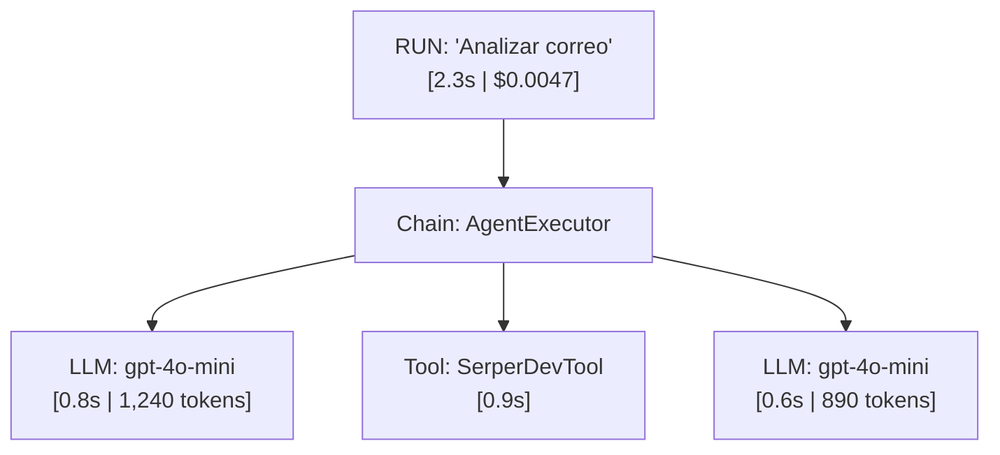
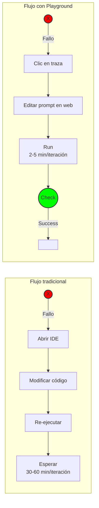

# Documento: 4.5_LANGSMITH.pdf

## Fuente

Parseado con LlamaCloud y almacenado para recuperación RAG.

## Markdown

# LANGSMITH

## Observabilidad: Encendiendo la luz en la caja negra


**Module**: Desarrollo Avanzado de Sistemas Multiagente

**Instructor**: Rubén Juárez Cádiz

---

# ¿Qué aprenderemos hoy?

1.  El terror de la IA en producción: alucinaciones sin explicación
2.  Las preguntas críticas que todo equipo de IA debe poder responder
3.  ¿Qué es LangSmith y por qué es imprescindible?
4.  Tracing: el árbol de ejecución completo
5.  Playground: editar y re-ejecutar fallos en tiempo real
6.  Evaluación: datasets para testear antes de cada deploy
7.  Configuración en 2 líneas de código
8.  Caso práctico: Caza y Captura de una Alucinación
9.  Análisis de métricas en el dashboard en vivo
10.  Entregable y criterios de evaluación
11.  Próximos pasos y recursos

---

# Tu bot funciona perfecto en local. En producción, inventa datos frente a clientes.

## El Terror de la IA en Producción

**El escenario más temido:** Un agente funciona en desarrollo, pero en producción responde algo inapropiado o inventa datos.


### Las cuatro preguntas sin respuesta:

<!-- 1. Semantically a table: Yes, it's a comparison of questions and their current status/answer.
2. Side-by-side check: No.
3. Row sampling: 4 rows.
4. Columns (3 total): Col 1: Icon, Col 2: Question, Col 3: Status.
5. Merge cell detection: None.
6. Header structure: No explicit header row in the visual, but the first row acts as data.
7. Column count verification: 3.
8. Header TSV sanity check: N/A.
9. Verification Critique: The icons are in their own visual column. -->

<table>
  <tbody>
    <tr>
        <td></td>
<td>¿Por qué dijo eso?</td>
<td>Imposible saberlo</td>
    </tr>
<tr>
        <td></td>
<td>¿Qué prompt exacto llegó al modelo?</td>
<td>Oculto bajo capas</td>
    </tr>
<tr>
        <td></td>
<td>¿Cuánto costó esa llamada?</td>
<td>Desconocido</td>
    </tr>
<tr>
        <td></td>
<td>¿Cuánto tardó cada paso?</td>
<td>Sin datos granulares</td>
    </tr>
  </tbody>
</table>

> **El dato:** El <mark>70%</mark> de los fallos ocurren en pasos intermedios invisibles. 

---

# LangSmith convierte la caja negra de la IA en un sistema completamente transparente

## ¿Qué es LangSmith? La Linterna del Desarrollador de IA


**Qué es LangSmith?:** Plataforma de observabilidad, depuración y evaluación de LangChain. Registra automáticamente cada llamada y decisión del agente.

## Los tres pilares de LangSmith


### 1. Tracing

Registra el árbol completo de ejecución
$\rightarrow$ Depurar fallos y alucinaciones


### 2. Playground

Editar y re-ejecutar trazas en la web
$\rightarrow$ Probar correcciones sin código


### 3. Evaluación

Datasets de Q&A para tests automáticos
$\rightarrow$ CI/CD para sistemas de IA

---

# TRACING: EL ÁRBOL COMPLETO DE EJECUCIÓN

Desglosa cada milisegundo de la ejecución de tu agente con precisión quirúrgica

## [Árbol de Ejecución]



## [Lo que ves en el dashboard]

*  Tokens consumidos por cada llamada
*  Coste en dólares de cada paso
*  Latencia de cada nodo
*  Entrada y salida exactas (el prompt real)

**Module:** Desarrollo Avanzado de Sistemas Multiagente
**Instructor:** Rubén Juárez Cádiz

---

# El Playground permite corregir un fallo directamente en el navegador, sin volver al IDE

Playground: Depurar sin Tocar el Código




### ¿Qué puedes hacer en el Playground?

* Editar el prompt directamente desde una traza fallida
* Cambiar el modelo (ej. gpt-4o-mini a gpt-4o)
* Ajustar parámetros (temperatura, max_tokens)
* Guardar la versión corregida en el Hub

---

# Los datasets de evaluación permiten testear el agente antes de cada actualización
## Evaluación: CI/CD para Sistemas de IA

### Key Points:

* **¿Por qué evaluar?:** Sin evaluación, cada actualización es un experimento en producción. Un cambio puede romper otros diez casos.

<table>
    <tr>
        <th>Versión</th>
        <th>Puntuación</th>
    </tr>
<tr>
        <td>Prompt v1</td>
<td>72%</td>
    </tr>
<tr>
        <td>Prompt v2</td>
<td>87%</td>
    </tr>
<tr>
        <td>Prompt v3</td>
<td>91%</td>
    </tr>
</table>

### El flujo de evaluación:


Module: Desarrollo Avanzado de Sistemas Multiagente
Instructor: Rubén Juárez Cádiz


---

# Integrar LangSmith en cualquier proyecto existente toma menos de 2 minutos

## Configuración: 2 Variables de Entorno y Listo

### [Configuración en .env]

```text
LANGCHAIN_TRACING_V2=true
LANGCHAIN_API_KEY=ls__tu_api_key_aqui
LANGCHAIN_PROJECT=mi-agente-produccion
```

### [Obtener la API Key]

1.  Registrarse en smith.langchain.com

2.  Settings → API Keys → Create API Key

3.  Copiar y pegar en .env

### [No se necesita cambiar el código del agente]

```python
from dotenv import load_dotenv
load_dotenv() # LangSmith se activa automáticamente

crew = Crew(...)
crew.kickoff() # Cada llamada queda registrada
```

>  **Nota importante:** ¡No se necesita cambiar el código del agente! LangSmith se integra automáticamente con las variables de entorno.

---

# Provocar un fallo a propósito para aprender a diagnosticarlo con precisión

## Caso Práctico: Caza y Captura de una Alucinación


1. **Configurar LangSmith:** Añadir variables al .env


2. **Provocar el fallo:** Pedir al agente algo imposible ('Dame las ventas exactas de mi empresa del año pasado')


3. **Abrir el dashboard en vivo:** Ver traza en tiempo real


4. **Identificar el nodo del fallo:** ¿En qué LLM call inventó los datos?


5. **Corregir en el Playground:** Editar el system prompt y re-ejecutar

---

# El Dashboard en Vivo: Métricas que Importan

El dashboard de LangSmith revela el coste real y el rendimiento exacto de cada agente

<!-- 1. Semantically a table: Yes.
2. Side-by-side check: No, it's a single table with 3 columns.
3. Row sampling: 6 data rows.
4. Columns (3 total): 1. Key Metrics (with icons), 2. Descripción, 3. Impacto.
5. Merge cell detection: None.
6. Header structure: 1 row.
7. Column count verification: 3.
8. Header TSV sanity check: [thead]Key Metrics	Descripción	Impacto
9. Verification Critique: Icons in the first column are part of the label. -->

<table>
  <thead>
    <tr>
        <th>Key Metrics</th>
        <th>Descripción</th>
        <th>Impacto</th>
    </tr>
  </thead>
  <tbody>
    <tr>
        <td> Tokens de entrada</td>
<td>Tamaño del prompt</td>
<td>Controla el coste</td>
    </tr>
<tr>
        <td> Tokens de salida</td>
<td>Tamaño de la respuesta</td>
<td>Controla la verbosidad</td>
    </tr>
<tr>
        <td> Coste total ($)</td>
<td>Gasto real</td>
<td>Presupuesto del proyecto</td>
    </tr>
<tr>
        <td> Latencia (ms)</td>
<td>Tiempo de respuesta</td>
<td>Experiencia del usuario</td>
    </tr>
<tr>
        <td> Tasa de error</td>
<td>% de fallos</td>
<td>Fiabilidad del sistema</td>
    </tr>
<tr>
        <td> Feedback score</td>
<td>Valoración humana</td>
<td>Calidad percibida</td>
    </tr>
  </tbody>
</table>


---

# Entregable y Criterios

Tu misión: Diagnosticar y corregir una alucinación usando LangSmith

## Criterios de Evaluación

**Integración LangSmith (20%)**: Variables de entorno configuradas correctamente


**Traza capturada (25%)**: Al menos 1 run completo visible en el dashboard


**Fallo identificado (25%)**: Nodo exacto del error localizado y documentado


**Corrección en Playground (20%)**: Prompt editado y re-ejecutado con mejora demostrable


**Análisis de métricas (10%)**: Reporte de tokens, coste y latencia del run


## Entregables Requeridos

1. [x] Captura del dashboard de LangSmith mostrando la traza completa
2. [x] Captura del Playground con el prompt original y el corregido
3. [x] Reporte breve (200 palabras) describiendo el fallo, la causa y la solución
4. [x] Archivo .env.example con las variables de LangSmith

### Extensión sugerida

 Crear un dataset de evaluación con 5 preguntas y sus respuestas ideales.

---

# PRÓXIMOS PASOS Y RECURSOS

LangSmith es el sistema nervioso del agente. Sin él, operas a ciegas en producción.

**Próximas herramientas del módulo:**


> "Un agente que no puedes observar es un agente en el que no puedes confiar. LangSmith no es un lujo para equipos avanzados; es el mínimo indispensable para llevar IA a producción con responsabilidad."
>
> — Rubén Juárez Cádiz

**Recursos recomendados:**

*  Documentación oficial: <u>docs.smith.langchain.com</u>
*  Plataforma web: <u>smith.langchain.com</u>
*  Repositorio del módulo en el aula virtual

## Texto Plano

LANGSMITH
Observabilidad: Encendiendo la luz en la caja negra
rreu seoad        data)
edent.orsetermolait =
(distahore)
Iecal raoontHedxidoena ratd;
return Serame;

stutfnss
(sinEte 1e.Hcmet))(
moy Dateeodting(ca" ssantd otoref
atioweiantentresilidos();

    Module: Desarrollo Avanzado de Sistemas Multiagente

Instructor: Rubén Juárez Cádiz

---

Qué aprenderemos hoy?

 1. El terror de la IA en producción: alucinaciones sin explicación
 1.
2. Las preguntas críticas que todo equipo de IA debe poder responder
2.
3.
3. iQué es LangSmith y por qué es imprescindible?
4. Tracing: el árbol de ejecución completo
 5. Playground: editar y re-ejecutar fallos en tiempo real
 6. Evaluación: datasets para testear antes de cada deploy
7. Configuración en 2 líneas de código
 8. Caso práctico: Caza y Captura de una Alucinación
 8.
 9. Análisis de métricas en el dashboard en vivo
10. Entregable y criterios de evaluación
 11. Próximos pasos y recursos

---

Tu bot funciona perfecto en local.
En producción, inventa datos frente a clientes.
El Terror de la IA en Producción

und  temido:        Las cuatro preguntas sin respuesta:
El escenario más temido: Un agente funciona
en desarrollo, pero en producción responde
algo inapropiado
algo inapropiado o inventa datos.           iPor qué dijo eso?           Imposible saberlo
                                            Qué prompt exacto llegó
                                            al modelo?                   Oculto bajo capas
                                            iCuánto costó esa llamada?   Desconocido

                                            iCuánto tardó cada paso?     Sin datos granulares

                                           El dato: El 70%     s fallos ocurren
                                           El dato:     de los
                                           en pasos intermedios invisibles. -70%

---

LangSmith convierte la caja negra de la IA en
sistema
un sistema completamente transparente
Qué es LangSmith? La Linterna del Desarrollador de IA

SOOnd dutiontax[eeLegents)
.craatarmploit FU;        Qué es LangSmith?: Plataforma de observabilidad,
                          sLangSmith?:
                          depuración y evaluación de LangChain. Registra
                          automáticamente cada llamada y decisión del agente.


Datasodcieg(      Los tres pilares de LangSmith

 1. Tracing                2. Playground           3. Evaluación
Registra el árbol        Editar y re-ejecutar      Datasets de Q&A para
 completo de ejecución     trazas en la web       tests automáticos
 Depurar fallos y          Probar correcciones     CI/CD para
 alucinaciones             sin código             sistemas de IA

---

TRACING: EL ARBOL COMPLETO DE EJECUCION
Desglosa cada milisegundo de la ejecución de tu agente con precisión quirúrgica

[Árbol de Ejecución]    [Lo que ves en el dashboard]
RUN: "Analizarcorreo    D
   [2.3s $0.0047]        Tokens consumidos por cada llamada
Chain: AgentExecutor    $ Coste en dólares de cada paso
LLM: gpt-4o-mini        Latencia de cada nodo
[0.8s 1,240 tokens]     :⁸ Entrada y salida exactas (el prompt real)
Tool: SerperDevTool
[0.9s]
LLM: gpt-4o-mini
[0.6s 890 tokens]
Module: Desarrollo Avanzado de Sistemas Multiagente
           Instructor: Rubén Juárez Cádiz

---

El Playground permite corregir un fallo directamente
en el navegador, sin volver al IDE
Playground: Depurar sin Tocar el Código    Playground


 Flujo tradicional                           Editable prompt                             Model
                                              Explain guantum computing in simple terms  gpt-4o-mini
                                              Explain Ivouriuexvov extenets of properter:
     000                                      and strak ssston's omplate in quantum      Temperature   0.7
                                              computing.

 Fallo Abrir IDE       Modificar Re-ejecutar  Esperar                                    Max Tokens    2048
     código                                 (30-60 min/
     iteración)

 Flujo con Playground                         Qué puedes hacer en el Playground?
                                                        Editar el prompt directamente desde una
                                                        traza fallida

 Fallo Clic en traza Editar prompt       Run  Success   Cambiar el modelo (ej. gpt-4o-mini a gpt-4o)
                         en web  (2-5 min/iteración)    Ajustar parámetros (temperatura, max_tokens)
                                             a
                                             8Guardar la versión corregida en el Hub

---

Los datasets de evaluación        Comparación de Versiones
permiten testear el agente antes                        100%
de cada actualización                                             87%      91%
 Evaluación: CI/CD paraSistemas de IA                    80%  72%

Key Points:                                              60%
  iPor qué evaluar?: Sin evaluación, cada actualización  40%
   es un experimento en producción. Un cambio puede
   romper otros diez casos.                              20%

 El flujo de evaluación:                                  0%  Prompt v1 Prompt v2 Prompt v3

              Definir          Ejecutar          Comparar
   Crear     Evaluador:      Evaluación:      versiones:
  Dataset:  LLM-as-Judge   Agente responde      Prompt v1    DD
  Q&A Ideal     (ies      LangSmith           (72%) | Prompt
           semánticamente      compara          v2 (87%) |
           equivalente?)  Genera puntuación  Prompt v3 (91%)
                              (ej. 87%)
                                                              CI/CD     Datasets de
       Pipeline                                                   Evaluación

Module: Desarrollo Avanzado de Sistemas Multiagente           Instructor: Rubén Juárez Cádiz

---

     IntegrarLangSmith en cualquier proyecto
                                                      2 minutos
      existente toma menos de2
  Configuración: 2 Variables de Entorno y Listo

[Configuración en .env]        [Obtener la API Key]

  LANGCHAIN TRACING_V2=true
  API KEY=ls__tu_api_key_aqui
  LANGCHAIN TRACING V2=true                            Registrarse en smith.langchain.com
      agente
 LANGCHAIN PROJECT=mi-agente-produccion
                                                       Settings → API Keys → Create API Key

[No se necesita cambiar el código del agente]     3.   Copiar y pegar en .env

 from dotenv import load dotenv
 load dotenv    LangSmith se activa automáticamente
                                                      Nota importante: iNo se necesita cambiar el
 crew = Crew(.  .)                                    código del agente! LangSmith se integra
 crew kickoff() # Cada llamada queda registrada       automáticamente con las variables de entorno.

---

Provocar un fallo a propósito para aprender a
           a
diagnosticarlo con precisión
           Caza y Captura de
Caso Práctico: Caza y Captura de una Alucinación

           data
       1. Configurar LangSmith: Añadir
.env   variables al .env                               Dasideard  Sanith-Hux raxitUeard
       icen                                           Tra
       2. Provocar el fallo: Pedir al agente algo     C
       imposible ('Dame las ventas exactas de mi
       empresa del año pasado')                       Stuats                           ERROR: Hallucination
                                                          LLMCedtion bbecioda          Detected in LLM Call
M      3. Abrir el dashboard en vivo: Ver traza en                                     Firren Kine
       tiempo real can¹¹    ssanto dto-at');

       4. Identificar el nodo del fallo: iEn qué LLM
       call inventó los datos?

    5. Corregir en el Playground: Editar el system
       prompt y re-ejecutar

---

EI Dashboard en Vivo: Métricas que Importan
El Dashboard en Vivo: Métricas
El dashboard de LangSmith revela el coste real y el rendimiento exacto de cada agente

Key Metrics           Descripción     Impacto        Real Example

88   Tokens de         Tamaño del     Controla el       Proyecto        Ejecuciones
     entrada          prompt          coste             Agencia de          15 runs
     Tokens de         Tamaño de la   Controla la       Contenido SEO
     salida           respuesta       verbosidad

     Coste total ($)   Gasto real    Presupuesto        Tokens totales  Coste total

                       Tiempo de      del proyecto      284,000 $0.43 USD
     Latencia(ms)     respuesta       Experiencia
                                      del usuario       Latencia promedio 52s

     Tasa de error     % de fallos    Fiabilidad del        Errores
                                      sistema               3

     Feedback          Valoración     Calidad
     score             humana         percibida

---

 20%        Entregable y Criterios
 Tu misión: Diagnosticar y corregir una alucinación usando LangSmith

     Criterios de Evaluación                          Entregables Requeridos
Integración LangSmith (20%): Variables de entorno     1. Captura del dashboard de LangSmith
 configuradas correctamente                          mostrando la traza completa
         20%                                              completa
Traza capturada (25%): Al menos 1 run completo        2. Captura del Playground con el prompt
                                                      original y el corregido
visible en el dashboard                                   I corregido
         25%                                          3. Reporte breve (200 palabras) describiendo
Fallo identificado (25%): Nodo exacto del error       el fallo, la causa y la solución
localizado y documentado                              4. Archivo .env.example con las variables de
         25%                                          LangSmith
Corrección en Playground (20%): Prompt editado y
re-ejecutado con mejora demostrable
     20%        Extensión sugerida
Análisis de métricas (10%): Reporte de tokens, coste
y latencia del run                                   Crear un dataset de evaluación con 5
     10%                                             preguntas y sus respuestas ideales.

---

     PROXIMOS PASOS Y RECURSOS
 LangSmith es el sistema nervioso del agente. Sin él, operas a ciegas en producción.
     a

Próximas herramientas del módulo:
     <6
     Un
                                                            Un agente que no puedes
                                                          observar es un agente en el
                                                             que no puedes confiar.
LangSmith  LangSmith +        OpenTelemetry +      LangSmith no es un lujo para
              CI/CD          LangSmith Hub LangSmith       equipos avanzados; es el
      Integrar evaluaciones  Repositorio de  Observabilidad
           en pipelines   prompts versionados unificada    mínimo indispensable para
Recursos recomendados:                                     Ilevar IA a producción con
 Documentación oficial: docs.smith.langchain.com        responsabilidad.
 Plataforma web: smith.langchain.com        Rubén Juárez Cádiz
 Repositorio del módulo en el aula virtual