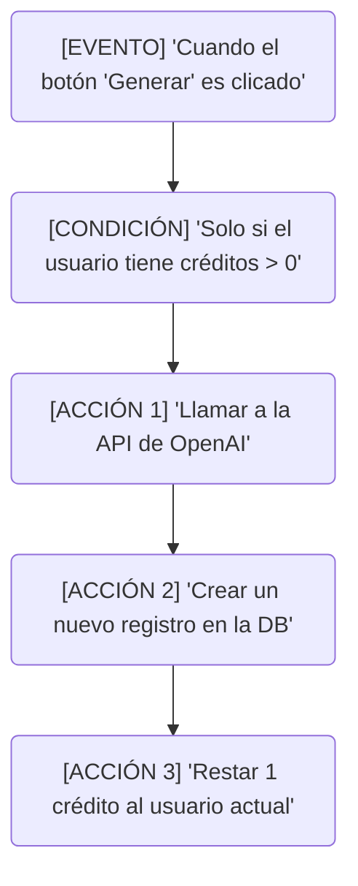
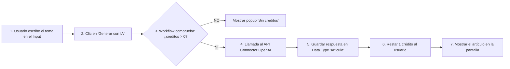
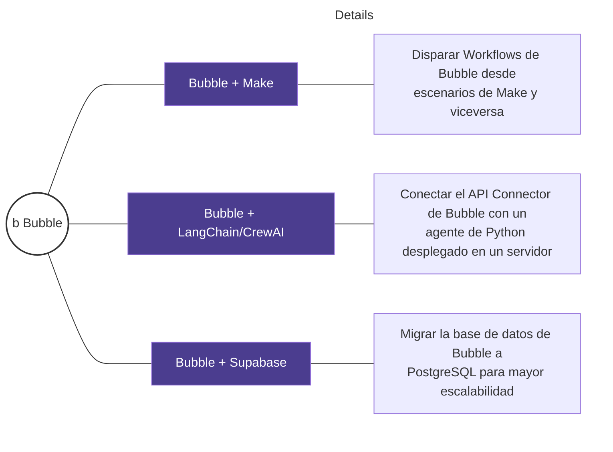

# Documento: BUBBLE.pdf

## Fuente

Parseado con LlamaCloud y almacenado para recuperación RAG.

## Markdown

# BUBBLE

## El "Heavyweight" del No-Code para plataformas SaaS


Desarrollo Avanzado de Sistemas Multiagente

**Instructor**: Rubén Juárez Cádiz

---

# ¿Qué aprenderemos hoy?

1. ¿Por qué Bubble y no Glide o Make?

2. **Turing-Complete Visual**: el límite es tu imaginación 

3. **Full-Stack**: Base de datos, Backend y Frontend en uno 

4. **The Canvas**: diseño píxel a píxel 

5. **Workflows**: la lógica de negocio visual 

6. Custom States y **Data Types**: gestión del estado 

7. API Connector: la llave maestra para conectar IA 

8. **Caso práctico**: SaaS de Copywriting con IA 

9. **Arquitectura y flujo del SaaS** 

10. **Entregable** y criterios de evaluación 

11. Próximos pasos y recursos 

---

# Bubble no es una herramienta No-Code más: es un entorno de desarrollo visual Turing-Complete

### ¿Por qué Bubble?


## Lo que Bubble puede construir

*    **Plataformas tipo Airbnb** (marketplace con pagos)
*    **Herramientas SaaS** con sistema de suscripción y créditos
*    **CRMs personalizados** con lógica de negocio compleja
*    **Redes sociales** con perfiles, feeds y mensajería

### El diferenciador clave:

**Bubble es Full-Stack:** combina base de datos propia, lógica de backend (Workflows) y diseño de frontend en una sola herramienta.


<!-- layout: page_3_image_9_v2.jpg page_3_image_7_v2.jpg -->


---

# El Canvas de Bubble es el editor visual más potente del No-Code: diseño responsive sin restricciones

The Canvas: Diseño Píxel a Píxel

## Key Points

### ¿Qué es el Canvas?

El editor de interfaz de usuario de Bubble. Permite posicionar y dimensionar cada elemento con precisión (similar a Flexbox).

### Los elementos del Canvas:

* **Tx Text**: Textos estáticos o dinámicos
* **Input**: Campos de entrada de datos
* **Button**: Botones que disparan Workflows
* **Repeating Group**: Listas dinámicas de datos
* **Popup**: Ventanas modales
* **Group**: Contenedores para organizar

### El sistema de diseño responsive:

Usa un sistema de columnas y filas (similar a CSS Grid) que adapta cada elemento a móvil, tablet y desktop sin código adicional.


Desarrollo Avanzado de Sistemas Multiagente | Instructor: Rubén Juárez Cádiz


---


# BUBBLE
## Workflows: La Lógica de Negocio Visual

### Estructura de un Workflow



**Un Workflow de Bubble es el equivalente visual de una función de backend**

**¿Qué es un Workflow?**

La unidad de lógica en Bubble. Define: "Cuando [EVENTO] ocurre, ejecutar [ACCIÓN 1], luego [ACCIÓN 2]..."

**Los tipos de eventos más importantes:**

*  **Button click**: El usuario hace clic en un botón
*  **Page is loaded**: La página termina de cargar
*  **Input value changed**: El usuario escribe en un campo
*  **API response received**: La IA devuelve una respuesta
*  **Condition is true**: Una condición lógica se cumple

---

# Los Data Types son el esquema de base de datos; los Custom States son la memoria temporal

## Custom States y Data Types

### Data Types: La Base de Datos Relacional

* Base de datos NoSQL propia integrada.
* Data Types = "tablas", Fields = "columnas".
* Ejemplo SaaS:
    - Usuario (email, nombre, creditos, plan)
    - Articulo (titulo, contenido, autor, fecha)


### Custom States: La Memoria de la Interfaz


* Variables temporales que viven en el navegador.
* No se guardan en la base de datos.
* Se usan para controlar el estado visual de la app.
* Ejemplo: Custom State 'modo_vista' -> Valor 'lista' o 'grid'


Desarrollo Avanzado de Sistemas Multiagente
Instructor: Rubén Juárez Cádiz


---

# El API Connector de Bubble conecta la plataforma con cualquier IA del mundo en menos de 10 minutos

## API Connector: La Llave Maestra

## ¿Qué es el API Connector?

El plugin nativo de Bubble para conectar con APIs externas mediante llamadas HTTP (GET, POST, PUT, DELETE). No requiere código. Solo configuración visual.

## El parámetro dinámico `<tema>`:

En Bubble, el `<tema>` se reemplaza en tiempo real con el valor del Input del usuario. Así, cada llamada a la API es personalizada.


### Configuración para OpenAI:

* **API Name**: OpenAI GPT-4
* **Authentication**: Private Key in Header
* **Header**: Authorization: Bearer {{OPENAI_API_KEY}}
* **API Call**: Generate Copywriting
* **Method**: POST
* **URL**: https://api.openai.com/v1/chat/completions

```json
{
  "model": "gpt-4o-mini",
  "messages": [
    { "role": "system", "content": "Eres un experto en copywriting persuasivo." },
    { "role": "user", "content": "Escribe un artículo de blog sobre: <tema>" }
  ],
  "max_tokens": 800
}
```

---

# Un SaaS funcional con login, créditos y generación de texto con IA, construido en Bubble sin escribir código

## Caso Práctico: SaaS de Copywriting con IA

### El reto

Crear una aplicación web donde los usuarios puedan registrarse, gastar 'créditos' y generar textos optimizados usando la API de OpenAI.

### Las 4 pantallas del SaaS


**Login/Registro**: Autenticación de usuarios


**Dashboard**: Vista general (créditos restantes, historial)


**Generador**: Interfaz principal de IA (Input tema, Botón 'Generar', Output)


**Historial**: Ver generaciones anteriores (Repeating Group)

### El flujo completo de generación



<!-- layout: page_8_image_9_v2.jpg -->


---

# La arquitectura del SaaS de Copywriting combina base de datos, lógica de negocio y frontend en un flujo coherente

Arquitectura del SaaS


> **El sistema de créditos:**
> Los créditos son un campo numérico en el Data Type Usuario. Cada vez que el **Workflow de generación** se ejecuta con éxito, **Bubble** ejecuta una acción "Make changes to current User" y resta 1 al campo **creditos**. Simple, pero suficiente para un MVP monetizable.

9


---

# Bubble ocupa el espacio entre el No-Code simple y el desarrollo tradicional, siendo la do la opción óptima para MVPs SaaS

## Comparativa: Bubble vs. Alternativas

<table>
  <thead>
    <tr>
        <th>Comparativa completa</th>
        <th>Glide</th>
        <th>Make</th>
        <th>Bubble</th>
        <th>React+Node</th>
    </tr>
  </thead>
  <tbody>
    <tr>
        <td>Curva de aprendizaje</td>
<td>Baja</td>
<td>Media</td>
<td>Alta</td>
<td>Muy alta</td>
    </tr>
<tr>
        <td>Tiempo hasta MVP</td>
<td>1 hora</td>
<td>1 día</td>
<td>1-2 semanas</td>
<td>1-3 meses</td>
    </tr>
<tr>
        <td>Complejidad máxima</td>
<td>Baja</td>
<td>Media</td>
<td>Muy alta</td>
<td>Ilimitada</td>
    </tr>
<tr>
        <td>Base de datos propia</td>
<td>No</td>
<td>No</td>
<td>Sí</td>
<td>Sí</td>
    </tr>
<tr>
        <td>Sistema de login</td>
<td>Básico</td>
<td>No</td>
<td>Completo</td>
<td>Manual</td>
    </tr>
<tr>
        <td>Pagos (Stripe)</td>
<td>No</td>
<td>Vía Make</td>
<td>Sí, plugin</td>
<td>Manual</td>
    </tr>
<tr>
        <td>Escalabilidad</td>
<td>Baja</td>
<td>Media</td>
<td>Alta</td>
<td>Ilimitada</td>
    </tr>
<tr>
        <td>Coste mensual</td>
<td>Desde $0</td>
<td>Desde $9</td>
<td>Desde $29</td>
<td>Variable</td>
    </tr>
  </tbody>
</table>

### ¿Cuándo elegir Bubble?

*  Cuando el producto necesita lógica de negocio compleja
*  Cuando se requiere un sistema de usuarios con roles y permisos
*  Cuando el MVP necesita integrarse con pagos (Stripe)
*  Cuando se quiere validar un SaaS antes de invertir en desarrollo

---

# Entregable y Criterios

Tu misión: Un SaaS funcional con login, créditos y generación de texto con IA

## Evaluation Criteria

**Data Types (15%):** Usuario y Articulo con campos correctos

```description
Progress bar showing 15% completion
```

**Canvas/UI (20%):** 3 pantallas: Login, Dashboard, Generador

```description
Progress bar showing 20% completion
```

**API Connector (25%):** Llamada a OpenAI configurada y funcional

```description
Progress bar showing 25% completion
```

**Workflow (25%):** Flujo completo con comprobación de créditos

```description
Progress bar showing 25% completion
```

**Publicación (15%):** App publicada en bubble.io y accesible

```description
Progress bar showing 15% completion
```

## Required Deliverables

* [x] 1. URL de la app publicada en Bubble (accesible públicamente)

* [x] 2. Captura del editor de Bubble mostrando el Canvas y los Workflows

* [x] 3. Captura del Data Editor con al menos 2 usuarios y 3 artículos generados

* [x] 4. Demostración en vivo del flujo completo: registro → generación → descuento de crédito

## Extensión Sugerida

Integrar el plugin de Stripe para que los usuarios puedan comprar paquetes de créditos adicionales directamente desde la app.

---

# Próximos Pasos y Recursos

Bubble es el frontend y la lógica de negocio. El siguiente paso es conectarlo con los agentes de IA del backend.



### 💡 Recursos recomendados

* Plataforma Bubble: bubble.io (plan gratuito disponible)
* Documentación oficial: manual.bubble.io
* Repositorio del módulo en el aula virtual

> " <mark>Bubble democratiza</mark> la creación de software empresarial. Con las herramientas de este módulo, un alumno puede construir y lanzar un <mark>SaaS de IA</mark> en producción en <mark>menos de un mes</mark>, algo que hace <mark>5 años</mark> requería un equipo de 5 ingenieros y 6 meses de desarrollo. "
>
> — Rubén Juárez Cádiz

## Texto Plano

BUBBLE
El "Heavyweight" del No-Code para plataformas SaaS


    Desarrollo Avanzado de Sistemas Multiagente
    Instructor: Rubén Juárez Cádiz

---

     Qué aprenderemos hoy?

1. Por qué Bubble y no Glide o Make?
      Turing-Complete Visual: el límite es tu imaginación
   2  Turing
    3.  Full-Stack: Base de datos, Backend y Frontend en uno
     4. The Canvas: diseño píxel a píxel E
       5. Workflows: la lógica de negocio visual
        6.    Custom States y Data Types: gestión del estado
          7. API Connector: la Ilave maestra para conectar IA
          8. Caso práctico: SaaS de Copywriting con IA
          9.  Arquitectura y flujo del SaaS
          10. Entregable y criterios de evaluación
              11.       Próximos pasos y recursos

---

Bubble no es una herramienta No-Code más: es un
entorno de desarrollo visual Turing-Complete
                                  Por qué Bubble?
                                  iPor qué

                                      Lo que Bubble puede construir
         </>               Código             Plataformas tipo Airbnb   Herramientas SaaS con

                                                                        créditos
                           (React+Node)       (marketplace con pagos)   sistema de suscripción y
                           Muy alta           CRMs personalizados       Redes sociales con
                           complejidad                                 perfiles, feeds y
                           (Cualquier cosa)   con lógica de negocio
                    Bubble                    compleja                 mensajería
                    Alta complejidad
                    (Plataformas SaaS             El diferenciador clave:

     Make           completas)                  Bubble es Full-Stack: combina base de datos propia
                                              lógica de backend (Workflows) y diseño de frontend en
     Media complejidad                            y
     (Automatización de flujos)                   una sola herramienta.

Glide
Baja complejidad                                 Base de             Backend  Frontend
(Apps de datos simples)                          datos    (Workflows)         (Diseño)

---

El Canvas de Bubble es el editor visual más potente del
No-Code: diseño responsive sin restricciones
        Diseño
The Canvas: Diseño Píxel a Píxel

  Key Points
  Qué es
   Qué es el Canvas?
   El editor de interfaz de usuario de Bubble. Permite posicionar y
   dimensionar cada elemento con precisión (similar a Flexbox).    Mobile  Tablet    Desktop

   Los elementos del Canvas:
    Tx Text: Textos estáticos o dinámicos
   0 Input: Campos de entrada de datos
     Button: Botones que disparan Workflows
     Repeating Group: Listas dinámicas de datos
     Popup: Ventanas modales
    O Group: Contenedores para organizar

 El sistema de diseño responsive:
 Usa un sistema de columnas y filas (similar a CsS Grid) que adapta
  cada elemento a móvil, tablet y desktop sin código adicional.

         Desarrollo Avanzado de Sistemas Multiagente Instructor: Rubén Juárez Cádiz

---

        BUBBLE
                                                             Negocio
    Workflows: La Lógica de Negocio Visual

    Estructura de un Workflow                           Un Workflow deBubble es el equivalente

  [EVENTo] "Cuando el botón 'Generar' es clicado"       visual deunafunción de backend
                                                        iQué
                                                        Qué es un Workflow?
                                                        La unidad de lógica en Bubble. Define: "Cuando [EVENTO]
[coNDiCióN] "Solo si el usuario tiene créditos > 0"    ocurre, ejecutar [ACCIóN 1], luego [ACCIóN 2].

                                                       Los tipos de eventos más importantes:
    [ACCióN 1] "Llamar a la API de OpenAl'                   Button click: El usuario hace clic en un botón

                                                        Page is loaded: La página termina de cargar
   [ACCIóN 2] "Crear un nuevo registro en la DB"             Input value changed: El usuario escribe en un campo

                                                        API  API response received: La IA devuelve una respuesta
    [ACcióN 3] "Restar 1 crédito al usuario actual"         Condition is true: Una condición lógica se cumple

---

                                 Los Data Types son el esquema de
           los Custom States sonla                          base de datos;
                                                            memoria temporal
           Custom States y Data
                                                   y        Types
                                                            States:  Memoria
DataTypes: La Base de Datos Relacional             Custom States: La Memoria de la Interfaz
Base de datos NoSQL propia integrada.                           Temporary Memory Cache
           Types
Data Types = "tablas", Fields = "columnas".
Ejemplo SaaS:
       Usuario (email, nombre, creditos, plan)                  Memory Cache
       Articulo (titulo, contenido, autor, fecha)

Field      Usuario    Articulo                 Field        Variables temporales que viven en el navegador.
                                               Titulo     •No se guardan en la base de datos.
                                                  Semonre   Se usan para controlar el estado visual de la app.
                                               Contenido    Ejemplo: Custom State 'modo_vista' -> Valor 'lista' o 'grid
Data fiel                                      Dats field
                                                            Lista    Grid

Desarrollo Avanzado de Sistemas Multiagente                     Instructor: Rubén Juárez Cádiz

---

 El APl Connector de Bubble conecta la plataforma con
     cualquier IA del mundo en menos de 10 minutos
           API Connector: La Llave Maestra

Qué es el APl Connector?        Configuración para
                                                                                  OpenAl:
El plugin nativo de Bubble para conectar con   API Name:                      OpenAI GPT-4
APIsexternas mediante Ilamadas HTTP (GET,      Authentication:                Private Key in Header
POST PUT, DELETE). Norequiere código. Solo
POST, PUT,
configuración      código.                      Header:    Authorization: Bearer {{OPENAI_API_KEY}}
     n visual.
                                                API Call:                     Generate Copywriting
 El parámetro dinámico <tema>:                  Method:    POST
 En Bubble, el <tema> se reemplaza en           URL:       https://api.openai.com/v1/chat/completions
 tiempo real con el valor del Input del          "model":  "gpt-4o-mini"
     Illamada a la API                           "messages"
 usuario. Así, cada llamada a la APl es                    "role": "system'   "content":"Eres un experto en copywriting persuasivo
                                                            "role": "user" 'content": "Escribe un artículo de blog sobre:<tema>
 personalizada.                                  "max_tokens": 800

---

Un SaaS funcional con login, créditosygeneraciónde texto
           IA,        en Bubblesinescribircódigo
    con IA, construido
               Caso Práctico: SaaS de Copywriting
               g con IA
El reto                                               El flujo
               flujo completo de generación
Crear una aplicación web donde los usuarios puedan
registrarse, gastar 'créditos' y generar textos optimizados
usando la API de OpenAl.        Button        NO
Las 4 pantallas del SaaS                     1. Usuario escribe   2. Clic en      3. Workflow    Mostrar popup
               ©                                               "Generar con IA"    comprueba:    "Sin créditos'
           Login/Registro: Autenticación    el tema en el Input                    icreditos > 0?
                                                                                               O?
           de usuarios

           Dashboard: Vista general        si
           (créditos restantes, historial)

           Generador: Interfaz principal de IA
           (Input tema, Botón 'Generar', Output)

           Historial: Ver generaciones anteriores  4. Llamada al
               4.                                                     5. Guardar    6. Restar 1  7. Mostrar el
           (Repeating Group)                       API Connector  respuesta en Data  crédito al  artículo en la
                                                      (OpenAl)     Type 'Articulo'  usuario      pantalla

---

    de Copywriting combina base de
La arquitectura del SaaS
datos, lógica de negocio
     y frontend en un flujo coherente
    y                                             flujo
    Arquitectura del SaaS

FRONTEND                                          BACKEND

Página: /login -> Formulario de autenticación     Workflow: "Registrar usuario" -> Crear registro en DB

Página: /dashboard -> Panel del usuario           Workflow: "Generar artículo" -> API Connector + DB

Página: /generador -> Interfaz de IA              Workflow: "Restar crédito" -> Actualizar campo numérico


BASE DE DATOS                                                      API EXTERNA

Data Type: Usuario (email, nombre, créditos, plan)    OpenAl API   gpt-40-mini Generación de texto

Data Type: Artículo (titulo, contenido, autor, fecha)


El sistema de créditos:
    Type
Los créditos son un campo numérico en el Data Type Usuario. Cada vez que el Workflow de
    changes        I
generación se ejecuta con éxito, Bubble ejecuta una acción "Make changes to current User" y resta
    MVP
1 al campo creditos. Simple, pero suficiente para un MvP monetizable.

---

Bubble ocupa el espacio entre el No-Code simple y el desarrollo
                                                                   y
tradicional, siendo la do la opción óptima para MVPs SaaS               Dashboard
Comparativa: Bubble vs. Alternativas

 Comparativa completa  Glide    Make      Bubble     React+Node   Cuándo elegir Bubble?

 Curva deaprendizaje    Baja    Media     Alta        Muy alta      Cuando el producto
 Tiempo hasta MVP     1 hora    1 día    1-2 semanas  1-3 meses    necesita lógica de
                                                                    negocio compleja
 Complejidad máxima Baja        Media     Muy alta    llimitada    Cuando se requiere un
                                                                    sistema
 Base de datos propia  No        No           Sí      Sí            sistema de usuarios con
                                                                   roles y permisos
 Sistema de login      Básico    No     Completo      Manual      Cuando el MVP necesita
                                                                   (Stripe)
 Pagos (Stripe)        No      Vía Make   Sí, plugin  Manual       integrarse con pagos
 Escalabilidad          Baja    Media     Alta        Illimitada   Cuando se quiere validar
                                                                    un SaaS antes de invertir
 Coste mensua     Desde $0     Desde $9   Desde $29   Variable      en desarrollo

---

                             Entregable y Criterios
Tu misión: Un SaaS funcional con login,                           y generación de texto con IA
 Tu misión: Un SaaS funcional con login, créditos y generación de texto con IA
                                                                  y

Evaluation Criteria                                            Required Deliverables
                                                                  de la
Data Types (15%): Usuario y Articulo con campos correctos       1. URL de la app publicada en Bubble (accesible
15%                                                             públicamente)
                                                               2. Captura
                                                                2. Captura del editor de Bubble mostrando el
Canvas/Ul (20%): 3 pantallas: Login, Dashboard, Generador           deleditor
                                                                  s y los
                                                                Canvas y los Workflows
 20%                                                            3.
                                                                3. Captura del Data Editor con al menos 2
API Connector (25%): Llamada a OpenAl configurada y funcional   usuarios y 3 artículos generados
 25%                                                            4. Demostración en vivo del flujo completo:
                                                                4.
                                                                registro → generación → descuento de crédito
Workflow (25%): Flujo completo con comprobación de créditos
 25%                                                           Extensión Sugerida

Publicación (15%): App publicada en bubble.io y accesible      Integrar el plugin de Stripe para que los usuarios
                                                               puedan comprar paquetes de créditos adicionales
                                                               directamente desde la app.
15%                                                               comprar

---

        Próximos Pasos y Recursos
               Bubble es el frontend y la lógica de negocio. El siguiente paso es conectarlo con los
                                             agentes de IA del backend.

        M Bubble + Make
              Bubble₊     O      "
              Disparar Workflows de Bubble desde             Bubble democratiza
              escenarios de Make y viceversa                 des     edemocratiza la creación
                                                                  empresarial. Con
                                                              desoftware empresarial.
                                                                  e
    Bubble     Bubble + LangChain/CrewAl                     las herramientas de este
               Conectar el APl Connector de Bubble con un     módulo, un alumno
               agente de Python desplegado en un servidor    construir alumno puede
                                                                  SaaS de IA
                                                                  lanzar un
                                                              ry
                                                              y
               Bubble + Supabase                            en producción en menos de un
                                                                 , algo que hace 5
               Migrar la base de datos de Bubble a            mes,        5Saños
                    PostgreSQL para mayor escalabilidad     requería un equipo de 5
                                                                  5
    Recursos recomendados                                    ingenieros y 6 meses de
Plataforma Bubble: bubble.io (plan gratuito disponible)       desarrollo."
    Documentación oficial: manual.bubble.io                       Rubén Juárez Cádiz
    Repositorio del módulo en el aula virtual