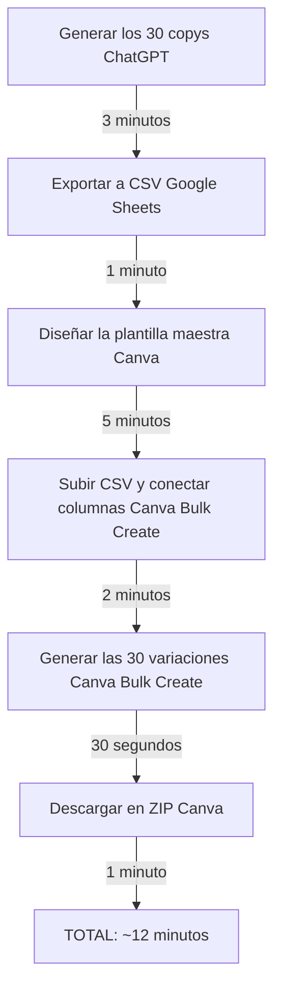
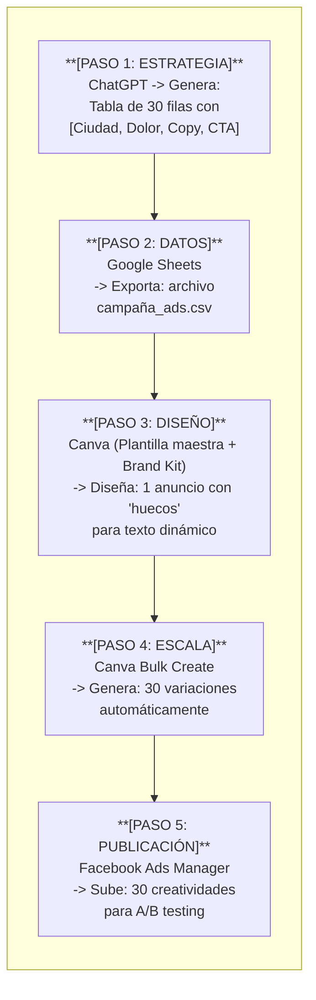
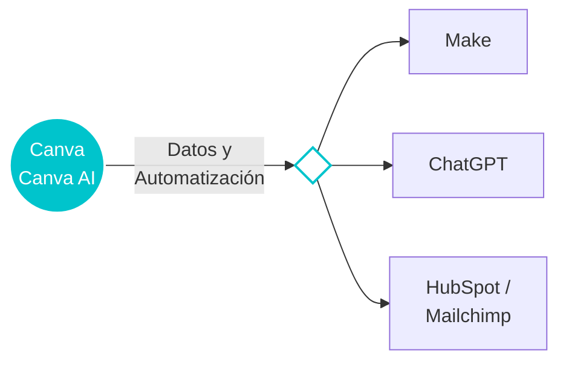

# Documento: CANVA_AI_(MAGIC_STUDIO).pdf

## Fuente

Parseado con LlamaCloud y almacenado para recuperación RAG.

## Markdown

# CANVA AI (MAGIC STUDIO)

## Activación visual a escala sin cuellos de botella

Desarrollo Avanzado de Sistemas Multiagente

Instructor: Rubén Juárez Cádiz

---

# ¿Qué aprenderemos hoy?

1. El cuello de botella del diseño

2. ¿Qué es Magic Studio?

3. Magic Switch: redimensión inteligente

4. Text to Image: adiós a los bancos de imágenes

5. Bulk Create: la función más potente

6. Brand Kit: consistencia a escala

7. Magic Write y Magic Edit

8. Caso práctico: Campaña de Ads

9. El flujo completo: de CSV a 30 anuncios

10. Resultados y métricas

11. Entregable y criterios de evaluación

12. Próximos pasos y recursos

---

# El departamento de diseño es el mayor cuello de botella en marketing; Canva AI elimina la dependencia y devuelve la velocidad al equipo

## El Cuello de Botella del Diseño

### El problema clásico

- Idea el lunes → Entrega el viernes.
- Resultado: campañas lentas y oportunidades perdidas.
- A escala: 30 variaciones = 30 briefs = 30 días de espera.

### El impacto real en números

<table>
  <thead>
    <tr>
        <th>Tarea</th>
        <th>Manual</th>
        <th>Canva AI</th>
    </tr>
  </thead>
  <tbody>
    <tr>
        <td>Crear 1 post:</td>
<td>2-3 horas</td>
<td>5 minutos (Canva AI)</td>
    </tr>
<tr>
        <td>Adaptar a 5 formatos:</td>
<td>1 día</td>
<td>30 segundos (Magic Switch)</td>
    </tr>
<tr>
        <td>30 variaciones de anuncio:</td>
<td>1-2 semanas</td>
<td>10 minutos (Bulk Create)</td>
    </tr>
<tr>
        <td>Imagen personalizada:</td>
<td>1 día</td>
<td>2 minutos (Text to Image)</td>
    </tr>
  </tbody>
</table>

> ### La mentalidad del Marketer Visual
> El marketer no necesita saber diseño. Necesita saber comunicar: qué quiere transmitir, a quién y en qué formato.
> **La IA se encarga del resto.**

---

# Magic Studio no es un conjunto de plantillas: es IA generativa integrada directamente en el flujo de trabajo del diseño

¿Qué es Magic Studio?

### Magic Studio: El ecosistema de IA de Canva

**Magic Write:**
Redacción con IA
(Copys, títulos)

**Text to Image:**
Generación de imágenes
(Stock personalizado)

**Magic Switch:**
Redimensión inteligente
(Adaptar formatos)

**Magic Edit:**
Edición por instrucción
(Cambiar elementos)

**Magic Eraser:**
Eliminación de objetos
(Limpiar fondos)

**Magic Expand:**
Expansión de imagen
(Ampliar encuadre)

**Bulk Create:**
Creación en lote
(Variaciones desde CSV)

**Presentations AI:**
Presentaciones automáticas

**La integración clave:**

Magic Studio no es un producto separado. Está integrado en el flujo de trabajo de Canva. Puedes generar una imagen, editarla, redimensionarla y crear 30 variaciones sin salir del lienzo.

---

# Magic Switch elimina el trabajo más tedioso del diseño: adaptar el mismo contenido a los 7+ formatos que exige el ecosistema digital actual

# Magic Switch

## ¿Qué es Magic Switch?

Una función de IA que toma un diseño y lo adapta inteligentemente a otro formato, reubicando y redimensionando los elementos automáticamente.

## El flujo con Magic Switch

1. Diseñar el Post de Instagram

2. Clic en "Redimensionar y Magic Switch"

3. Seleccionar todos los formatos deseados

4. La IA adapta el diseño a cada formato

5. Revisar y ajustar manualmente

6. Descargar todos los formatos en un ZIP

---

# Text to Image elimina la dependencia de los bancos de imágenes genéricos y permite crear activos visuales únicos y perfectamente alineados con la marca

Text to Image: Adiós a los bancos de imágenes

## ¿Por qué los bancos de imágenes son un problema?

Las imágenes de stock son usadas por miles de empresas. No diferencian.

Encontrar la imagen perfecta puede llevar horas.

Las imágenes de personas en stock parecen artificiales y poco auténticas.

## Prompts efectivos para Text to Image en marketing

<table>
  <thead>
    <tr>
        <th>Producto en contexto: "Una taza de café artesanal sobre una mesa de madera rústica, luz natural de ventana, fotografía editorial, estilo minimalista"</th>
        <th>Persona/personaje: "Una directora de marketing en su 30s, sonriendo, en una oficina moderna con plantas, estilo fotografía corporativa auténtica, sin stock"</th>
    </tr>
  </thead>
  <tbody>
    <tr>
        <td>Abstracto/concepto: "Conexiones de red neuronal en tonos azul y morado, fondo oscuro, estilo infografía futurista, alta resolución"</td>
<td>Ilustración de marca: "Ilustración vectorial plana de un robot amigable usando un portátil, paleta de colores: azul #0066CC y blanco, estilo minimalista"</td>
    </tr>
  </tbody>
</table>

---

# Bulk Create es la función más transformadora de Canva para marketing: convierte una hoja de datos en una campaña visual completa en minutos

Bulk Create y Brand Kit

## Bulk Create: La función de escala

Permite conectar un archivo CSV a un diseño de Canva y generar automáticamente una variación del diseño por cada fila del CSV.

## Brand Kit: Consistencia a escala

El Brand Kit de Canva almacena:

- Paleta de colores de la marca (HEX exactos)

- Tipografías aprobadas (archivos de fuente)

- Logos en todas sus variantes

<table>
  <thead>
    <tr>
        <th>ciudad</th>
        <th>dolor</th>
        <th>copy</th>
        <th>cta</th>
    </tr>
  </thead>
  <tbody>
    <tr>
        <td>Madrid</td>
<td>¿Cansado de perder clientes?</td>
<td>En Madrid, el 73%...</td>
<td>Prueba gratis</td>
    </tr>
<tr>
        <td>Barcelona</td>
<td>¿Tu equipo pierde horas?</td>
<td>En Barcelona...</td>
<td>Ver demo</td>
    </tr>
<tr>
        <td>Valencia</td>
<td>¿Sin tiempo para crecer?</td>
<td>En Valencia...</td>
<td>Empieza hoy</td>
    </tr>
  </tbody>
</table>

<table>
  <thead>
    <tr>
        <th>Color</th>
        <th>HEX</th>
    </tr>
  </thead>
  <tbody>
    <tr>
        <td>Dark Blue</td>
<td>#0D1117</td>
    </tr>
<tr>
        <td>Light Blue</td>
<td>#58A6FF</td>
    </tr>
<tr>
        <td>Purple</td>
<td>#8957E5</td>
    </tr>
  </tbody>
</table>

**Tipografías aprobadas**: Inter, Roboto Mono

Con el Brand Kit activo, la IA de Canva aplica automáticamente los colores y fuentes de la marca a cualquier diseño generado, garantizando la consistencia visual sin revisión manual.

Desarrollo Avanzado de Sistemas Multiagente
Instructor: Rubén Juárez Cádiz

---

# 30 variaciones visuales de un anuncio de Facebook Ads perfectamente diseñadas y listas para publicar, generadas en menos de 10 minutos

## Caso Práctico: Campaña de Ads

### El reto:

* Crear 30 variaciones visuales de un anuncio de Facebook Ads, cada una adaptada a una ciudad y un beneficio distinto, sin contratar a un diseñador.

### El resultado:

* 30 imágenes publicitarias perfectamente diseñadas, con el Brand Kit aplicado, listas para subir a Facebook Ads Manager y crear una campaña de A/B testing masivo.

### El flujo completo:

* **Generar los 30 copys (ChatGPT)** $\rightarrow$ 3 minutos
* **Exportar a CSV (Google Sheets)** $\rightarrow$ 1 minuto
* **Diseñar la plantilla maestra (Canva)** $\rightarrow$ 5 minutos
* **Subir CSV y conectar columnas (Canva Bulk Create)** $\rightarrow$ 2 minutos
* **Generar las 30 variaciones (Canva Bulk Create)** $\rightarrow$ 30 segundos
* **Descargar en ZIP (Canva)** $\rightarrow$ 1 minuto

**TOTAL: ~12 minutos**

---

# La integración de Prompt Engineering + Canva AI crea un pipeline de producción de contenido que antes requería un equipo de 3 personas y 2 semanas

## El Flujo Completo

### El impacto estratégico

Este pipeline no solo ahorra tiempo. Permite hacer A/B testing masivo que antes era imposible por coste.

Con 30 variaciones, el algoritmo de Facebook puede optimizar automáticamente hacia la creatividad que mejor convierte.

---

# El pipeline Prompt Engineering + Canva AI no solo reduce el tiempo de producción: multiplica la capacidad de testing y optimización de las campañas

## Resultados y Métricas

<table>
  <thead>
    <tr>
        <th>Comparativa de producción</th>
        <th>Manual (Tradicional)</th>
        <th>IA + Canva (Optimizado)</th>
    </tr>
  </thead>
  <tbody>
    <tr>
        <td>Tiempo para 30 variaciones</td>
<td>2 semanas</td>
<td>12 minutos</td>
    </tr>
<tr>
        <td>Coste (diseñador freelance)</td>
<td>~600€</td>
<td>~0€</td>
    </tr>
<tr>
        <td>Variaciones para A/B testing</td>
<td>2-3</td>
<td>30+</td>
    </tr>
<tr>
        <td>Consistencia de Brand Kit</td>
<td>Manual</td>
<td>Automática</td>
    </tr>
<tr>
        <td>Tiempo de iteración</td>
<td>Días</td>
<td>Minutos</td>
    </tr>
  </tbody>
</table>

### El efecto compuesto

*   **Más variaciones**
    *   Más datos de A/B testing
        *   Más datos
            *   Mejor optimización del algoritmo
                *   Mejor optimización
                    *   Menor CPM y mayor ROAS
                        *   Menor coste
                            *   Mayor escalabilidad del presupuesto

> ### El nuevo rol del Marketer
>
> El marketer ya no es el ejecutor del diseño. Es el estratega que define los mensajes, los segmentos y los objetivos. La IA y Canva son los ejecutores. Este cambio de rol es el que genera el mayor impacto en productividad y resultados.

---

# ENTREGABLE Y CRITERIOS

**Tu misión:** Crear una campaña de 10 variaciones de anuncio usando el pipeline de Prompt Engineering + Canva Bulk Create.

## Criterios de Evaluación

CSV generado con IA (20%): Tabla de 10 filas con Ciudad, Dolor, Copy, CTA

<!-- layout: page_11_image_7_v2.jpg qpri -->

Plantilla maestra (25%): Diseño en Canva con Brand Kit aplicado

<!-- layout: page_11_image_5_v2.jpg pihd -->

Bulk Create (30%): 10 variaciones generadas automáticamente

Magic Switch (15%): Al menos 2 formatos adicionales (Story + Banner)

Calidad visual (10%): Coherencia de marca y claridad del mensaje

## Entregables Requeridos

*   [x] 1. El archivo CSV utilizado para el Bulk Create
*   [x] 2. Captura de la plantilla maestra en Canva (con los campos dinámicos visibles)
*   [x] 3. Las 10 variaciones descargadas (en ZIP o Google Drive)
*   [x] 4. Las mismas 10 variaciones adaptadas a formato Story (9:16) con Magic Switch

## Extensión sugerida

**Automatizar con Make:** cuando se añada una nueva fila al Google Sheet, Make genera automáticamente el CSV actualizado y lo sube a Canva para generar la nueva variación.

---

# Próximos Pasos y Recursos

Canva AI es la capa visual. El siguiente paso es conectarla con los datos y la automatización para crear un pipeline de marketing completamente autónomo.

**Canva + Make**: Automatizar la generación de creatividades cuando se añadan nuevos productos o campañas

**Canva + ChatGPT**: Usar la API de OpenAI para generar los copys del CSV automáticamente

**Canva + HubSpot/Mailchimp**: Exportar las creatividades directamente a las plataformas de email marketing

### Recursos recomendados

*    **Plataforma Canva**: <u>canva.com</u> (plan gratuito con funciones básicas de IA)

*    **Canva for Teams**: Plan recomendado para equipos de marketing (Brand Kit completo)

*    **Repositorio del módulo en el aula virtual**

> "El diseño siempre fue el cuello de botella del marketing. Con Canva AI, ese cuello de botella desaparece. El límite ya no es la capacidad de producción visual, sino la calidad de la estrategia y la creatividad del mensaje."
>
> — Rubén Juárez Cádiz 

16

## Texto Plano

CANVA AI      STUDIO)
Al (MAGIC STUDIO)
          cuellos
a         cuellos de botella
Activaciónvisual a escala sin

T  TO

   C

Desarrollo Avanzado de Sistemas Multiagente
    Instructor: Rubén Juárez Cádiz

---

 Qué aprenderemos hoy?

 1. El cuello de botella del diseño       7. Magic Write y Magic Edit

 2. iQué es Magic Studio?                 8. Caso práctico: Campaña de Ads
17 3. Magic Switch: redimensión           9. El flujo completo: de CSV a 30
7
KK inteligente                            anuncios
 4. Text to Image: adiós a los bancos    0
 de imágenes                             0Dl 10. Resultados y métricas

 5. Bulk Create: la función más potente   11. Entregable y criterios de
                                          evaluación
 6. Brand Kit: consistencia a escala      12. Próximos pasos y recursos

---

El departamento de diseño es el mayor cuello de botella en marketing;
Canva Al elimina la dependencia y devuelve la velocidad al equipo
    El Cuello de Botella del Diseño

El problema clásico        El impacto real en números
- Idea
- Idea el lunes → Entrega el viernes.                         Manual                       Canva Al
Resultado: campañas lentas y oportunidades perdidas.
- A escala: 30 variaciones = 30 briefs = 30 días de espera.   Crear 1 post:                5 minutos
                                                              2-3 horas                    (Canva Al)

                                                              Adaptar a 5 formatos:        30 segundos
La mentalidad del Marketer Visual                             1 día                        (Magic Switch)
    El marketer no necesita saber diseño.                     30 variaciones de anuncio:   10 minutos
Necesita saber comunicar: qué quiere transmitir,              1-2 semanas                  (Bulk Create)
           a quién y en qué formato.
    La IA seencargadel resto.                                 Imagen personalizada:        2 minutos
                                                              1 día                        (Text to Image)

---

Magic Studio no es un conjunto de plantillas: es IA generativa
integrada directamente en el flujo de trabajo del diseño
Qué es Magic Studio?
      Magic Studio: El ecosistema de IA de Canva

 Magic Write:                Text to Image:                               Magic Switch:
 Redacción con IA            Generación de imágenes                       Redimensión inteligente
  (Copys, títulos)           (Stock personalizado)                        (Adaptar formatos)

                                                                          Magic Expand:
  Magic Edit:
  Magic                      Magic Eraser:                                Expansión de imagen
  Edición por instrucción     Eliminación de objetos                      (Ampliar encuadre)
  (Cambiar elementos)        (Limpiar fondos)

                                                        La integración clave:
 Bulk Create:                 Presentations Al:         Magic Studio no es un producto separado.
 Creación en lote            Presentaciones             Está integrado en el flujo de trabajo de
  (Variaciones desde CSV)     automáticas                Canva. Puedes generar una imagen, editarla,
                                                         redimensionarla y crear 30 variaciones sin
                                                         salir del lienzo.

---

    Magic Switch elimina el trabajo más tedioso del diseño: adaptar el
    mismo contenido a los 7+ formatos que exige el ecosistema digital actual
        Magic Switch
        Switch
    Qué es Magic Switch?
    Una función de IA que toma un diseño y lo adapta inteligentemente a otro  El flujo con Magic Switch
    formato, reubicando y redimensionando los elementos automáticamente.
                                                                                              1. Diseñar el Post de Instagram

                                                                              Redimensionar   2. Clic en "Redimensionar y Magic Switch"
     Banner web                                                               y Magic Switch
    (1200x628px)    Presentación
                   (1920x1080px)                                                              3. Seleccionar todos los formatos deseados

                                   4. La IA adapta el diseño a cada formato
                            YouTube Thumbnail
  Story/Reel    Post cuadrado  (1280x720px)
(1080x1920px)    (1080x1080px)     5. Revisar y ajustar manualmente

  Pinterest    7+ Formatos    6. Descargar todos los formatos en un ZIP
(1000x1500px)

---

Text to Image elimina la dependencia de los bancos de
imágenes genéricos y permite crear activos stivos visuales
únicos y perfectamente alineados con la marca
Text to Image: Adiós a los bancos de imágenes

Por qué los bancos de imágenes   Prompts efectivos para Text to Image en marketing
son un problema?

Las imágenes de stock son         Producto en contexto:              Persona/personaje:
usadas por miles de empresas.     "Una taza de café artesanal        "Una directora de marketing
No diferencian.                   sobre una mesa de madera           en su 30s, sonriendo, en una
                                   rústica, luz natural de           oficina moderna con
                                  ventana, fotografía editorial,     plantas, estilo
                                  estilo minimalista"                fotografía corporativa
Encontrar la imagen perfecta                                         auténtica, sin stock"
puede llevar horas.                Abstracto/concepto:               llustración de marca:

Las imágenes de personas en       "Conexiones de red neuronal        "Ilustración vectorial plana de
                                  en tonos azul y morado, fondo      un robot amigable usando un
stock parecen artificiales y      oscuro, estilo infografía          portátil, paleta de colores:
poco auténticas.                  futurista, alta resolución"        azul #0066CC y blanco,
                                                                     estilo minimalista'

---

Bulk Create es la función más transformadora de Canva para marketing:
convierte una hoja de datos en una campaña visual completa en minutos
Bulk Create y Brand Kit

 Bulk Create: La función de escala                                          Brand Kit: Consistencia a escala
 Permite conectar un archivo CSV a un diseño de Canva y generar             El Brand Kit de Canva almacena:
 automáticamente una variación del diseño por cada fila del CSV.            Paleta de colores de la marca (HEX exactos)
                                                                             Tipografías aprobadas (archivos de fuente)
                                               Canva           a ↓ 8      - Logos en todas sus variantes

 CSV                                                  B        CCanva            HEX
                                                     Do
                                                                                 Roboto Mono
  ciudad     dolor          copy           cta                                   AaInter,

  Madrid     Cansado de     En Madrid,     Prueba     A                      #0D1117    Tipografías aprobadas
             perder                       gratis           © Conre               #58A6FF #8957E5
             clientes?      el 73%..                       Tu equipo

  Barcelona  Tu equipo      En                             pierde horas?         C
             pierde horas?  Barcelona...   Ver demo  OD

  Valencia   Sin tiempo     En            Empieza                                Logos en todas sus variantes
             para crecer?   Valencia...   hoy              Canvs
                                                           Sin tiempo
                                                           para crecer?     Con el Brand Kit activo, la IA de Canva aplica
                                                           ca oi Co e       automáticamente los colores y fuentes de la marca a
                                                                            cualquier diseño generado, garantizando la
                                                                            consistencia visual sin revisión manual.

Desarrollo Avanzado de Sistemas Multiagente    Instructor: Rubén Juárez Cádiz

---

                         30 variaciones visuales de un anuncio de Facebook Ads perfectamente
diseñadas y listas para publicar, generadas en menos de 10 minutos
  Caso Práctico: Campaña de Ads

                                                      El flujo completo:
  El reto:                                            Generar los 30 copys (ChatGPT) →3 minutos
Crear 30 variaciones visuales de un                                                 3
anuncio de Facebook Ads, cada una
adaptada a una ciudad y un beneficio          B       Exportar a CSV (Google Sheets) →  1 minuto
distinto, sin contratar a un diseñador.
  a
                                              Canva   Diseñar la plantilla maestra (Canva)  5 minutos
                                                                                    5

                                              Canva   Subir CSV y conectar columnas 2 minutos
                                                      (Canva Bulk Create
  El resultado:                               Canva   Generar las 30 variaciones    30 segundos
 30 imágenes publicitarias perfectamente              (Canva Bulk Create)
      ,listas
  diseñadas, con el Brand Kit aplicado, listas
 para subir a Facebook Ads Manager y crear
  a                                           Canva   Descargar en ZIP (Canva)      1 minuto
  campaña
  una campaña de A/B testing masivo.
                                                      TOTAL: ~12 minutos

---

    La integración de Prompt Engineering + Canva Al crea
un pipeline de producción de contenido que antes
  requería un equipo de 3 personas y 2 semanas
    y
    El FlujoCompleto

        Canva                                          El impacto
                                                       impacto estratégico
   [PASO 1: ESTRATEGIA]     [PASO 2: DATOS]                   [PASO 3: DISENO]             Este pipeline no solo ahorra
    ChatGPT -> Genera:       Google Sheets         Canva (Plantilla maestra + Brand Kit)    tiempo. Permite hacer A/B
  Tabla de 30 filas con  Exporta: archivo  Diseña: 1 anuncio con "huecos"    Permite
[Ciudad, Dolor, Copy, CTA]  campaña_ads.csv                 para texto dinámico            testing masivo que antes era
                                                                                               imposible por coste.

                                                                                         Con 30 variaciones, el algoritmo
                                                                                           de Facebook puede optimizar
                                                       automáticamente
                                                                                             automáticamente hacia la
    [PASO 5: PUBLICACIÓN]  [PASO 4: ESCALA]        [PASO 5: PUBLICACIÓN]                 creatividad que mejor convierte.
    Facebook Ads Manager  Canva Bulk Create        Facebook Ads Manager
    Sube: 30 creatividades >Genera: 30 variaciones Sube: 30 creatividades
    para A/B testing       automáticamente         para A/B testing

---

     El pipeline Prompt Engineering + Canva Al no solo reduce el tiempo de
    producción: multiplica la capacidad de testing y optimización de las campañas
                                       Resultados y Métricas

     Comparativa de                    Manual      IA + Canva  Más variaciones        El efecto compuesto
    producción                     (Tradicional)  (Optimizado)    Más datos de
     Tiempo para 30 variaciones      2 semanas 12 minutos         A/B testing     6000
                                                   Más datos
     Coste (diseñador freelance)   ~600€       ~0€    Mejor optimización
                                                        del algoritmo  000
    Variaciones para A/B testing   2-3     x   30+        Mejor optimización

     Consistencia de Brand Kit     Manual          Automática      Menor CPM y
                                                                    mayor ROAS
                                                   Menor coste .
     Tiempo de iteración                Días        Minutos    P
                                               Mayor escalabilidad
                                                 del presupuesto

                                              El nuevo rol del Marketer
 El marketer ya no es el ejecutor del diseño. Es el estratega que define los mensajes, los segmentos y los objetivos.
La IA y Canva son los ejecutores. Este cambio de rol es el que genera el mayor impacto en productividad y resultados.
    XA oDol 6000

---

                                                                                          ENTREGABLE Y CRITERIOS
     campaña
                                                                     Tu misión: Crear una campaña de 10 variaciones de anuncio usando
     Prompt                                                                  +              BulkCreate.
                                                 el pipeline de Prompt Engineering + Canva Bulk Create.

Criterios de Evaluación                                                     Entregables Requeridos
 CSV generado con IA (20%): Tabla de 10 filas con Ciudad, Dolor, Copy, CTA   1. El archivo CSV utilizado para el Bulk Create
 20%                                                                 20%     2. Captura de la plantilla maestra en Canva (con los

Plantilla maestra (25%): Diseño en Canva con Brand Kit aplicado              campos dinámicos visibles)
 25%        25%                                                              3. Las 10 variaciones descargadas (en ZIP o Google Drive)
 Bulk Create (30%): 10 variaciones generadas automáticamente                 4. Las mismas 10 variaciones adaptadas a formato Story
     30%                                                             30%     (9:16) con Magic Switch
Magic Switch (15%): Al menos 2 formatos adicionales (Story + Banner
 15%                                                                 15%    Extensión sugerida
 Calidad visual (10%): Coherencia de marca y claridad del mensaje            Automatizar con Make: cuando se añada una nueva fila al
 10%                                                                 10%     Google Sheet, Make genera automáticamente el CSV
                                                                             actualizado y lo sube a Canva para generar la nueva variación.

---

                                                                              Próximos Pasos y Recursos
                                              Pasos y
                                                    Canva Al es la capa visual. El siguiente paso es conectarla con los datos y la
                                                      automatización para crear un pipeline de marketing completamente autónomo.

                                          M         Canva + Make: Automatizar la
                                                    generación de creatividades      GG
                                                    cuando se añadan nuevos
                                          Make      productos o campañas        16

Canva                                               Canva + ChatGPT: Usar la API de  El diseño siempre fue el cuell
                                                    OpenAl para generar los copys del  o de botella del marketing.
                                                    CSV automáticamente

       Automatización                               Canva + HubSpot/Mailchimp:       botella desaparece. EI límite
Canva Al  Datos y        ChatGPT                        Con Canva Al, ese cuello de
                                                    Exportar las creatividades          ya no es la capacidad de
                                                    directamente a las plataformas de
Recursos recomendados                  HubSpot /    email marketing                    producción visual, sino la
                                       Mailchimp                                     calidad de la estrategia y la
 Plataforma Canva: canva.com (plan gratuito con funciones básicas de IA)        creatividad del mensaje."
 Canva for Teams: Plan recomendado para equipos de marketing (Brand Kit
 completo)                                              Rubén Juárez Cádiz
 Repositorio del módulo en el aula virtual
                                                        >