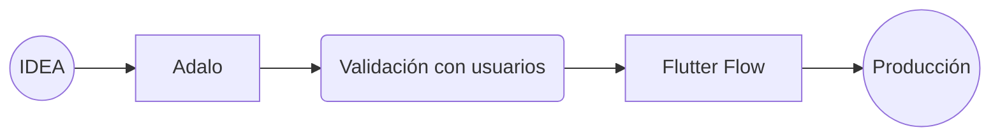
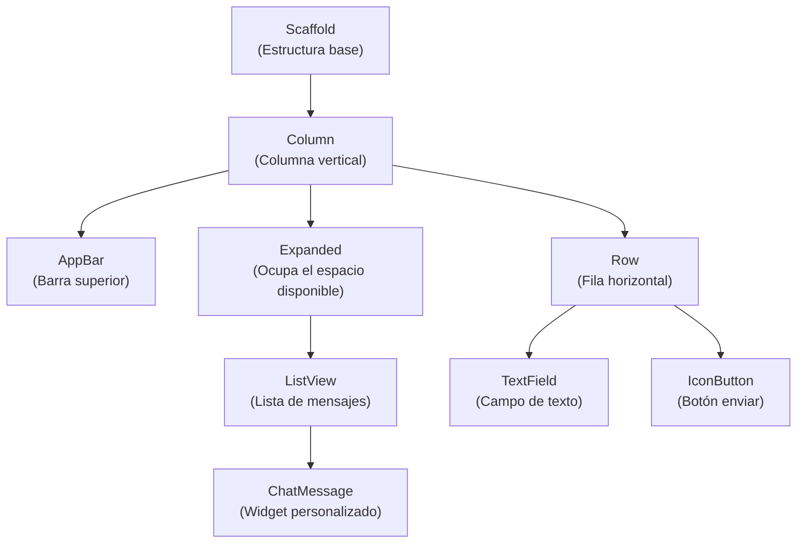
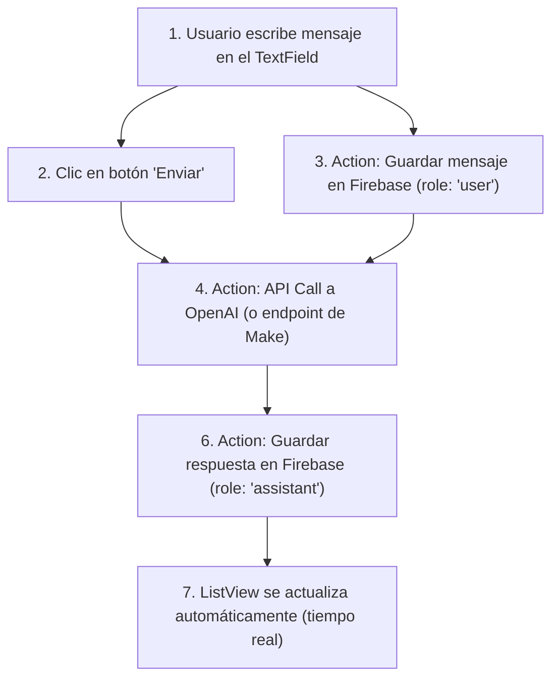

# Documento: FLUTTERFLOW_(Y_ADALO).pdf

## Fuente

Parseado con LlamaCloud y almacenado para recuperación RAG.

## Markdown

# FLUTTERFLOW (Y ADALO)

## Compilando apps nativas para iOS y Android con asistencia de IA

Módulo: Desarrollo Avanzado de Sistemas Multiagente

Instructor: Rubén Juárez Cádiz

---

# ¿Qué aprenderemos hoy?

1. **¿Por qué apps nativas y no solo web?**

2. **Adalo:** el prototipo nativo más rápido del mercado

3. **FlutterFlow:** la evolución profesional basada en Flutter

4. **Adalo vs. FlutterFlow:** ¿cuándo usar cada uno?

5. **Árbol de Widgets:** la jerarquía de la interfaz

6. **Backend con Firebase y Supabase**

7. **Acciones y API Calls:** conectando la app con IA

8. **FlutterFlow AI Gen:** generando pantallas con texto

9. **Caso práctico:** App Nativa de Asistente de Viajes

10. **Arquitectura y flujo de la app**

11. **Entregable y criterios de evaluación**

12. **Próximos pasos y recursos**

---

# Una app nativa en el bolsillo del usuario es el canal más directo, personal y potente para desplegar un agente de IA

## ¿Por qué Apps Nativas?

### El problema del web-only

*  Sin acceso nativo a cámara, micrófono, GPS o notificaciones push.

*  Menor confianza que las apps instaladas desde App Stores.

*  Experiencia de usuario (UX) inferior al móvil nativo.

* 

### El caso de uso de IA en móvil

*  Transcripción de voz en tiempo real (hablar con el agente)

*  Análisis de imágenes con la cámara (visión artificial)

*  Notificaciones push del agente ("Tu informe está listo")

*  Acceso offline con sincronización posterior

### La barrera tradicional

Desarrollar para iOS (Swift) y Android (Kotlin) requería dos equipos y el doble de tiempo. Flutter resolvió esto con un único lenguaje. **FlutterFlow** es su editor visual.

*  Dos Equipos, Doble Tiempo

*  Dos Equipos, Doble Tiempo

*  Único Lenguaje, Editor Visual

---

# Adalo convierte una idea en una app nativa instalable en las App Stores en menos de un día
## Adalo: El Prototipo Nativo Más Rápido

## ¿Qué es Adalo?

Plataforma No-Code para crear apps móviles. Su fortaleza es la velocidad: prototipos funcionales en horas.

## Limitaciones:

- Lógica compleja difícil de implementar
- No exporta código fuente (vendor lock-in)
- Rendimiento inferior a app nativa real
- Personalización visual limitada

## Componentes clave:


**Collections:** Base de datos
**Screens:** Pantallas de la app
**Components:** Botones, listas, formularios
**Actions:** Lógica simple
**External Collections:** Conexión con APIs

## ¿Cuándo usar Adalo?

Para validar una idea de app con usuarios reales antes de invertir en FlutterFlow o desarrollo nativo.

El 'Lean Startup' del desarrollo móvil.

---

# FlutterFlow es el editor visual de Flutter de Google: genera código nativo real, limpio y exportable
## FlutterFlow: La Evolución Profesional

### ¿Qué es FlutterFlow?

Un constructor visual de aplicaciones basado en Flutter (el framework multiplataforma de Google). A diferencia de Adalo, FlutterFlow genera código Dart real que puedes exportar, modificar y desplegar en producción.

### El diferenciador vs. Adalo

FlutterFlow no es solo un prototipador. Es una herramienta de producción. Las apps construidas en FlutterFlow son indistinguibles de las construidas por un equipo de desarrolladores Flutter senior.

### Las ventajas clave de FlutterFlow


**Código exportable:** Descarga el código Dart/Flutter completo


**Flutter nativo:** Compila a iOS y Android de forma nativa


**Firebase integrado:** Backend en tiempo real listo en minutos


**Supabase integrado:** Alternativa open-source a Firebase


**Custom Functions:** Escribir código Dart personalizado


**AI Gen:** Generar pantallas y lógica con IA

---

# Adalo y FlutterFlow no compiten: se complementan en diferentes etapas del ciclo de vida de un producto

## Adalo vs. FlutterFlow

### Comparativa completa

<table>
  <thead>
    <tr>
        <th>Característica</th>
        <th>Adalo</th>
        <th>FlutterFlow</th>
    </tr>
  </thead>
  <tbody>
    <tr>
        <td>Curva de aprendizaje</td>
<td>Muy baja</td>
<td>Media</td>
    </tr>
<tr>
        <td>Tiempo hasta MVP</td>
<td>Horas</td>
<td>Días</td>
    </tr>
<tr>
        <td>Calidad del código</td>
<td>No exporta</td>
<td>Código Dart real</td>
    </tr>
<tr>
        <td>Rendimiento</td>
<td>Medio</td>
<td>Nativo alto</td>
    </tr>
<tr>
        <td>Firebase/Supabase</td>
<td>Básico</td>
<td>Completo</td>
    </tr>
<tr>
        <td>Lógica compleja</td>
<td>Limitada</td>
<td>Completa</td>
    </tr>
<tr>
        <td>AI Gen</td>
<td>No</td>
<td>Sí, nativa</td>
    </tr>
<tr>
        <td>Escalabilidad</td>
<td>Baja</td>
<td>Alta</td>
    </tr>
  </tbody>
</table>



Usa Adalo para validar en 1 día. Si la idea funciona, migra a FlutterFlow para construir la versión de producción.

---

# El Árbol de Widgets de Flutter define la jerarquía visual de la app; Firebase o Supabase gestionan los datos en tiempo real
## Árbol de Widgets y Backend

### El Árbol de Widgets:

En **Flutter (y FlutterFlow)**, toda la interfaz es un árbol de "Widgets" anidados. Entender esta jerarquía es fundamental.



### Firebase vs. Supabase:

<table>
  <thead>
    <tr>
        <th> </th>
        <th></th>
        <th></th>
    </tr>
  </thead>
  <tbody>
    <tr>
        <td>Tipo de DB:</td>
<td>Firebase<br/>(NoSQL)</td>
<td>Supabase<br/>(SQL)</td>
    </tr>
<tr>
        <td>Tiempo real:</td>
<td>Firebase<br/>(Sí)</td>
<td>Supabase<br/>(Sí)</td>
    </tr>
<tr>
        <td>Autenticación:</td>
<td>Firebase<br/>(Completa)</td>
<td>Supabase<br/>(Completa)</td>
    </tr>
<tr>
        <td>Open-source:</td>
<td>Firebase<br/>(No)</td>
<td>Supabase<br/>(Sí)</td>
    </tr>
<tr>
        <td>Precio:</td>
<td>Firebase<br/>(Pay-as-you-go)</td>
<td>Supabase<br/>(Plan gratuito)</td>
    </tr>
<tr>
        <td>Integración FlutterFlow:</td>
<td>Firebase<br/>(Nativa)</td>
<td>Supabase<br/>(Nativa)</td>
    </tr>
  </tbody>
</table>


---

# **FlutterFlow AI Gen** genera pantallas completas, esquemas de base de datos y funciones personalizadas a partir de texto

FlutterFlow AI Gen

## ¿Qué puede hacer FlutterFlow AI Gen?

### <u>1. Generar pantallas completas:</u>

* **Prompt:** Genera una pantalla tipo chat con un campo de texto abajo y una lista de mensajes estilo WhatsApp

* **Resultado:** Pantalla completa con todos los widgets configurados

### <u>2. Generar esquemas de base de datos:</u>

* **Prompt:** Crea la estructura de base de datos para una app de asistente de viajes

* **Resultado:** Colecciones de Firebase con todos los campos y tipos

### <u>3. Generar Custom Functions (código Dart):</u>

* **Prompt:** Escribe una función que devuelva el último mensaje del usuario

* **Resultado:** Código Dart funcional listo para usar


### **El impacto en productividad:**

Con AI Gen, el tiempo para crear la estructura base de una app se reduce de horas a minutos. El desarrollador se convierte en un 'director' que guía a la IA.

---

# Una app nativa de chatbot de viajes, construida en FlutterFlow con Firebase y conectada a OpenAI, lista para las App Stores

Caso Práctico: App de Asistente de Viajes

## El reto

Construir una interfaz móvil nativa y conectarla a una base de datos para crear un asistente inteligente de viajes en el bolsillo del usuario.

## Las pantallas de la app

* **Splash/Login:** Autenticación con Firebase Auth
* **Home:** Lista de conversaciones anteriores
* **Chat:** Interfaz principal de conversación
* **Perfil:** Datos del usuario y preferencias




---

# Conectar FlutterFlow con OpenAI requiere configurar una sola API Call que se reutiliza en toda la app

## Configuración de la API Call

### El parámetro dinámico [userMessage]

En FlutterFlow, se define como una variable de la API Call. Al ejecutar la acción, FlutterFlow reemplaza [userMessage] con el texto del TextField del usuario en tiempo real.

### La respuesta de la IA

FlutterFlow parsea automáticamente el JSON de respuesta de OpenAI y permite acceder a `choices[0].message.content` directamente en las acciones.

### Configuración de la API Call en FlutterFlow:

**API Name**: OpenAI Chat

**Method**: POST

**URL**: https://api.openai.com/v1/chat/completions

**Headers**:

* **Authorization**: Bearer [OPENAI_API_KEY]
* **Content-Type**: application/json

**Body (JSON):**

```json
{
  "model": "gpt-4o-mini",
  "messages": [
    { "role": "system", "content": "Eres un experto asistente de viajes..." },
    { "role": "user", "content": "[userMessage]" }
  ],
  "max_tokens": 500
}
```

---

# Entregable y Criterios

Tu misión: Una app nativa de chatbot de IA, compilada en FlutterFlow y conectada a OpenAI

## Criterios de Evaluación

*   **15%** $\rightarrow$ **Árbol de Widgets (15%):** Pantalla de chat correctamente estructurada
*   **20%** $\rightarrow$ **Firebase (20%):** Autenticación y base de datos configuradas
*   **15%** $\rightarrow$ **AI Gen (15%):** Al menos 1 pantalla generada con IA documentada
*   **30%** $\rightarrow$ **API Call (30%):** Llamada a OpenAI configurada y funcional
*   **20%** $\rightarrow$ **Compilación (20%):** App compilada y ejecutada en emulador o dispositivo real

## Entregables Requeridos

*   [x] 1. Enlace al proyecto de FlutterFlow (compartido como "View Only")
*   [x] 2. Video de pantalla (screen recording) de la app funcionando en un emulador o dispositivo real
*   [x] 3. Captura del árbol de widgets de la pantalla de chat
*   [x] 4. Captura de la configuración de la API Call de OpenAI

## Extensión Sugerida

Añadir historial de conversaciones guardado en Firebase, de modo que el usuario pueda retomar cualquier conversación anterior.

---

# Próximos Pasos y Recursos

FlutterFlow es la interfaz nativa. El siguiente paso es conectarla con los agentes de IA del backend para crear experiencias verdaderamente inteligentes.

### Próximas herramientas del módulo:


**FlutterFlow + Make**
Usar Make como middleware entre la app y los agentes de Python (CrewAI, LangGraph)

**FlutterFlow + LangSmith**
Monitorizar las llamadas a OpenAI realizadas desde la app

**FlutterFlow + Supabase**
Migrar el backend de Firebase a PostgreSQL para consultas más complejas

> "Con FlutterFlow, el agente de IA deja de ser un script en la terminal y se convierte en un producto real, con una interfaz hermosa, en el bolsillo de miles de usuarios. Ese es el puente entre la IA experimental y la IA que genera valor de negocio."

— Rubén Juárez Cádiz

### Recursos recomendados:

*   **Plataforma FlutterFlow:**
    flutterflow.io (plan gratuito disponible)

*   **Documentación oficial:**
    docs.flutterflow.io

*   **Plataforma Adalo:**
    adalo.com (plan gratuito disponible)

*   **Repositorio del módulo:**
    en el aula virtual

## Texto Plano

FLUTTERFLOW (Y ADALO)

Compilando apps nativas paraiOs
 y Android con asistencia de IA

        deLataillall
    Módulo: Desarrollo Avanzado de
    SistemasMultiagente

    Rubén Juárez Cádiz
    Instructor: Rubén

---

        Qué aprenderemos hoy?

    iPor qué apps nativas y no solo web?       7   Acciones y API Calls: conectando la app
                                                   con IA

2   Adalo: el prototipo nativo más rápido del  8   FlutterFlow Al Gen: generando pantallas
    mercado                                        con texto

3  FlutterFlow: la evolución profesional       9    Caso práctico: App Nativa de Asistente
   basada en Flutter                               de Viajes

4  Adalo vs. FlutterFlow: icuándo usar         10  Arquitectura y flujo de la app
   cada uno?

5  Árbol de Widgets: Ia jerarquía de la        11   Entregable y criterios de evaluación
   interfaz

   Backend con Firebase y Supabase             12   Próximos pasos y recursos

---

Una app nativa en el bolsillo del usuario es el canal
                                                                es el canal más
directo, personal y potente para desplegar un agente de IA
                                Por qué Apps Nativas?
El problema del               El caso de uso de
web-only                      IA en móvil
     Sin acceso nativo a        Transcripción de voz                         La barrera tradicional
      cámara, micrófono, GPS    en tiempo real (hablar      Desarrollar para iOS (Swift) y Android (Kotlin) requería
     o notificaciones push.    con el agente)               dos equipos y el doble de tiempo. Flutter resolvió esto

      Menor confianza que      Análisis de imágenes          con un único lenguaje.FlutterFlow es su editor visual.  ocEacl;
      las apps instaladas       con la cámara (visión       iOs
     desde App Stores.         artificial                   Dos Equipos,    Dos Equipos,

     Experiencia de usuario    Notificaciones push          Doble Tiempo    Doble Tiempo
     (UX) inferior al móvil     del agente ("Tu informe        Tiempo
                               es listo")
     nativo.                   está listo")
o                               Acceso offline con                          Unico Lenguaje,
                                sincronización posterior                    Editor Visual

---

Adalo convierte una idea en unaapp nativa instalable
en las AppStores                                           app
                                        s de un día
                                    en menos
     sen
                                    Más Rápido
 Adalo: El Prototipo Nativo Más

iQué
 Qué es Adalo?                                        Limitaciones:
 Plataforma No-Code para crear apps móviles.          - Lógica compleja difícil de implementar
                                                           código
 Su fortaleza es la velocidad: prototipos             - No exporta código fuente (vendor lock-in)
 funcionales en horas.                                - Rendimiento inferior a app nativa real
                                                               a
                                                      - Personalización visual limitada
 Componentes clave:
                                                           Cuándo usar Adalo?
                                                           Para validar una idea de app con usuarios
 Collections: Screens: Components: Actions:   External     reales antes de invertir en FlutterFlow O
 Base de     Pantallas   Botones,   Lógica  Collections:   desarrollo nativo.
  datos      de la app   listas,    simple    Conexión     El 'Lean Startup' del desarrollo móvil.
                       formularios        con APIs         Startup'

---

FlutterFlow es el editor visual de Flutter de Google:
generacódigo nativo real, limpioy exportable
     FlutterFlow:
     FlutterFlow: La Evolución Profesional

Qué es FlutterFlow?        Las ventajas clave de FlutterFlow
Un constructor visual de aplicaciones basado en            Código exportable:       Flutter nativo:
Flutter (el framework multiplataforma de Google). A        Código    I código
                                                           Descarga el código
diferencia de Adalo, , FlutterFlow genera código Dart     Descarga                  Compila a iOS y
     puedes                                                                         nativa
real que puedes exportar, modificar y desplegar en         Dart/Flutter completo   Android de forma
producción.
                                                          Firebase integrado:       Supabase integrado:
                                                           Backend en tiempo
 El diferenciador vs. Adalo                                       I en tiempo       Alternativa open-
                                                           real listo en minutos    source a Firebase
 FlutterFlownoessolo un prototipador. Es una
 herramientadeproducción. Las apps construidas en         Custom Functions:        Al Gen:
 FlutterFlowson indistinguibles de las construidas         Escribir código Dart    Generar pantallas y
 por un        Flutter senior.                             personalizado            lógica con IA
 por equipodedesarrolladoresFlutter

---

Adalo y FlutterFlow no compiten: se complementan en
                                        diferentes etapas del ciclo de vida de un producto
                                                      Adalo vs. FlutterFlow
Comparativa completa
Característica       Adalo   FlutterFlow
Curva deaprendizaje  Muy baja        Media
Tiempo hasta MVP     Horas      Días
Calidad del código   No exporta Código Dart real
Rendimiento          Medio   Nativo alto
Firebase/Supabase    Básico         Completo   IDEA [Adalo] Validación [Flutter
                                                               con        Producción
                                                             usuarios  Flow]
Lógica compleja      Limitada   Completa
Al Gen               No     Sí, nativa
Escalabilidad        Baja             Alta  Usa Adalo para validar en 1 día. Si la idea funciona, migra
                                               a FlutterFlow para construir la versión de producción.

---

     de Flutter define la jerarquía visual de la
EIÁrbol de Widgets
app;Firebase o Supabase gestionan los datos en tiempo real
Árbol de Widgets y Backend

El Árbol de Widgets:                                                         Firebase vs. Supabase:
                                                                             OB
 En Flutter (y FlutterFlow), toda la interfaz es un árbol de
 "Widgets" anidados. Entender esta jerarquía es fundamental.

                                                                             Tipo de DB:   Firebase         Supabase
      Scaffold                                                                             (NoSQL)           (SQL)
 (Estructura base)                                                       Tiempo real:      Firebase         Supabase
                                                                                             (Si)             (Si)
       Column
 (Columna vertical)                                                          Autenticación: Firebase        Supabase
                                                                             (Completa)                    (Completa)

      AppBar                  Expanded    Row                                Open-source:  Firebase         Supabase
 (Barra superior)  (Ocupa el espacio disponible)    (Fila horizontal)                        (No)             (Si)

                              ListView                                       Precio:       Firebase   Supabase
                        (Lista de mensajes)  TextField                   IconButton    (Pay-as-you-go)  (Plan gratuito)
                                          (Campo de texto)               (Botón enviar)
                                                                         Integración       Firebase         Supabase
                            ChatMessage                                  FlutterFlow:      (Nativa)         (Nativa)
                       (Widget personalizado)

---

FlutterFlow Al Gen genera pantallas completas, esquemas de
base de datos y funciones personalizadas a partir de texto
FlutterFlow Al Gen

Qué puede hacer FlutterFlow Al Gen?

1. Generar pantallas completas:
 Prompt: Genera una pantalla tipo chat con un campo de
 texto abajo y una lista de mensajes estilo WhatsApp    TEXT PROMPT:
  Resultado: Pantalla completa con todos los widgets    "Genera..
 configurados

2. Generar esquemas de base de datos:
Prompt: Crea la estructura de base de datos para una
 app de asistente de viajes
Resultado: Colecciones de Firebase con todos los
 campos y tipos        El impacto
3. Generar Custom Functions (código Dart):        impacto en productividad:
     Gen,,el tiempoparacrear la estructura base
Prompt: Escribe una función que devuelva el último      Con Al Gen,        base de
     EIdesarrollador
 mensaje del usuario        unaappse reduce dehoras aminutos. El
     guíaa la IA.
Resultado: Código Dart funcional listo para usar        se convierte en un director que

---

Una app nativa de chatbot de viajes, construida enF
                                                                               FlutterFlow
con Firebase y conectada a OpenAl, lista para las AppStores
Caso Práctico: App de Asistente de Viajes

El reto                                                                    El flujo de una conversación
Construir una interfaz móvil nativa y conectarla a una base de datos
para crear un asistente inteligente de viajes en el bolsillo del usuario.   1. Usuario escribe mensaje  2. Clic en botón
Las pantallas de la app                                                    en el TextField                  "Enviar'
 Splash/Login: Autenticación con Firebase Auth
Home: Lista de conversaciones anteriores                                                                 4. Action: API
 Chat: Interfaz principal de conversación                                  3. Action: Guardar mensaje
 Perfil: Datos del usuario y preferencias                                  en Firebase (role: "user")    Call a OpenAl
                                                                               (o endpoint de Make)


    N2id a810s))
        6. Action: Guardar respuesta
S     en Firebase (role: "assistant"
f In                                7. ListView se actualiza
                                        automáticamente
Splash/Login  Home  Chat  Perfil         (tiempo real)

---

Conectar FlutterFlow con OpenAl                     Configuración de la APl Call en FlutterFlow:
requiere configurar unasolaAPI
Call que se reutiliza en todalaapp                   API Name: OpenAI Chat
Configuración de la API Call                        Method: POST
                                                     URL: https://api.openai.com/v1/chat/completions
 El parámetro dinámico [userMessage]                 Headers:
 En FlutterFlow, se define como una variable de la   Authorization: Bearer [OPENAI_API_KEY]
      I ejecutar                                     Content-Type: application/json
 API Call. Al ejecutar la acción, FlutterFlow
 reemplaza [userMessage] con el texto del
 TextField del usuario en tiempo real.               Body (JSON):

                                                      "model": "gpt-4o-mini"
 La respuesta de la IA                                "messages":
                                                      { "role": "system"  "content": "Eres un experto
  FlutterFlow parsea automáticamente el JSON de      asistente de viajes
  respuesta de OpenAl y permite acceder a             { "role": "user'   'content" [userMessage]
  choices[0].message.content directamente en las      "max_tokens": 500
 acciones.

---

       Entregable y Criterios
             y
   Tu misión: Una app nativa de chatbot de IA, compilada en FlutterFlow y conectada a OpenAl

   Criterios de Evaluación                  Entregables Requeridos

15%     Árbol de Widgets (15%): Pantalla      1. Enlace al proyecto de FlutterFlow (compartido
         de chat correctamente               como "View Only")
        estructurada                             "View Only")
                                             2. Video de pantalla (screen recording) de la app
20%      Firebase (20%): Autenticación y     funcionando en un emulador o dispositivo real
        base de datos configuradas           3. Captura del árbol de widgets de la pantalla de
                                             chat
15%      Al Gen (15%): Al menos 1 pantalla
        generada con IA documentada         4. Captura de la configuración de la API Call de
                                             OpenAl
30%      API Call (30%): Llamada a OpenAl
         configurada y funcional            Extensión Sugerida

20%      Compilación (20%): App             Añadir historial de conversaciones guardado en
         compilada y ejecutada en           Firebase, de modo que el usuario pueda retomar
         emulador o dispositivo real        cualquier conversación anterior.

---

                   Próximos Pasos y
                   y Recursos
               FlutterFlow es la interfaz nativa. El siguiente paso es conectarla con los agentes
                     de IA del backend para crear experiencias verdaderamente inteligentes.

Próximas herramientas del módulo:

/II make       FlutterFlow + Make
    Usar Make como middleware entre la app y  "Con FlutterFlow, el agente de IA
               los agentes de Python (CrewAl, LangGraph)    deja de ser un script en la

               LangSmith FlutterFlow + LangSmith      terminal y se convierte en un    o
               realizadas desde la app         producto real, con una interfaz     ocicol;
FlutterFlow        Monitorizar las Ilamadas a OpenAl


    supabase                                 FlutterFlow + Supabase                 hermosa, en el bolsillo de miles
                                             Migrar el backend de Firebase           de usuarios. Ese es el puente
                                             a PostgreSQL para consultas

Recursos recomendados:                       más complejas                          entre la IA experimental y la IA
Plataforma FlutterFlow:                     Plataforma Adalo:                        que genera valor de negocio."
flutterflow.io (plan gratuito disponible)   adalo.com (plan gratuito disponible)     - Rubén Juárez Cádiz
Documentación oficial:                      Repositorio del módulo:                  o
                                            en el aula virtual
docs.flutterflow.io