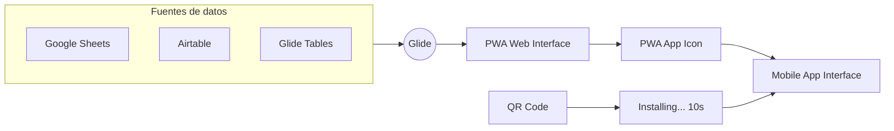
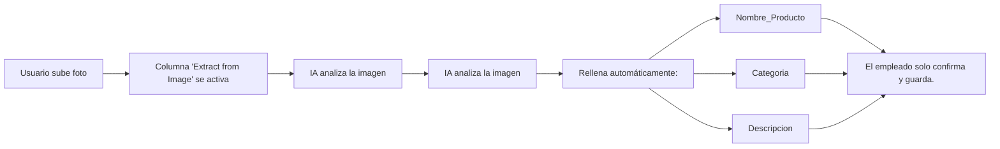

# Documento: GLIDE.pdf

## Fuente

Parseado con LlamaCloud y almacenado para recuperación RAG.

## Markdown

# GLIDE

## De una hoja de cálculo a una App móvil en minutos

Módulo: Desarrollo Avanzado de Sistemas Multiagente

Instructor: Rubén Juárez Cádiz

---

# ¿Qué aprenderemos hoy?

1.  El poder de los datos que ya tienes
2.  ¿Qué es Glide y por qué es diferente?
3.  Arquitectura Data Driven: la app refleja tus tablas
4.  Componentes y Layouts: listas, formularios y acciones
5.  Columnas Calculadas y de IA: el superpoder de Glide
6.  Glide AI: IA nativa en la base de datos
7.  Caso práctico: App de Inventario Inteligente
8.  Configuración del Google Sheet y la interfaz
9.  Acción de IA: Image to Text con visión artificial
10.  Entregable y criterios de evaluación
11.  Próximos pasos y recursos

---

# Las empresas ya tienen sus datos en Excel. Glide los convierte en apps al instante.

## El Poder de los Datos que Ya Tienes

* **Key Points:**

- **El problema del dato atrapado:** Millones de empresas operan sobre hojas de cálculo. Datos valiosos, pero atrapados en un formato de ordenador, no en el móvil.

- **El caso de uso perfecto:** Conectar datos de agentes de IA con una interfaz móvil accesible sin equipo frontend.

**Google Sheet**
(Datos)

**Glide**
(Conversión)

**Mobile App**
(Acceso)

### El Time-to-Value más rápido del mercado:

**Desarrollo nativo: 3-6 meses**
(Requiere código experto)

**Flutter / Ionic: 1-3 meses**
(Requiere código intermedio)

**Bubble: 1-4 semanas**
(No-Code complejo)

**Glide: 30-60 minutos**
(No-Code mínimo)

---

# Glide convierte cualquier Google Sheet o tabla en una app web progresiva (PWA) una instalable en el móvil
## ¿Qué es Glide?

**¿Qué es Glide?**: Plataforma No-Code que genera PWA desde fuentes de datos estructuradas.

**¿Qué es una PWA?**: Web que se comporta como app nativa (instalable, offline, cámara, GPS). Sin App Store.

----

**Fuentes de datos:**

Google Sheets

Airtable

Glide Tables

Cámara

GPS

Offline

Sin App Store

----

<!-- layout: page_4_image_9_v2.jpg -->

**La ventaja clave:**
El usuario escanea un QR, instala en 10s y accede a datos en tiempo real.

---

# En Glide, la estructura de la app es un reflejo directo de tus tablas de datos
## Arquitectura Data Driven

### El principio fundamental
Cada tabla es una "**colección**". Cada fila es un **elemento**.
Cada columna es un **campo**.

### Ejemplo práctico
* Tabla "**Usuarios**" -> Lista de usuarios con foto y nombre
* Tabla "**Productos**" -> Catálogo con imagen, precio y stock
* Tabla "**Tareas**" -> Lista de tareas con estado y asignado

### El flujo de diseño en Glide

1. **Conectar fuente de datos** (Google Sheet) 
2. **Glide genera automáticamente una app básica** 
3. **Personalizar layouts:** Lista, Detalle, Formulario 
4. **Añadir componentes:** Botones, Imágenes, Badges 
5. **Configurar acciones:** Enviar email, Añadir fila, Llamar a API 
6. **Publicar y compartir por QR** 

---

# Los componentes pre-construidos de Glide permiten crear interfaces profesionales sin diseñar desde cero

## Componentes y Layouts

### Los layouts principales

*    **Lista**: Mostrar colecciones (Catálogo de productos)

*    **Detalle**: Ver información completa (Ficha de cliente)

*    **Formulario**: Capturar datos (Alta de nuevo producto)

*    **Mapa**: Visualizar ubicaciones (Rutas de reparto)

*    **Calendario**: Gestionar eventos (Agenda de tareas)

### Los componentes más útiles

*    **Imagen**: Muestra fotos desde URLs o archivos

*    **Badge**: Etiquetas de estado con colores

*    **Botón de acción**: Ejecuta una acción al pulsarlo

*    **Formulario inline**: Edición directa

*    **Gráfico**: Visualización de datos numéricos

> **Responsive automático**: Glide adapta automáticamente el layout para móvil, tablet y desktop.

---

# Las Columnas de IA son el superpoder de Glide: procesan datos automáticamente sin código

## Columnas Calculadas y de IA

### ¿Qué son las Columnas Calculadas?

Columnas especiales que no almacenan datos estáticos, sino que calculan o procesan información en tiempo real. Equivalente a fórmulas de Excel, pero con IA.

### Las Columnas de IA más importantes:

*  **Extract from Image**: Extrae texto de una foto (Leer etiquetas)
*  **Generate Text**: Genera texto con un LLM (Crear descripciones)
*  **Classify**: Clasifica texto en categorías (Categorizar tickets)
*  **Translate**: Traduce texto a otro idioma (App multilingüe)
*  **Generate Audio**: Convierte texto en voz (Audiolibros)

### La magia del flujo

Instructor: Rubén Juárez Cádiz

---

# Glide AI integra modelos de visión e idioma directamente en las columnas de datos, sin APIs ni código

Glide AI: IA Nativa en la Base de Datos

## ¿Qué es Glide AI?

Capa de IA nativa que añade procesamiento de lenguaje e imagen directamente en la estructura de datos.

**Visión Artificial (Image to Text)**

Analiza imágenes y extrae información estructurada (nombres, etiquetas).

**Generación de Texto (LLM integrado)**

Genera descripciones o resúmenes basados en datos de la fila.

**Generación de Audio (Text to Speech)**

Convierte texto en voz para apps de formación o guías.

### El diferenciador clave

A diferencia de integrar OpenAI manualmente, Glide AI no requiere código. Se configura visualmente en 3 clics.

---

# Una app móvil que reconoce productos con la cámara y rellena el inventario automáticamente

## Caso Práctico: App de Inventario Inteligente

**El reto:**

Crear una app móvil para el personal de almacén donde no tengan que teclear los datos de los nuevos productos. Solo fotografiar y confirmar.

**Paso 1: Configurar el Google Sheet**

* Columnas: Foto | Nombre_Producto | Categoria | Stock | Descripcion_IA

**Paso 2: Crear la interfaz en Glide**

* Pantalla principal: Lista de productos con foto y stock

* Botón flotante: "Añadir producto" -> Abre formulario con cámara

* Formulario: Campo de foto (cámara) + campo Stock (manual)

**Paso 3: Configurar la Acción de IA**

* Columna "Nombre_Producto" (Extract from Image): Fuente -> Foto

* Columna "Categoria" (Classify): Fuente -> Nombre_Producto

**Producto Reconocido:**
Caja Electrónica

**Categoría:**
Electrónica

**Stock Sugerido:**
1

Instructor: Rubén Juárez Cádiz

---

# El entregable es una PWA instalable en cualquier móvil mediante un código QR, sin App Store

## El Resultado: PWA Instalable por QR

### El flujo de despliegue de Glide

1. Publicar la app en Glide (1 clic)

2. Glide genera una URL única y un código QR

3. El empleado escanea el QR con su móvil

4. El navegador pregunta: "¿Instalar esta app?"

5. La app aparece en el escritorio del móvil como una app nativa

6. Acceso instantáneo, sin App Store, sin descarga

### El impacto real

**Antes**
5-10 minutos por producto (buscar referencia, teclear datos, verificar)

❌ **Reducción de errores**
Eliminación del error humano en el tecleo de datos

**Después**
30 segundos por producto (fotografiar, confirmar, guardar)

✅ **Reducción de errores**
Eliminación del error humano en el tecleo de datos

---

# Entregable y Criterios

Tu misión: Una app móvil con IA que reconoce productos y actualiza el inventario automáticamente

## Criterios de Evaluación

<table>
  <thead>
    <tr>
        <th>Criterio</th>
        <th>Porcentaje</th>
    </tr>
  </thead>
  <tbody>
    <tr>
        <td>Fuente de datos: Google Sheet con columnas correctas</td>
<td>15%</td>
    </tr>
<tr>
        <td>Interfaz Glide: Lista, formulario y pantalla de detalle</td>
<td>25%</td>
    </tr>
<tr>
        <td>Columna de IA: Extract from Image configurada y funcional</td>
<td>30%</td>
    </tr>
<tr>
        <td>PWA publicada: App accesible por URL y QR</td>
<td>20%</td>
    </tr>
<tr>
        <td>Documentación: Capturas del proceso y del resultado</td>
<td>10%</td>
    </tr>
  </tbody>
</table>

## Entregables Requeridos

* [ ] URL de la app publicada en Glide (accesible desde móvil)

* [ ] Código QR generado por Glide para instalar la PWA

* [ ] Captura del Google Sheet con datos rellenados automáticamente por la IA

* [ ] Video corto (30s) demostrando el flujo: foto → IA → dato guardado

### Extensión sugerida

Añadir una columna 'Descripcion_IA' que genere automáticamente una descripción de marketing del producto usando la columna 'Generate Text' de Glide AI.

---

# Próximos Pasos y Recursos

Glide es la interfaz de usuario. El siguiente paso es conectarla con los agentes de IA del backend.

## Glide + Make (Integromat)

Automatizar flujos entre la app y otros sistemas (CRM, email, Slack).

## Glide + Webhooks

Conectar la app con los agentes de CrewAI para disparar flujos de IA desde el móvil.

## Glide + Supabase

Escalar la base de datos de Google Sheets a una base de datos PostgreSQL real.

## Recursos recomendados

* Plataforma Glide: glideapps.com (plan gratuito disponible)
* Documentación oficial: docs.glideapps.com
* Repositorio del módulo en el aula virtual

## Texto Plano

GLIDE
    De una hoja de cálculo a una App móvil en minutos
    a Appmóvil
Módulo: Desarrollo Avanzado de Sistemas Multiagente

                           091Y009800010
                           011010001101000
                           010111001000000110111111
    #901010100001000001        040Q1011010101

    Instructor: Rubén Juárez Cádiz

---

    Qué aprenderemos hoy?
           S

& El poder de los datos que ya tienes
     1.
       iQué es Glide y por qué es diferente?
      2.
     3.Arquitectura Data Driven: la app refleja tus tablas
      4.
oll  4. Componentes y Layouts: listas, formularios y acciones
       Columnas Calculadas y de IA: el superpoder de Glide
ull   5.
     6Glide Al: IA nativa en la base de datos
      6.
     7.Caso práctico: App de Inventario Inteligente
      7.
      8. Configuración del Google Sheet y la interfaz
      9. Acción de IA: Image to Text con visión artificial
      10. Entregable y criterios de evaluación
      11. Próximos pasos y recursos

---

Las empresas          tienen sus
                  ya tienen
datos en Excel. Glide los                                       El Time-to-Value más
 convierte en apps al instante.                                 rápido del mercado:
                  que     Tienes                                Desarrollo nativo: 3-6 meses
El Poder de los Datos que Ya
 Key Points:                                                     (Requiere código experto)
   problema del dato atrapado: Millones de empresas operan
  El problema
   hojasde        Datos                                         Flutter / lonic: 1-3 meses
   sobre hojas de cálculo. Datos valiosos, pero atrapados en un
                      móvil.                                     (Requiere código intermedio)
   formato de ordenador, no en el móvil.
  - El caso de uso perfecto: Conectar datos de agentes de IA con
                      equipo
   una interfaz móvil accesible sin equipo frontend.
                                                                 Bubble: 1-4semanas
                                                                 (No-Code complejo)

                                                                Glide: 30-60minutos
                                                                (No-Code mínimo)
                                                                 (No-Code
  Google Sheet    Glide        Mobile App
   (Datos)        (Conversión)        (Acceso)

---

     Google
Glide convierte cualquier Google
                                                 Sheet o
                                                 Otabla en una
appwebprogresiva (PWA) una instalable en el móvil
                                           iQué
     Qué es Glide?
iQué es Glide?: Plataforma No-Code que genera    iQué es una PWA?: Web que se comporta como app
PWAdesde       dedatos                           nativa (instalable, offline, cámara, GPS). Sin App Store.
desde fuentes de datos estructuradas.

Fuentes
Fuentes de datos: M
            Google Sheets Airtable Glide Tables  Cámara  GPS Offline Sin App Store

 La ventaja clave:
 El usuario escanea un QR, instala en PKL    Eill
 10s y accede a datos en tiempo real. D.     Installing..
     10s

---

   Glide,     estructura                                          es un reflejo
En Glide, la                                               a de laapp                            reflejo
                                                           tablas
    directo de tus tablas de datos
    Arquitectura Data Driven
                                                                 flujo de diseño en Glide
                                                               El f
    El principio fundamental                                   El flujo
Cada tabla es una "colección". Cada fila es un elemento.         1. Conectar fuente de datos
    Cada columna es un campo.                                    (Google Sheet)                        H

            Tabla                                                2. Glide genera automáticamente
Columna A Columna B Columna C                                    una app básica

                                                                 3. Personalizar layouts:
                                                                 Lista, Detalle, Formulario

    Elemento 5                                                   4. Añadir componentes:
                                                                 Botones, Imágenes, Badges
Ejemplo práctico                                                 5. Configurar acciones:
Tabla "Usuarios" -> Lista de usuarios con foto y nombre          Enviar email, Añadir fila, Llamar a API
Tabla "Productos" -> Catálogo con imagen, precio y stock
    >
"Tareas                                                          6. Publicar y compartir por QR
Tabla "Tareas" -> Lista de tareas con estado y asignado

---

Los componentes
      s pre-construidos de Glide permiten
crear interfaces profesionalessin disenar desde cero
Componentes y Layouts

Los layouts principales        Los componentes más útiles
 Lista: Mostrar            Detalle: Ver           Imagen: Muestra fotos desde URLs o archivos
  colecciones              información
  (Catálogo de             completa               Badge: Etiquetas de estado con colores
  productos)               (Ficha de cliente)
                                                  Botón de acción: Ejecuta una acción al pulsarlo
  Formulario:              Mapa:
  Capturar datos           Visualizar             Formulario inline: Edición directa
  (Alta de nuevo           ubicaciones
  producto)                (Rutas de reparto)     Gráfico: Visualización de datos numéricos

  Calendario:
 Gestionar                                        Responsive automático: Glide adapta
  eventos                                         automáticamente el layout para móvil,
  (Agenda de tareas)                              tablet y desktop.

---

Las Columnas de IA son el superpoder de Glide:
procesan datos automáticamente sin código

                         Columnas Calculadas y de IA
                                              yde IA

 Qué son las Columnas Calculadas?                                  La magia del flujo
 Columnas especiales que no almacenan datos estáticos, sino
 que calculan o procesan información en tiempo real.
 Equivalente a fórmulas de Excel, pero con IA.                     Usuario sube  Columna "Extract  IA analiza la imagen
Las Columnas de IA más importantes:                                 foto      from Image" se activa
  Extract from Image: Extrae texto de una foto (Leer etiquetas)
                                                                        Nombre_Producto
  Generate Text: Genera texto con un LLM (Crear descripciones)
  Classify: Clasifica texto en categorías (Categorizar tickets)         Categoria
  Translate: Traduce texto a otro idioma (App multilingüe)          IA analiza     Rellena                    El empleado
                                                                    la imagen  automáticamente: Descripcion  solo confirma
  Generate Audio: Convierte texto en voz (Audiolibros)                                                         y guarda.
  Instructor: Rubén Juárez Cádiz

---

 Glide Al integra modelos de visión e idioma directamente
en las columnas de datos, sin APls ni código
 Glide Al: IA Nativa en la Base de Datos

iQué
 Qué es Glide Al?
Capa de IA nativa que añade procesamiento de lenguaje e imagen directamente en la estructura de datos.

 Visión Artificial            Generación de Texto         Generación de Audio
     Text)                      (LLM integrado)    (Text to
 (Image to                                                  (Text to Speech)
 Analiza imágenes y extrae   Genera descripciones 0   Convierte texto en voz para
 información estructurada  resúmenes basados en datos  apps de formación o guías.
 (nombres,
 (nombres, etiquetas).            de la fila.

                        clave
       El diferenciador clave
       A diferencia de integrar OpenAl manualmente, Glide Al no requiere
     código. Se configura    3 clics.
                  código. Se configura visualmente en 3 clics.

---

Una app móvil que reconoce productos con la
      app
cámara y rellena el inventario automáticamente
            y
            App     InventarioInteligente
Caso Práctico: App de

      El reto:
      Crear una app móvil para el personal de almacén donde no tengan que
            Solo fotografiar y confirmar.                                       Producto Reconocido:
      teclear los datos de los nuevos productos. Solo fotografiar y confirmar.

      Paso 1: Configurar el Google Sheet                                        Caja Electrónica
      Columnas: Foto | Nombre_Producto | Categoria | Stock | Descripcion_IA     Categoría:
                                                                                Electrónica
      Paso 2: Crear la interfaz en Glide
        Pantalla principal: Lista de productos con foto y stock                 Stock Sugerido:
       Botón flotante: "Añadir producto" -> Abre formulario con cámara          1
       Formulario: Campo de foto (cámara) + campo Stock (manual)

CAI   Paso 3: Configurar la Acción de IA
        Columna "Nombre_Producto" (Extract from Image): Fuente -> Foto
        Columna
      Columna "Categoria" (Classify): Fuente -> Nombre_Producto

            Instructor: Rubén Juárez Cádiz

---

El entregable es una PWA instalable en cualquier
móvil mediante un código QR, sin App Store
El Resultado: PWA
EI Resultado: PWA Instalable por QR

 El flujo de despliegue de Glide                 El impacto real
2 Publicar la app en Glide (1 clic)    Glide

 8O2 Glide genera una URL única y
     un código QR

 o0   El empleado escanea el QR             Antes                Después
      con su móvil                          5-10 minutos por     3C reyurdos por

     4 El navegador pregunta:               producto (buscar      producto
      iInstalar esta app?"                  referencia, tecleaa   (fotografiar,
                                            datos vernificar)     confirmar, guardar)
     5 La app aparece en el escritorio
      del móvil como una app nativa          Reducción de         Reducción de
      Acceso instantáneo, sin App            errores              errores
                                             Eliminación del      Eliminación del
      Store, sin descarga        COOO        error humano en el   error humano en el
                                             tecleo de datos      tecleo de datos

---

                                                                            Entregable y Criterios
                                       Tu misión: Una app móvil con IA que reconoce productos y actualiza el inventario automáticamente

Criterios de Evaluación        Entregables Requeridos

   e de datos: Google        15%            URL de la app publicada en Glide (accesible desde
   Fuente
  Sheet con columnas correctas             móvil)

       Glide: Lista,                25%
   Interfaz                                 Código QR generado por Glide para instalar la PWA
   formulario y pantalla de detalle        Captura
                                            Captura del Google Sheet con datos rellenados
                                            automáticamente por la IA
       Extract from                 30%
   Columna de IA:                               por la IA
  Image configurada y funcional             Video corto (30s) demostrando el flujo: foto → IA →
                                           dato guardado
DO
OS PWA publicada: App               20%
   accesible por URL y QR                 Extensión sugerida

  Documentación: Capturas           10%   Añadir una columna 'Descripcion_IA' que genere
   del proceso y del resultado            automáticamente una descripción de marketing del
       producto usando la columna 'Generate Text' de Glide Al.

---

    Próximos Pasos y Recursos
Glide es la interfaz de usuario. El siguiente paso es conectarla con los agentes de IA del backend.

    IN Glide + Make (Integromat)                                        66
                          Automatizar flujos entre la app y otros
                          sistemas (CRM, email, Slack).         101010   La IA más poderosa es

                         Glide + Webhooks                                inútil si el usuario final
                         Conectar la app con los agentes de CrewAl      no puede acceder a ella.
                                                                         Glide cierra esa brecha:
                          para disparar flujos de IA desde el móvil.    Glide

Glide                     Glide + Supabase                        1000   pone la inteligencia de
                                                                         tus agentes en el bolsillo
    PostgreSQL            Escalar la base de datos de Google Sheets      de cualquier persona, sin
                         a una base de datos PostgreSQL real.     10     necesidad de que sepa

Recursos recomendados                                                    programar.
Plataforma Glide: glideapps.com (plan gratuito disponible)               — Rubén Juárez Cádiz.
Documentación oficial: docs.glideapps.com
Repositorio del módulo en el aula virtual