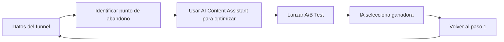

# Documento: HUBSPOT_AI.pdf

## Fuente

Parseado con LlamaCloud y almacenado para recuperación RAG.

## Markdown

# HUBSPOT AI
## El cerebro del CRM y la automatización inteligente

**Module**: Desarrollo Avanzado de Sistemas Multiagente

**Instructor**: Rubén Juárez Cádiz

---

# ¿Qué aprenderemos hoy?

1. El problema del contenido huérfano

2. IA + First-Party Data: la ventaja de HubSpot

3. De la campaña a la conversión

4. ChatSpot: el asistente conversacional del CRM

5. AI Content Assistant: redacción integrada

6. Predictive Lead Scoring: quién está listo para comprar

7. Workflows y automatización inteligente

8. Caso práctico: Secuencia de Nurturing Auto-Optimizada

9. El embudo completo: Landing Page + Emails + A/B Testing

10. Resultados y métricas del funnel

11. Entregable y criterios de evaluación

12. Próximos pasos y recursos

---

# Generar contenido con IA sin un CRM que lo distribuya y mida es como imprimir folletos y guardarlos en un cajón: no genera leads ni ventas

## El Problema del Contenido Huérfano

### El problema del contenido huérfano:

* Se genera el post de LinkedIn con ChatGPT. ✅
* Se diseña el anuncio con Canva AI. ✅
* Se publica. ✅

* ¿Quién hizo clic? ❓
* ¿Quién descargó el Whitepaper? ❓
* ¿Quién abrió el email? ❓
* ¿Quién está listo para comprar? ❓

**Sin un CRM:** nadie lo sabe. El contenido muere sin conversión.

### El gap entre Marketing y Ventas:

<table>
  <thead>
    <tr>
        <th> </th>
        <th>Sin HubSpot</th>
        <th>Con HubSpot AI</th>
    </tr>
  </thead>
  <tbody>
    <tr>
        <td>Seguimiento de leads:</td>
<td>Manual, en Excel</td>
<td>Automático, en tiempo real</td>
    </tr>
<tr>
        <td>Calificación de leads:</td>
<td>Subjetiva</td>
<td>Predictiva (Lead Score)</td>
    </tr>
<tr>
        <td>Personalización de emails:</td>
<td>Genérica</td>
<td>Basada en comportamiento</td>
    </tr>
<tr>
        <td>Alineación Marketing-Ventas:</td>
<td>Reuniones semanales</td>
<td>Dashboard compartido</td>
    </tr>
  </tbody>
</table>

>  **La solución:** HubSpot AI conecta el contenido generado con IA con los datos de comportamiento de los clientes para crear un sistema de conversión inteligente y automatizado.

---

# La ventaja de HubSpot AI sobre ChatGPT es que no trabaja con datos genéricos: trabaja con el comportamiento real de tus clientes

## IA + First-Party Data

*   **First-Party Data:** El activo más valioso:
*   Datos recopilados directamente de clientes: visitas web, aperturas de email, clics, formularios, llamadas, compras.

**La diferencia clave:**

ChatGPT escribe un email genérico.

HubSpot AI escribe un email personalizado para Juan Pérez, sabiendo que visitó la página de precios ayer y descargó el Whitepaper hace 2 semanas.

## ¿Qué sabe HubSpot AI de cada contacto?

**Páginas visitadas:** "Visitó la página de precios 3 veces"

**Emails abiertos:** "Abre emails los martes a las 10:00h"

**Contenido descargado:** "Descargó el Whitepaper de IA"

**Historial:** "Asistió al webinar de octubre"

**Ciclo de vida:** "Lead -> MQL -> SQL -> Cliente"

---

# **ChatSpot** convierte el CRM en una conversación: cualquier miembro del equipo puede obtener datos, crear contactos y lanzar campañas con lenguaje natural

ChatSpot

## ¿Qué es ChatSpot?

Un asistente de IA conversacional integrado en HubSpot que permite interactuar con el CRM usando lenguaje natural, sin necesidad de navegar por menús o conocer la interfaz.

> **El impacto en el equipo de ventas:** Un comercial puede preparar su jornada completa en 5 minutos usando solo ChatSpot, sin tocar el teclado para navegar por el CRM.

### Comandos de ChatSpot en acción:

*   "Dame un informe de las ventas del mes pasado"
    **AI** $\rightarrow$ Genera y muestra el informe

*   "Añade a Juan Pérez de la empresa TechCorp a mi CRM"
    **AI** $\rightarrow$ Crea el contacto automáticamente

*   "¿Cuáles son mis 10 leads más calientes esta semana?"
    **AI** $\rightarrow$ Lista los leads por Lead Score

*   "Redacta un email de seguimiento para los leads que abrieron el email de ayer"
    **AI** $\rightarrow$ Genera el borrador del email

*   "Crea una tarea para llamar a todos los contactos en etapa SQL"
    **AI** $\rightarrow$ Crea las tareas en el CRM

---

# El AI Content Assistant de HubSpot elimina el cambio de contexto: el marketer redacta, optimiza y publica sin salir del CRM

## AI Content Assistant

### ¿Qué es el AI Content Assistant?

Una IA integrada directamente en los editores de HubSpot (emails, blogs, landing pages, redes sociales) que permite redactar, resumir, cambiar el tono o expandir el contenido sin salir de la herramienta.

> **La ventaja del contexto:**
>
> A diferencia de usar ChatGPT por separado, el AI Content Assistant de HubSpot tiene acceso al contexto del contacto, la campaña y el historial, lo que permite generar contenido mucho más personalizado y relevante.

## Capacidades del AI Content Assistant:

<table>
  <thead>
    <tr>
        <th>Redactar Genera contenido desde cero</th>
        <th>Resumir Condensa textos largos</th>
        <th>Cambiar tono Adapta el registro</th>
    </tr>
  </thead>
  <tbody>
    <tr>
        <td>Expandir Amplía un borrador</td>
<td>Traducir Traduce el contenido</td>
<td>Optimizar SEO Mejora para buscadores</td>
    </tr>
  </tbody>
</table>

---

# El Predictive Lead Scoring de HubSpot elimina la subjetividad del equipo de ventas: la IA decide qué lead merece una llamada hoy y cuál necesita más nurturing

Predictive Lead Scoring

**CHALLENGE**: EL MODELO MANUAL ESTÁ DESACTUALIZADO

**¿Qué es el Lead Scoring?** Un sistema que asigna una puntuación numérica a cada contacto en función de su perfil y comportamiento, para priorizar los esfuerzos del equipo de ventas.

**SOLUTION**: LA IA ANALIZA MILES DE SEÑALES

### Lead Scoring Manual vs. Predictivo

<table>
  <thead>
    <tr>
        <th> </th>
        <th>MANUAL</th>
        <th>PREDICTIVO</th>
    </tr>
  </thead>
  <tbody>
    <tr>
        <td>Criterios</td>
<td>Definidos por el equipo</td>
<td>Aprendidos por la IA</td>
    </tr>
<tr>
        <td>Actualización</td>
<td>Periódica</td>
<td>Tiempo real</td>
    </tr>
<tr>
        <td>Variables</td>
<td>5-10 criterios</td>
<td>Miles de señales</td>
    </tr>
<tr>
        <td>Precisión</td>
<td>Media</td>
<td>Alta</td>
    </tr>
<tr>
        <td>Mantenimiento</td>
<td>Alto</td>
<td>Bajo</td>
    </tr>
  </tbody>
</table>

### Las señales que analiza la IA

<!-- layout: wrbk page_7_image_1_v2.jpg -->

**Señales de interés**: Visitas a precios, descargas, aperturas.

**Señales de urgencia**: Frecuencia, tiempo en web.

**Señales de ajuste**: Tamaño de empresa, sector, cargo.

**Señales negativas**: Inactividad, cancelación.

> 
> **El resultado práctico**: El equipo de ventas llega al lunes con una lista ordenada de los 10 leads más calientes, con el contexto completo de cada uno, listos para llamar.

Module: Desarrollo Avanzado de Sistemas Multiagente | Instructor: Rubén Juárez Cádiz

---

# Un embudo de ventas completo y **automatizado**, generado con IA dentro del CRM, que capta leads, los nutre y los cualifica sin intervención humana

## Caso Práctico: Nurturing Auto-Optimizado

### El reto:

Crear una Landing Page y una secuencia de correos automáticos para los usuarios que descargaron el Whitepaper, todo dentro del CRM de HubSpot.

> **La integración con el módulo anterior:**
> El flujo conecta directamente con las creatividades de Canva AI y los copys de Prompt Engineering generados en las sesiones anteriores. Todo el contenido generado con IA ahora tiene un destino y un propósito dentro del funnel.

<table>
  <thead>
    <tr>
        <th>Etapa</th>
        <th>Descripción</th>
        <th>Herramienta/Acción</th>
    </tr>
  </thead>
  <tbody>
    <tr>
        <td>[TRÁFICO]</td>
<td>Anuncio de Facebook Ads</td>
<td>(Canva AI)</td>
    </tr>
<tr>
        <td>[CAPTACIÓN]</td>
<td>Landing Page</td>
<td>(HubSpot AI Content Assistant)</td>
    </tr>
<tr>
        <td>[CONVERSIÓN]</td>
<td>Formulario de descarga del Whitepaper</td>
<td> </td>
    </tr>
<tr>
        <td>[NURTURING]</td>
<td>Secuencia de 3 emails</td>
<td>(AI Email Writer)</td>
    </tr>
<tr>
        <td>[CUALIFICACIÓN]</td>
<td>Predictive Lead Scoring</td>
<td> </td>
    </tr>
<tr>
        <td>[VENTA]</td>
<td>Alerta al equipo de ventas:</td>
<td>Lead caliente, llamar hoy</td>
    </tr>
  </tbody>
</table>

Module: Desarrollo Avanzado de Sistemas Multiagente
Instructor: Rubén Juárez Cádiz

---

# La combinación de Landing Page + Secuencia de Emails + A/B Testing adaptativo crea un sistema de conversión que mejora solo con el tiempo

## El Embudo: Landing Page + Emails + A/B Testing

### Paso 1: Landing Page con IA

> **Prompt al AI Content Assistant:**
> "Crea una landing page para la descarga de nuestro Whitepaper 'IA en la Gestión del Talento. Incluye: headline impactante, 3 bullets con los beneficios clave, formulario con 3 campos (nombre, email, empresa) y un CTA de descarga."

### Paso 2: Secuencia de 3 emails

*   **Inmediato**: Tu Whitepaper está aquí + Bienvenida
*   **Día 3**: El insight más importante del Whitepaper
*   **Día 7**: ¿Listo para implementarlo en tu empresa?

### Paso 3: A/B Testing Adaptativo

HubSpot AI prueba automáticamente 2 versiones del asunto del email. Tras las primeras horas, detecta cuál tiene mayor tasa de apertura y envía automáticamente la versión ganadora al 90% restante de la lista.

---

# Un funnel automatizado con HubSpot AI no solo genera leads: genera datos que permiten optimizar continuamente la tasa de conversión

## Resultados y Métricas del Funnel

### Las métricas clave del funnel:

<table>
  <tbody>
    <tr>
        <td>Métrica</td>
<td>Descripción</td>
<td>Benchmark</td>
<td>Valor Actual</td>
    </tr>
<tr>
        <td>Tasa de conversión LP</td>
<td>Visitantes que rellenan el formulario</td>
<td>&gt;15%</td>
<td>18%</td>
    </tr>
<tr>
        <td>Tasa de apertura email</td>
<td>Contactos que abren el email</td>
<td>&gt;25%</td>
<td>30%</td>
    </tr>
<tr>
        <td>Tasa de clic (CTR)</td>
<td>Contactos que hacen clic en el CTA</td>
<td>&gt;5%</td>
<td>8%</td>
    </tr>
<tr>
        <td>Lead Score promedio</td>
<td>Puntuación media de los leads captados</td>
<td>&gt;50/100</td>
<td>65/100</td>
    </tr>
<tr>
        <td>MQL Rate</td>
<td>Leads que alcanzan el umbral de cualificación</td>
<td>&gt;20%</td>
<td>22%</td>
    </tr>
  </tbody>
</table>

### El ciclo de mejora continua:

### El ROI del funnel automatizado:

Un funnel bien configurado en HubSpot trabaja 24/7 sin intervención humana. Cada lead que entra es automáticamente nurturado, cualificado y entregado al equipo de ventas en el momento óptimo.

---

# Entregable y Criterios

Tu misión: Construir un mini-funnel de captación y nurturing en HubSpot, con IA integrada en cada etapa.

## Criterios de Evaluación | Entregables Requeridos

*   **Landing Page (25%):** 25%
    Creada con AI Content Assistant, con formulario
    [x] 1. Captura de la Landing Page publicada en HubSpot

*   **Workflow (20%):** 20%
    Automatización configurada (trigger + secuencia)
    [x] 2. Captura del Workflow configurado (diagrama del flujo)

*   **Secuencia de emails (25%):** 25%
    3 emails redactados con AI Email Writer
    [x] 3. Los 3 emails de la secuencia (en el editor de HubSpot)

*   **A/B Testing (15%):** 15%
    Al menos 1 prueba A/B configurada en el asunto
    [x] 4. Captura de la configuración del A/B Test

*   **Lead Scoring (15%):** 15%
    Criterios de puntuación definidos en el CRM
    [x] 5. Captura del dashboard de métricas del funnel

### Extensión Sugerida
Integrar HubSpot con Make para enviar notificación a Slack al equipo de ventas cuando un lead alcance un Lead Score de 80+. 

---

# Próximos Pasos y Recursos

HubSpot AI es el sistema nervioso del marketing digital; el siguiente paso es conectarlo con los agentes de IA del backend para crear un sistema de ventas completamente autónomo.

## Próximas herramientas del módulo

<!-- layout: ohgy page_12_image_4_v2.jpg page_12_image_5_v2.jpg xczw wybu rcte luvy shxm jsyi lzip -->

### HubSpot + Make
Automatizar acciones en el CRM desde eventos externos.

### HubSpot + LangChain
Crear un agente de IA que responda automáticamente a los leads.

### HubSpot + ChatGPT API
Personalizar los emails de nurturing en tiempo real.

> El CRM con IA no es una herramienta de marketing. Es el sistema nervioso central de la empresa. Cuando el contenido, los datos y la automatización convergen en un solo sistema inteligente, el marketing deja de ser un coste y se convierte en una máquina de crecimiento predecible.
>
> > — Rubén Juárez Cádiz

## Recursos recomendados

*  HubSpot Academy: academy.hubspot.com (certificaciones gratuitas)
*  HubSpot Free CRM: hubspot.com/products/crm (plan gratuito disponible)
*  Repositorio del módulo en el aula virtual.

## Texto Plano

HUBSPOT AI
El cerebro del CRM y la automatización inteligente
y

CRM

Module: Desarrollo Avanzado de Sistemas Multiagente
Instructor: Rubén Juárez Cádiz

---

       Qué aprenderemos hoy?
                                                   S

     1. El problema del contenido                  7. Workflows y automatización
     huérfano                                      inteligente
    2. IA + First-Party Data: la ventaja           8. Caso práctico: Secuencia de
    de HubSpot                              000    Nurturing Auto-Optimizada
A:  3. De la campaña a la conversión               9. El embudo completo: Landing
     4. ChatSpot: el asistente                     Page + Emails + A/B Testing
     4.
    conversacional del CRM                  D0
                                            0000   10. Resultados y métricas del funnel
     5. Al Content Assistant: redacción     m      11. Entregable y criterios de
     integrada                                     evaluación
    6. Predictive Lead Scoring: quién              12. Próximos pasos y recursos
     está listo para comprar

---

Generar contenido con IA sin un CRM que lo distribuya y mida es como
imprimir folletos y guardarlos en un cajón: no genera leads ni ventas
El Problema del Contenido Huérfano

El problema del contenido huérfano:        El gap entre Marketing y Ventas:

 Se genera el post de LinkedIn con ChatGPT.                                 Sin HubSpot     Con HubSpot Al
 Se diseña el anuncio con Canva Al.                  Seguimiento de         Manual,,en Excel   Automático, en
                                                     leads:                                    tiempo real
                                                                                                tiempo
 Se publica.                                         Calificación de leads:  Subjetiva          Predictiva
                                                                                               (Lead Score)
                                                                             Genérica           comportamiento
 iQuién hizo clic?                                   Personalización de                        Basada en
                                                     emails:
 iQuién descargó el Whitepaper?                      Alineación              Reuniones          Dashboard
 iQuién abrió el email?                              Marketing-Ventas:       semanales          compartido
     ?
 iQuién está listo para comprar??                              La solución: HubSpot Al conecta el contenido
                                                               generado con IA con los datos de
Sin un CRM: nadie lo sabe. El contenido muere sin              comportamiento de los clientes para crear un
conversión.                                                    sistema de conversión inteligente y automatizado.

---

La ventaja deHubSpotAl sobre                              iQué sabe HubSpot Al
                                                               AI
ChatGPT es queno trabaja con                              de cada contacto?
datos genéricos: trabajacon el
comportamiento real detus clientes                         Páginas visitadas: "Visitó la
IA + First-Party Data                                      página de precios 3 veces"
  First-Party Data: El activo más valioso:                 Emails abiertos: "Abre emails
  Datos recopilados directamente de clientes:              los martes a las 10:00h"
  visitas web, aperturas de email, clics, formularios,     Contenido descargado:
  Illamadas, compras.                                      "Descargó el Whitepaper de IA"

 La diferencia clave:                                      Historial:
 ChatGPT escribe un email genérico.                        "Asistió al webinar de octubre"
 HubSpot Alescribeun emailpersonalizado para               Ciclo de vida:
 Juan Pérez,
  Pérez,sabiendoque visitó la página de precios            "Lead -> MQL -> SQL -> Cliente"
ayer y descargó el Whitepaper hace 2 semanas.

---

ChatSpot convierte el CRM en una conversación: cualquier miembro del equipo
puede obtener datos, crear contactos y lanzar campañas con lenguaje natural
ChatSpot

Qué es ChatSpot?        Comandos de ChatSpot en acción:        Sales Report
Un asistente de IA conversacional         "Dame un informe de las ventas del mes pasado" lll
                                          AI
                                          Al >
                                              > Genera y muestra el informe
                                               y
integrado en HubSpot que permite          "Añade a Juan Pérez de la empresa TechCorp
interactuar con el CRM usando lenguaje         a
                                          a mi CRM"        Juan Pérez
                                           a
natural, sin necesidad de navegar         Al Crea el contacto automáticamente
por menus o conocer la interfaz.           iCuáles son mis 10 leads más calientes esta
                                          semana?"
                                          AI → Lista los leads por Lead Score

 El impacto en el equipo
     de ventas: Un
     ventas:                              "Redacta un email de seguimiento para los
                                          leads que abrieron el email de ayer
 comercialpuede preparar su jornada       Al        ayer"
                                           AI Genera el borrador del email
 completaen 5 minutos
 5     usando
     usando solo
 ChatSpot,sintocarel tecladopara          "Crea una tarea para llamar a todos los
navegar por el CRM.                       contactos en etapa SQL"
                                          Al → Crea las tareas en el CRM

---

El Al Content Assistant de     Capacidades del Al Content Assistant:
 HubSpot elimina el cambio
de contexto: el marketer
 redacta, optimiza y publiza y
       y      y
publica sin salir del CRM                                             Redactar   Resumir          Cambiar tono

 Al Content Assistant                                             Genera contenido Condensa textos Adapta el
       desde cero                                                                largos             registro
 Qué es el Al Content Assistant?        CR
Una IA integrada directamente en los
  Una IA integrada directamente en los editores de HubSpot
  (emails, blogs, landing pages, redes sociales) que permite      K7
  redactar, resumir, cambiar el tono o expandir el contenido sin
  salir de la herramienta.                                        KV

   La ventaja del contexto:                                           Expandir   Traducir     Optimizar SEO
   ChatGPT por separado, el AI Content                               Amplía un   Traduce el       Mejora para
   A diferencia de usar ChatGPT por separado, el Al Content
   Assistant de HubSpot tiene acceso al contexto del contacto,
   la campaña y el historial, lo que permite generar contenido        borrador   contenido         buscadores
   mucho más personalizado y relevante.

---

                        Scoring deHubSpot
 El Predictive Lead                                                              elimina la subjetividad
 delequipo
                   de ventas: la IA decidequé lead merece unaIlamada
               cuál
hoy y
 hoy y cuál necesita más nurturing
 Predictive Lead Scoring

                        EST        SOLUTION: LA IA ANALIZA MILES DE SENALES
 CHALLENGE: EL MODELO MANUAL
                        ESTA DESACTUALIZADO
 Qué es el Lead Scoring? Un sistema que asigna una puntuación
 numérica a cada contacto en función de su perfil y comportamiento,        Las señales que analiza la IA
 para priorizar los esfuerzos del equipo de ventas.
                   Lead Scoring Manual vs. Predictivo                            Señales de interés: Visitas a
                        MANUAL $ PREDICTIVO     0000                             precios, descargas, aperturas.
   Criterios   Definidos por el equipo      Aprendidos por la IA                Señales de urgencia:
   Actualización      Periódica         Tiempo real                             Frecuencia, tiempo en web.
  Variables         5-10 criterios    Miles de señales
  Precisión             Media               Alta                                 Señales de ajuste: Tamaño de
   Mantenimiento         Alto               Bajo                                 empresa, sector, cargo.

               El resultado práctico: El equipo de ventas llega al lunes con       × Señales negativas:
               una lista ordenada de los 10 leads más calientes, con el          Inactividad, cancelación.
               contexto completo de cada uno, listos para Ilamar.

                   Module: Desarrollo Avanzado de Sistemas Multiagente | Instructor: Rubén Juárez Cádiz

---

  Un embudode ventas completo y
       y                                                                           [TRÁFICO]
 automatizado, generado con IA                                                     Anuncio de Facebook Ads
                                                                                   (Canva Al)
 dentrodel CRM, que capta leads,                                 [CAPTACIÓN]
 los nutre y los cualifica sin
       y                                                         Landing Page
                                                                 (HubSpot Al Content Assistant)
 intervención humana
  Caso Práctico: Nurturing                                        [CONVERSIÓN]
       gAuto-Optimizado                                           Formulario de descarga
El reto:                                                          del Whitepaper
   reto:
       Landing                                                         [NURTURING]
  Crear una Landing Page y una secuencia de correos          Secuencia de 3 emails
  automáticos para los usuarios que descargaron el Whitepaper,
 todo dentro del CRM de HubSpot.                                 (AI Email Writer)
                                                                   [CUALIFICACIÓN]
   La integración con el módulo anterior:                          Predictive Lead
                                                                   Scoring
   El flujo conecta directamente con las creatividades de
   Canva Al y los copys de Prompt Engineering generados en
   las sesiones anteriores. Todo el contenido generado con IA      A [VENTA]
   ahora tiene un destino y un propósito dentro del funnel.                        Alerta al equipo de ventas:
                                                                                   "Lead caliente, Ilamar hoy"

  Module: Desarrollo Avanzado de Sistemas Multiagente                  Instructor: Rubén Juárez Cádiz

---

La combinación de Landing Page + Secuencia de Emails + A/B Testing
adaptativo crea un sistema de conversión que mejora solo con el tiempo
El Embudo: Landing Page + Emails + A/B Testing
     Paso 1: Landing Page con IA
 Paso 1:
 Landing Page con IA                           > Prompt al AI Content Assistant:
                                               "Crea una landing page para la descarga de nuestro Whitepaper 'IA en la Gestión
                                               del Talento. Incluye: headline impactante, 3 bullets con los beneficios clave,
                                              formulario con 3 campos (nombre, email, empresa) y un CTA de descarga.

R-8  Paso 2:        Paso 2: Secuencia de 3 emails
     Secuencia de 3 emails     Inmediato       Día 3            Día 7
                               Tu Whitepaper   El insight más   iListo para
                               está aquí +     importante del   implementarlo en
                               Bienvenida      Whitepaper       tu empresa?

Paso 3:        Paso 3: A/B Testing Adaptativo
A/B Testing     X HubSpot Al prueba automáticamente 2 versiones del
Adaptativo     ↑ vs asunto del email. Tras las primeras horas, detecta cuál
    5%          5% tiene mayor tasa de apertura y envía automáticamente
                    la versión ganadora al 90% restante de la lista.      90%

---

Un funnel automatizado con HubSpot Al no solo genera leads: genera
datos que permiten optimizar continuamente la tasa de conversión
Resultados y Métricas del Funnel

Las métricas clave del funnel:                         El ciclo de mejora continua:
Tasa de conversión LP:                                        18%
Visitantes que rellenan el formulario (>15%)       15%        Datos del funnel

Tasa de apertura email:                                       30%    Volver al
Contactos que abren el email (>25%)                    30%            paso 1    Identificar punto
                                                                                   de abandono
Tasa de clic (CTR):
Contactos que hacen clic en el CTA (>5%)     8%                8%        Usar Al Content

Lead Score promedio:                                              IA selecciona
Puntuación media de los leads captados (>50/100)           65/100    ganadora     Assistant para

MQL Rate:                                              65/100        X              optimizar
Leads que alcanzan el umbral de cualificación (>20%)          22%        Lanzar A/B Test
                                                   22%

El ROl del funnel automatizado:
Un funnel bien configurado en HubSpot trabaja 24/7 sin intervención humana. Cada lead que entra es
automáticamente nurturado, cualificado y entregado al equipo de ventas en el momento óptimo.

---

     Entregable y
     y Criterios
Tu misión: Construir un mini-funnel de captación y nurturing en HubSpot, con IA integrada en cada etapa.

 Criterios de Evaluación                                       Entregables Requeridos
 Landing Page (25%):                              25%          1. Captura de la Landing Page publicada en HubSpot
Creada con Al Content Assistant, con formulario

 Workflow (20%):                                  20%          2. Captura del Workflow configurado (diagrama del flujo)
 Automatización configurada (trigger + secuencia)        CRM   3. Los 3 emails de la secuencia (en el editor de HubSpot)

 Secuencia de emails (25%):                       25%
 3 emails redactados con Al Email Writer                       4. Captura de la configuración del A/B Test

A/B Testing (15%):        15%                                  5. Captura del dashboard de métricas del funnel
 Al menos 1 prueba A/B configurada en el asunto

Lead Scoring (15%):                               15%         Extensión Sugerida
 Criterios de puntuación definidos en el CRM        Integrar HubSpot con Make para enviar
                                                              notificación a Slack al equipo de ventas cuando un
                                                               a a|equipo
                                                              lead alcance un Lead Score de 80+.

---

Próximos Pasos y Recursos                                                            KKKKK
 HubSpot Al es el sistema nervioso del marketing digital; el siguiente paso es conectarlo con los agentes de IA del backend
para crear un sistema de ventas completamente autónomo.
 Próximas herramientas del módulo                                               <6

     O                                     HubSpot + Make                       C6
                                           Automatizar acciones en el CRM        EI CRM con IA no es una
                                            desde eventos externos.             herramienta de marketing. Es el

                                            HubSpot + LangChain                 sistema nervioso central de la
                                            Crear un agente de IA que responda   empresa. Cuando el contenido,
                                            automáticamente a los leads.         los datos y la automatización

                                            HubSpot + ChatGPT API               convergen en un solo sistema
                                            Personalizar los emails de          inteligente, el marketing deja
                                           nurturing en tiempo real.            de ser un coste y se convierte
 Recursos recomendados                                                          en una máquina de
 HubSpot Academy: academy.hubspot.com (certificaciones gratuitas)               crecimiento predecible.
 HubSpot Free CRM: hubspot.com/products/crm (plan gratuito disponible)            Rubén Juárez Cádiz
 Repositorio del módulo en el aula virtual.