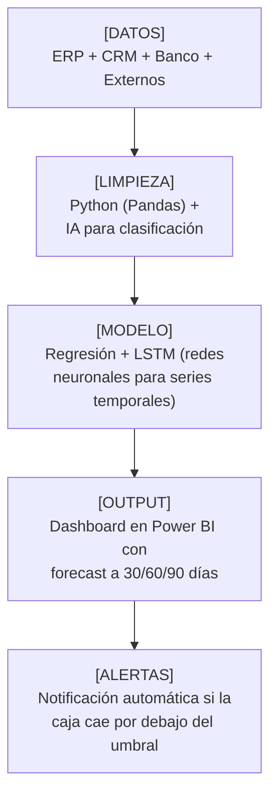
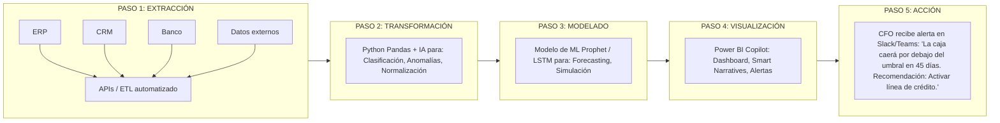

# Documento: IA_EN_FINANZAS_Y_CONTABILIDAD.pdf

## Fuente

Parseado con LlamaCloud y almacenado para recuperación RAG.

## Markdown

# IA EN FINANZAS Y CONTABILIDAD

## De "Cuentafrijoles" a Estrategas Predictivos

### Módulo: Desarrollo Avanzado de Sistemas Multiagente

Instructor: Rubén Juárez Cádiz

---

# ¿Qué aprenderemos hoy?

1. El fin del 'Copy-Paste' en Excel

2. De lo reactivo a lo predictivo

3. Detección de anomalías y fraude

4. Power BI con Copilot: lenguaje natural sobre datos

5. Planful: FP&A con IA

6. Kensho: extracción de datos financieros

7. El nuevo rol del CFO y el analista financiero

8. Caso práctico: Forecasting de Caja con IA

9. El pipeline: de datos a decisión

10. Resultados y métricas de impacto

11. Entregable y criterios de evaluación

12. Próximos pasos y recursos

---

# El 70% del tiempo en finanzas se gasta en recopilar y limpiar datos; la IA libera ese tiempo para el análisis estratégico que realmente genera valor
## El Fin del "Copy-Paste" en Excel

### El problema del trabajo manual en finanzas

*  **Conciliación bancaria manual:** 2-3 días al mes por empresa.
*  **Entrada de datos de facturas:** Errores humanos en el 3-5% de los registros.
*  **Consolidación de presupuestos:** Múltiples versiones de Excel circulando por email.
*  **Reporting mensual:** Semanas de trabajo para producir un dashboard desactualizado.

> ### La transformación del rol
> El analista financiero del futuro no introduce datos en Excel. Interpreta los insights que la IA ha generado, toma decisiones estratégicas y comunica los resultados al equipo directivo.

### El coste real del trabajo manual

<table>
  <thead>
    <tr>
        <th>Proceso</th>
        <th>Manual</th>
        <th>IA</th>
    </tr>
  </thead>
  <tbody>
    <tr>
        <td>Conciliación bancaria</td>
<td>⚠️ 3 días/mes</td>
<td>✅ 2 horas/mes</td>
    </tr>
<tr>
        <td>Clasificación de facturas</td>
<td>⚠️ 1 día/semana</td>
<td>✅ Automático</td>
    </tr>
<tr>
        <td>Cierre mensual</td>
<td>⚠️ 5-7 días</td>
<td>⚡ 1-2 días</td>
    </tr>
<tr>
        <td>Forecasting trimestral</td>
<td>⚠️ 2 semanas</td>
<td>✅ 2 horas</td>
    </tr>
  </tbody>
</table>

---

# La IA transforma las finanzas de una disciplina que mira al pasado a una que anticipa el futuro
## De lo Reactivo a lo Predictivo

### El paradigma tradicional vs. el paradigma IA

**Reactivo**
¿Qué pasó? (Excel, ERP)
$\rightarrow$ Informe pasado

**Descriptivo**
¿Por qué pasó? (Power BI)
$\rightarrow$ Causa raíz

**Predictivo**
¿Qué pasará? (IA + ML)
$\rightarrow$ Forecast a 90 días

**Prescriptivo**
¿Qué debemos hacer? (IA)
$\rightarrow$ Recomendaciones

### El Forecasting predictivo en la práctica analiza:

*   **Datos históricos:** Patrones de cobros y pagos.
*   **Datos externos:** Estacionalidad, tipo de interés, IPC.
*   **Datos de pipeline:** Probabilidad de cierre en CRM.
*   **Datos de comportamiento:** Clientes que pagan tarde.

### El resultado:

> **Predicción de la posición de caja a 90 días con margen de error < 5%, permitiendo decisiones estratégicas anticipadas.**

---

# Los modelos de IA revisan el 100% de las transacciones en milisegundos, detectando fraudes y errores que el ojo humano nunca encontraría

## Detección de Anomalías y Fraude

### El problema del fraude y los errores

*  El fraude interno cuesta el 5% de los ingresos anuales.
*  El 80% de los fraudes son cometidos por empleados con acceso.
*  La auditoría tradicional solo revisa muestras del 5-10%.

### ¿Qué detecta la IA?

<table>
  <tbody>
    <tr>
        <td></td>
<td>Factura duplicada</td>
<td>→ Mismo proveedor e importe</td>
<td>→ Coincidencia de patrón</td>
    </tr>
<tr>
        <td></td>
<td>Fraude en gastos</td>
<td>→ Gastos en fines de semana</td>
<td>→ Anomalía temporal</td>
    </tr>
<tr>
        <td></td>
<td>Proveedor fantasma</td>
<td>→ Nuevo, importe alto, sin historial</td>
<td>→ Outlier estadístico</td>
    </tr>
<tr>
        <td></td>
<td>Error de redondeo</td>
<td>→ Importes terminados en .00</td>
<td>→ Patrón sospechoso</td>
    </tr>
  </tbody>
</table>

### La Ley de Benford

Los números naturales en contabilidad siguen un patrón estadístico predecible. La IA detecta desviaciones de este patrón como señales de manipulación.

<table>
  <thead>
    <tr>
        <th>Category</th>
        <th>Status</th>
    </tr>
  </thead>
  <tbody>
    <tr>
        <td>Normal Distribution</td>
<td>Data</td>
    </tr>
<tr>
        <td>Outliers (Tail)</td>
<td>Anomalos</td>
    </tr>
  </tbody>
</table>

---

# **Power BI con Copilot** convierte cualquier dataset financiero en un interlocutor: el CFO puede hacer preguntas en **lenguaje natural** y obtener análisis en segundos

Power BI con Copilot

## ¿Qué es Power BI Copilot?

La integración de IA generativa (basada en GPT-4) directamente en Power BI, que permite interactuar con los datos usando lenguaje natural y generar informes automáticamente.

> **El impacto en el reporting:** El cierre mensual, que antes requería 5-7 días de trabajo del equipo financiero, se convierte en un proceso de 1-2 días donde la IA genera automáticamente los gráficos, los comentarios narrativos y las alertas sobre desviaciones del presupuesto.

## Capacidades de Power BI Copilot:

### Q&A en lenguaje natural:
[¿Por qué bajaron los márgenes en Q3?]

<table>
  <thead>
    <tr>
        <th>Quarter</th>
        <th>Value</th>
    </tr>
  </thead>
  <tbody>
    <tr>
        <td>Q1</td>
<td>20%</td>
    </tr>
<tr>
        <td>Q2</td>
<td>45%</td>
    </tr>
<tr>
        <td>Q3</td>
<td>30%</td>
    </tr>
  </tbody>
</table>

Los márgenes en Q3 disminuyeron un 15% debido a un aumento en los costos de materias primas y una reducción en las ventas del producto principal en la región norte.

### Smart Narratives:
[Resume el dashboard en 3 puntos clave]

**Generative summary:**
* Las ventas totales aumentaron un 10% respecto al año anterior.
* Los costos operativos se mantuvieron estables.
* Se detectaron oportunidades de crecimiento en el mercado asiático.

### Generación de informes:
[Crea un informe mensual de ventas]

### Detección de tendencias:
[¿Qué productos tienen tendencia negativa?]

<table>
  <thead>
    <tr>
        <th>Producto</th>
        <th>Tendencia</th>
        <th>Variación</th>
    </tr>
  </thead>
  <tbody>
    <tr>
        <td>Producto X</td>
<td></td>
<td>-1.50%</td>
    </tr>
<tr>
        <td>Producto Y</td>
<td></td>
<td>-1.86%</td>
    </tr>
<tr>
        <td>Producto X</td>
<td></td>
<td>-2.52%</td>
    </tr>
<tr>
        <td>Producto Y</td>
<td></td>
<td>-1.60%</td>
    </tr>
  </tbody>
</table>

---

# Planful y Kensho representan los dos extremos de la IA financiera: la planificación interna inteligente y la inteligencia de mercado automatizada

Planful y Kensho

## Planful: FP&A con IA (Finanzas Internas):

* **Pronósticos continuos (Rolling Forecasts):** Actualización automática del presupuesto.

* **Detección de desviaciones:** Alertas en tiempo real.

* **Colaboración:** Plataforma única, sin Excel descentralizados.

* **Escenarios:** Simula el impacto de decisiones.

## Kensho: Inteligencia de Mercado (Entorno Externo):

**Extrae datos estructurados de documentos no estructurados:**

* PDFs de informes anuales
* Transcripciones de earnings calls
* Noticias financieras en tiempo real
* Documentos regulatorios (SEC filings)

### La diferencia clave:

Planful optimiza las finanzas internas. Kensho procesa el entorno externo.

Juntos, representan la visión 360° que necesita un equipo financiero moderno.

---

# Un modelo de Forecasting de Caja con IA puede predecir la posición de tesorería a 90 días con un margen de error inferior al 5%, transformando la gestión financiera

## Caso Práctico: Forecasting de Caja

> **El Reto:**
>
> Construir un modelo de previsión de caja (Cash Flow Forecasting) que integre datos históricos, datos del CRM y factores externos para predecir la posición de tesorería a 90 días.

### Las fuentes de datos del modelo:

**ERP (SAP/Odoo):**
Facturas pendientes de cobro y pago

**CRM (HubSpot):**
Pipeline de ventas y probabilidad de cierre

**Banco:**
Extractos bancarios históricos

**Datos externos:**
IPC, tipo de interés, estacionalidad

<!-- layout: page_8_image_7_v2.jpg -->

---

# El pipeline de IA financiera convierte datos dispersos en múltiples sistemas en una única fuente de verdad que permite tomar decisiones en tiempo real

## El Pipeline: De Datos a Decisión

### [PASO 1: EXTRACCIÓN] | [PASO 2: TRANSFORMACIÓN] | [PASO 3: MODELADO] | [PASO 4: VISUALIZACIÓN] | [PASO 5: ACCIÓN]

<table>
  <thead>
    <tr>
        <th>[PASO 1: EXTRACCIÓN]</th>
        <th>[PASO 2: TRANSFORMACIÓN]</th>
        <th>[PASO 3: MODELADO]</th>
        <th>[PASO 4: VISUALIZACIÓN]</th>
        <th>[PASO 5: ACCIÓN]</th>
    </tr>
  </thead>
  <tbody>
    <tr>
        <td>ERP, CRM, Banco, Datos externos. APIs / ETL automatizado</td>
<td>Python (Pandas) + IA para: Clasificación, Anomalías, Normalización</td>
<td>Modelo de ML (Prophet / LSTM) para: Forecasting, Simulación</td>
<td>Power BI Copilot: Dashboard, Smart Narratives, Alertas</td>
<td>CFO recibe alerta en Slack/Teams: "La caja caerá por debajo del umbral en 45 días. Recomendación: Activar línea de crédito."</td>
    </tr>
  </tbody>
</table>

---

# La IA en finanzas no es un proyecto de tecnología: <mark>es un proyecto de transformación del negocio</mark> que impacta directamente en la rentabilidad

Resultados y Métricas de Impacto

## El impacto medible de la IA en finanzas:

<table>
  <thead>
    <tr>
        <th>Métrica</th>
        <th>Impacto</th>
        <th>Detalle</th>
    </tr>
  </thead>
  <tbody>
    <tr>
        <td>Tiempo de cierre</td>
<td>-60%</td>
<td>(de 7 a 3 días)</td>
    </tr>
<tr>
        <td>Precisión del forecast</td>
<td>-70%</td>
<td>-70% desviación (de 15% a 5%)</td>
    </tr>
<tr>
        <td>Detección de fraude</td>
<td>+90%</td>
<td>transacciones revisadas (de 10% a 100%)</td>
    </tr>
<tr>
        <td>Tiempo en reporting</td>
<td>-75%</td>
<td>(de 40h a 10h)</td>
    </tr>
<tr>
        <td>Coste de errores</td>
<td>-85%</td>
<td>errores en facturas</td>
    </tr>
  </tbody>
</table>

## El ROI de la inversión en IA financiera:

*   Una empresa con **50M€** de facturación que reduce su tasa de error en facturas del 3% al 0.5% ahorra **~1.25M€ anuales**.

*   Un mejor forecasting de caja permite optimizar la gestión de la deuda, reduciendo los costes financieros en un **10-20%**.

## El nuevo perfil del analista financiero:

Ya no es el experto en Excel. Es el experto en interpretar los outputs de la IA, validar los modelos y comunicar los insights al equipo directivo. **El valor humano es la interpretación y la decisión, no la ejecución.**

---

# Entregable y Criterios

**Tu misión:** Construir un mini-modelo de Forecasting de Caja usando Python y visualizarlo en Power BI.

## CRITERIOS DE EVALUACIÓN

<table>
  <thead>
    <tr>
        <th>Criterio</th>
        <th>Peso</th>
    </tr>
  </thead>
  <tbody>
    <tr>
        <td>Extracción de datos</td>
<td>20%</td>
    </tr>
<tr>
        <td>Modelo de forecasting (prophet)</td>
<td>30%</td>
    </tr>
<tr>
        <td>Detección de anomalías</td>
<td>20%</td>
    </tr>
<tr>
        <td>Dashboard Power BI</td>
<td>20%</td>
    </tr>
<tr>
        <td>Smart Narratives</td>
<td>10%</td>
    </tr>
  </tbody>
</table>

## ENTREGABLES REQUERIDOS

1. Notebook de Python con el modelo de forecasting

2. Dataset utilizado (CSV o Excel)

3. Captura del dashboard de Power BI con el forecast

4. Captura del Smart Narrative generado por Copilot

5. Documento de 1 página con los insights clave del modelo

### EXTENSIÓN SUGERIDA
Integrar el modelo con Make para enviar alerta al CFO por Slack.

---

# Próximos Pasos y Recursos

La IA en finanzas es el punto de convergencia de todos los módulos anteriores: datos, automatización y agentes inteligentes trabajando juntos.

*   **Próximas herramientas del módulo:**
    *   **Python + Prophet/LSTM:** Modelos de series temporales para forecasting financiero
    *   **Power BI + Copilot:** Visualización inteligente y narrativas automáticas
    *   **Make + HubSpot:** Integrar el pipeline de ventas con el modelo de forecasting de caja

> "El CFO que entiende de IA no es el que sabe programar modelos. Es el que sabe qué preguntas hacerle a los modelos, cómo interpretar sus respuestas y cómo convertirlas en decisiones que protegen y hacen crecer el negocio. Esa es la diferencia entre un contador y un estratega financiero."
>
> > — Rubén Juárez Cádiz

## Recursos recomendados:

*    **Microsoft Power BI:** powerbi.microsoft.com (versión gratuita disponible)
*    **Prophet (Meta):** facebook.github.io/prophet (librería open-source)
*    **Planful:** planful.com (demo disponible)
*    **Repositorio del módulo en el aula virtual**

## Texto Plano

IA EN FINANZAS Y CONTABILIDAD
     Y

    De "Cuentafrijoles" a Estrategas Predictivos
    a

Módulo: Desarrollo Avanzado de Sistemas Multiagente

              ,578
           351,500

    1018100100    11011101010181
        1100110101
     1110100001010

    Instructor: Rubén Juárez Cádiz

---

0101110n                                                                  366.727
111010010951*     Qué aprenderemos hoy?                                   317.292
035000101110010                                                           750.882
                                                                          207.064  89.73
6481 127901710                                                                        56
00111001110110100   1.   El fin del 'Copy-Paste' en Excel        1,650
0010110610010101   2.    De lo reactivo a lo predictivo                   163,900 G.
                                                                                      46
                   3.    Detección de anomalías y fraude                              55
                   4.    Power Bl con Copilot: lenguaje natural sobre datos          4,5
                   5.    Planful: FP&A con IA                                        172
                   6.    Kensho: extracción de datos financieros
                   7.    El nuevo rol del CFO y el analista financiero    38,2220  2.371
                   8.    Caso práctico: Forecasting de Caja con IA         384815  11.69
                   9.    El pipeline: de datos a decisión
                   10.   Resultados y métricas de impacto
                    11.  Entregable y criterios de evaluación
                    12.  Próximos pasos y recursos

---

El 70% del tiempo en finanzas se gasta en recopilar y limpiar datos; la IA
libera ese tiempo para el análisis estratégico que realmente genera valor
El Fin del "Copy-Paste" en Excel

El problema del trabajo manual en finanzas             El coste real del trabajo manual
 Conciliación bancaria manual: 2-3 días al mes por
  empresa.                                             Proceso      Manual         IA
  Entrada de datos de facturas: Errores humanos en el
  3-5% de los registros.                               Conciliación    A 3 días/mes
  Consolidación de presupuestos: Múltiples versiones   bancaria             2 horas/mes
 de Excel circulando por email.
  Reporting mensual: Semanas de trabajo para           Clasificación de
  producir un dashboard desactualizado.               facturas      ! día/semana   Automático

  La transformación del rol                            Cierre mensual   5-7 días   1-2 días
  El analista financiero del futuroⁿᵒ introduce datos en
                            que la IA ha
Excel. Interpreta los insights
      s que
toma decisiones estratégicas     ha generado,         Forecasting
                            y comunica los
                            y                         trimestral        semanas    2 horas
             resultados al equipo directivo.

---

La IA transforma las
                                finanzas de una disciplina
que mira al pasado a una que anticipa el futuro
                                o a lo Predictivo
                 De lo Reactivo    a

El paradigma tradicional vs. el paradigma IA      El Forecasting predictivo en la práctica analiza:

                                                   Datos históricos: Patrones de cobros y pagos.

                            Prescriptivo           Datos externos: Estacionalidad, tipo de interés, IPC.
                            iQué debemos hacer? (IA
                            -> Recomendaciones     Datos de pipeline: Probabilidad de cierre en CRM.
              Predictivo        Datos de comportamiento: Clientes que pagan tarde.
              Qué pasará? (IA + ML)
                 Forecast a 90 días
4.
   Descriptivo
   Por qué pasó? (Power Bl)                        El resultado:
   > Causa raíz                                     Predicción de laposición de caja a90días con
  Reactivo                                            margen deerror 5%, permitiendodecisiones
  Qué pasó? (Excel, ERP)                                      estratégicasanticipadas.
   Informe pasado

---

 Los modelos de IA revisan el 100% de las transacciones en milisegundos,
detectando fraudes y errores que el ojo humano nunca encontraría
                     Detección de Anomalías y Fraude

El problema del fraude y los errores               Qué detecta la IA?
 El fraude interno cuesta el 5% de los         Factura     Mismo proveedor            Coincidencia
 ingresos anuales.                             duplicada   e importe                  de patrón
 El 80% de los fraudes son cometidos por       Fraude en   Gastos en fines de         Anomalía
 empleados con acceso.                        gastos       semana                     temporal
 La auditoría tradicional solo revisa         Proveedor    Nuevo, importe alto,       Outlier
                                              fantasma     sin historial              estadístico
 muestras del 5-10%.                           Error de    Importes terminados        Patrón
                                              redondeo     en.00                      sospechoso

 o                                           La Ley de Benford                             Data
                                             Los números naturales en contabilidad         Anomalos
                                            siguen un patrón estadístico predecible.
                                            La IA detecta desviaciones de este patrón
                                             como señales de manipulación.        Normal   Anomalas

---

Power Bl con Copilot convierte cualquier dataset financiero
en un interlocutor: el CFO puede hacer preguntas en lenguaje
 natural y obtener análisis en segundos
 Power BI con Copilot
                                                     Capacidades de Power BI Copilot:
  Qué es Power Bl Copilot?                                                                                         Los márgenes en Q3
  La integración de IA generativa (basada en         Q&A en lenguaje natural:                                      disminuyeron un 15%
                                                                                                                   debido a un aumento en
  GPT-4) directamente en Power Bl, que permite        iPor qué bajaron los márgenes en Q3?      20%                los costos de materias
                                                                                                                   primas y una reducción
                                                                                                                   en las ventas del producto
  interactuar con los datos usando lenguaje                                                                        principal en la región
                                                                                                                   norte.
  natural y generar informes automáticamente.        Smart Narratives:                          Generatire summary:
                                                                                                Las ventas totales aumentaron un 10% respecto al
                                                      Resume el dashboard en 3 puntos clave     año anterior
                                                                                                Los costos operativos se mantuvieron estables.
                                                                                                Se detectaron oportunidades de crecimiento en el
   El impacto en el reporting: El cierre mensual,                                               mercado asiático.
   que antes requería 5-7 días de trabajo del         Generación de informes:
    equipo financiero, se convierte en un             Crea un informe mensual de ventas
   proceso de 1-2 días donde la IA genera
    automáticamente los gráficos, los
    comentarios narrativos y las alertas sobre        Detección de tendencias:                    Producto X       -1.60%
    desviaciones del presupuesto.                     Qué productos tienen tendencia negativa?    Producto Y       -1.86%
                                                                                                  Producto X        -252%
                                                                                                  Producto Y       -1.60%

---

Planful y Kensho representan los dos extremos de la IA financiera: la
planificación interna inteligente y la inteligencia de mercado automatizada
Planful y Kensho

Planful: FP&A con IA (Finanzas Internas):           Kensho: Inteligencia de Mercado (Entorno Externo)
 Pronósticos continuos (Rolling Forecasts):         Extrae datos estructurados de documentos no
Actualización automática del presupuesto.           estructurados:        (01010101
Detección de desviaciones: Alertas en tiempo real.   PDFs de informes anuales
 Colaboración: Plataforma única, sin Excel            Transcripciones de earnings calls     11101
 descentralizados.
 Escenarios: Simula el impacto de decisiones.         Noticias financieras en tiempo real        00
                                                     Documentos regulatorios (SEC filings)

                                                    clave:
                              La diferencia clave:
   Planful optimiza las finanzas internas. Kensho procesa el entorno externo.
 Juntos, representan la visión 360° que necesita un equipo financiero moderno.

---

Un modelo de Forecasting de Caja con IA puede predecir la posición de tesorería
a 90 días con un margen de error inferior al 5%, transformando la gestión financiera
Caso Práctico: Forecasting de Caja

El Reto:                                                        [DATOS]
 Construir un modelo de previsión de caja (Cash             ERP + CRM + Banco + Externos
 Flow Forecasting) que integre datos históricos,
 datos del CRM y factores externos para predecir la        [LIMPIEZA]
 posición de tesorería a 90
     tesorería a 90 días.                Python (Pandas) +
                                                                  IA para clasificación

 Las fuentes de datos del modelo:        *                      [MODELO]
                                                                     Regresión + LSTM (redes
 ERP (SAP/Odoo):                     CRM (HubSpot):             neuronales para series temporales)
  Facturas pendientes                Pipeline de ventas y
 de cobro y pago                     probabilidad de cierre     [OUTPUT]
                                                                Dashboard en Power BI con
                                                                 forecast a 30/60/90 días

 Banco: Extractos                    Datos externos: IPC,       [ALERTAS]
 bancarios históricos                tipo de interés,
                                     estacionalidad        Notificación automática si la
                                                          caja cae por debajo del umbral

---

El pipeline de IA
     pipeline de IA financiera convierte datos dispersos
 en múltiples sistemas en una única fuente de verdad
     que permite tomar decisiones en tiempo real

     El Pipeline: De Datos a Decisión
     I

     [PASO 1:       [PASO 2:          [PASO 3:          [PASO 4:          [PASO 5:
 EXTRACCION]    TRANSFORMACIÓN] MODELADO] VISUALIZACIÓN]                  ACCION]
 ERP        an

CRM        000                                            CFO recibe alerta

Banco        o00                                          en Slack/Teams:
Datos                                                                "La caja caerá por
externos                                                             debajo del umbral

  APIs / ETL    Python (Pandas)     Modelo de ML   Power BI Copilot:  en 45 días.
     automatizado  + IA para:  (Prophet / LSTM) para:  Dashboard,      Recomendación:
                 Clasificación,     Forecasting,   Smart Narratives,  Activar línea de
                   Anomalías,        Simulación         Alertas           crédito.
     Normalización

---

La IA en finanzas no es un proyecto de tecnología: es un proyecto de
transformación del negocio que impacta directamente en la rentabilidad
Resultados y Métricas de Impacto

El impacto medible de la IA en finanzas:               El ROl de la inversión
                                                                          n en IA financiera:
 Tiempo de cierre:     Precisión del forecast: Detección de fraude:   Una empresa con 50M€ de facturación que
 -60% 7 -70%     7 +90%     7                                         reduce su tasa de error en facturas del 3% al
                                                                          ~
 (de 7 a 3 días)      -70% desviación       transacciones revisadas   0.5% ahorra ~1.25M€ anuales.
     (de 15% a 5%)      (de 10% a 100%)                               Un mejor forecasting de caja permite
                                                                      gestión
 Tiempo en reporting:  Coste de errores:                              optimizar la gestión de la deuda, reduciendo
 -75% (de 40h a 10h) 7 -85%errores en                                 los costes financieros en un 10-20%.
     facturas

 El nuevo perfil del analista financiero:
 Ya no es el experto en Excel. Es el experto en interpretar los outputs de la IA, validar los     AI
 modelos y comunicar los insights al equipo directivo. El valor humano es la
 interpretación y la decisión, no la ejecución.

---

Entregable y Criterios
Tu misión: Construir un mini-modelo de Forecasting de Caja usando Python y visualizarlo en Power Bl.

CRITERIOS DE EVALUACION                      ENTREGABLES REQUERIDOS

           Extraccióndedatos        20%     1. Notebook de Python con el modelo de
                                           forecasting

           Modelo de forecasting     30%   2. Dataset utilizado (CSV o Excel)
prophet                                     3. Captura del dashboard de Power Bl con el
                                            forecast
           Deteccióndeanomalías      20%    4. Captura del Smart Narrative generado por
                                            Copilot
                                            5. Documento de 1 página con los insights clave
           DashboardPowerBI          20%   del modelo

                                             EXTENSION SUGERIDA
    Smart Narratives                 10%     Integrar el modelo con Make para enviar alerta
                                             al CFO por Slack.

---

Próximos Pasos y Recursos

La IA en finanzas es el punto de convergencia de todos los módulos     1
 datos,automatización y agentes inteligentes trabajando juntos.     "EI CFO que entiende de IA
anteriores: datos, automatización y agentes        <
      I que sabe
                                                                                 no es el que sabe
  8LSTM        M programar modelos. Es el
  Prophet        que sabe qué preguntas

   Próximas  Python + Prophet/LSTM: Power BI + Copilot: Make + HubSpot:        hacerle a los modelos,
 herramientas  Modelos de series   Visualización        HubSpot:
 del módulo:    temporales para    inteligente y    Integrar el pipeline de     cómo interpretar sus
             forecasting financiero  narrativas       ventas con el modelo       respuestas y cómo
                                    automáticas      de forecasting de caja  convertirlas en decisiones
Recursos recomendados:                                                      que protegen y hacen crecer
 Microsoft Power Bl: powerbi.microsoft.com (versión gratuita disponible)  el negocio. Esa es la diferencia
                                                                               entre un contador y un
 Prophet (Meta): facebook.github.io/prophet (librería open-source)             estratega financiero.
 Planful: planful.com (demo disponible)        Rubén Juárez Cádiz
 Repositorio del módulo en el aula virtual