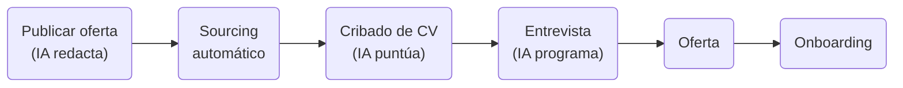

# Documento: IA_EN_RECURSOS_HUMANOS.pdf

## Fuente

Parseado con LlamaCloud y almacenado para recuperación RAG.

## Markdown

# IA EN RECURSOS HUMANOS

## Contratación, Retención y Analítica de Talento


Module: Desarrollo Avanzado de Sistemas Multiagente

Instructor: Rubén Juárez Cádiz

---

# ¿Qué aprenderemos hoy?


1. El sesgo humano en la contratación


2. De lo reactivo a lo predictivo en RRHH


3. People Analytics: predecir el churn de empleados


4. Workable: ATS con IA integrada


5. Avature: CRM de talento semántico


6. Peoplebox.ai: rendimiento y engagement


7. El nuevo rol del Director de RRHH


8. Caso práctico: Pipeline de Contratación Automatizado


9. El flujo completo: de la oferta al onboarding


10. Resultados y métricas de impacto


11. Entregable y criterios de evaluación


12. Próximos pasos y recursos

```description
A central decorative element consisting of a vertical zigzag line with glowing nodes connects the two columns of topics.
```

---


# El 79% de los reclutadores admite tomar decisiones basadas en intuición; la IA reduce el sesgo cognitivo y mejora la calidad del talento
## El Sesgo Humano en la Contratación

### El problema del sesgo en la contratación

*    **Sesgo de afinidad:** Preferir candidatos similares.

*    **Sesgo de halo:** Una buena primera impresión contamina la evaluación.

*    **Sesgo de confirmación:** Buscar información que confirme la impresión.

*    **Sesgo de nombre:** Nombres "extranjeros" reciben 50% menos llamadas.

### El coste de una mala contratación

<table>
  <thead>
    <tr>
        <th>Rol</th>
        <th>Coste (% del salario anual)</th>
    </tr>
  </thead>
  <tbody>
    <tr>
        <td>Empleado base</td>
<td>30% del salario anual</td>
    </tr>
<tr>
        <td>Manager</td>
<td>150% del salario anual</td>
    </tr>
<tr>
        <td>Director</td>
<td>213% del salario anual</td>
    </tr>
<tr>
        <td>C-Suite</td>
<td>Hasta 500% del salario anual</td>
    </tr>
  </tbody>
</table>

> ### La solución de la IA
> El cribado ciego con IA evalúa únicamente las habilidades, la experiencia y los logros del candidato, eliminando el nombre, la foto, la edad y el género del proceso de evaluación inicial.

---

# Perder a un empleado clave cuesta entre 1 y 2 años de su salario; la IA puede predecir quién va a abandonar la empresa con 6 meses de antelación

## People Analytics: Predecir el Churn

### ¿Qué es el Employee Churn Prediction?

Un modelo de IA que analiza múltiples señales de comportamiento y satisfacción para calcular la probabilidad de que un empleado abandone la empresa en los próximos 6-12 meses.

> **El impacto del People Analytics:** Las empresas que usan People Analytics tienen un **25%** menos de rotación no deseada y un **30%** más de satisfacción de los empleados.

### Las señales que analiza la IA


**Reducción de actividad en Slack/Teams** -> Desenganche progresivo


**Disminución de participación en reuniones** -> Desconexión del equipo


**Caída en encuestas de clima** -> Insatisfacción creciente


**Tiempo sin promoción o aumento** -> Estancamiento percibido


**Cambios en patrones de trabajo** -> Búsqueda activa de empleo


**Actividad en LinkedIn** -> Señal externa de búsqueda

---

# Workable reduce el tiempo de contratación en un 50% automatizando las tareas más repetitivas del reclutamiento
## Workable: ATS con IA

### ¿Qué es Workable?

Un ATS (Applicant Tracking System) con IA integrada que gestiona todo el pipeline de contratación.

### Capacidades de IA de Workable


**Redacción de ofertas:** Genera descripciones optimizadas


**Sourcing automático:** Busca candidatos pasivos en LinkedIn, GitHub


**Recomendaciones:** Sugiere candidatos anteriores de la base de datos


**Cribado de CV:** Puntúa y rankea automáticamente los candidatos


**Programación de entrevistas:** Coordina agendas automáticamente

### El flujo de contratación con Workable




---

# Avature convierte la base de datos de candidatos en un activo estratégico: la IA semántica encuentra el candidato perfecto para una nueva vacante entre miles de CVs archivados

Avature: CRM de Talento Semántico

## ¿Qué es Avature?

Un CRM de talento altamente personalizable que usa IA semántica para hacer "matching" entre perfiles de candidatos y vacantes abiertas.

### El Matching Semántico

A diferencia de la búsqueda por palabras clave, la IA semántica entiende el contexto. Un candidato con experiencia en "Machine Learning con TensorFlow" aparecerá en una búsqueda de "Deep Learning".

<table>
  <thead>
    <tr>
        <th colspan="3">La diferencia entre ATS y CRM de Talento</th>
    </tr>
<tr>
        <th> </th>
        <th>ATS</th>
        <th>CRM</th>
    </tr>
  </thead>
  <tbody>
    <tr>
        <td>Enfoque:</td>
<td>Proceso de selección activo</td>
<td>Relación a largo plazo</td>
    </tr>
<tr>
        <td>Base de datos:</td>
<td>Candidatos activos</td>
<td>Activos + pasivos + alumni</td>
    </tr>
<tr>
        <td>IA:</td>
<td>Cribado y ranking</td>
<td>Matching semántico y nurturing</td>
    </tr>
<tr>
        <td>Uso:</td>
<td>Cubrir vacantes abiertas</td>
<td>Construir pipeline futuro</td>
    </tr>
  </tbody>
</table>


---

# Peoplebox.ai cierra el gap entre los OKRs de la empresa y el engagement del equipo, usando IA para dar coaching automatizado a los managers en tiempo real

Peoplebox.ai: Rendimiento y Engagement

## ¿Qué es Peoplebox.ai?

Una plataforma de gestión del rendimiento (OKRs) y engagement que se integra con Slack y Teams, usando IA para analizar el sentimiento del equipo y proporcionar coaching automatizado.

### El impacto en la retención

Los equipos que usan Peoplebox.ai reportan un **40% de reducción** en el tiempo dedicado a reuniones de seguimiento y un **25% de mejora** en la satisfacción de los empleados.

## Capacidades de Peoplebox.ai


**OKRs y KPIs:** Seguimiento del rendimiento individual y de equipo


**Encuestas de pulso:** Encuestas semanales de 2 preguntas para medir el clima


**Análisis de sentimiento:** IA analiza las respuestas y detecta tendencias


**Coaching para managers:** Recomendaciones personalizadas basadas en datos


**1:1 Meetings:** Agenda automática con temas sugeridos por IA

---

# Un pipeline de contratación automatizado con IA puede reducir el tiempo de contratación de <mark>45 días a 15 días</mark>, manteniendo o mejorando la <mark>calidad</mark> del talento seleccionado

## Caso Práctico: Pipeline de Contratación


## El pipeline de contratación con IA:

<table>
  <thead>
    <tr>
        <th>Etapa</th>
        <th>Tiempo Manual</th>
        <th>Tiempo con IA</th>
    </tr>
  </thead>
  <tbody>
    <tr>
        <td>Redacción de oferta:</td>
<td>2 horas (Manual) -&gt;</td>
<td>10 minutos (Workable AI)</td>
    </tr>
<tr>
        <td>Publicación multicanal:</td>
<td>1 hora (Manual) -&gt;</td>
<td>Automático (Workable)</td>
    </tr>
<tr>
        <td>Sourcing de candidatos:</td>
<td>2 días (Manual) -&gt;</td>
<td>2 horas (Workable AI)</td>
    </tr>
<tr>
        <td>Cribado de CVs (100 CVs):</td>
<td>5 horas (Manual) -&gt;</td>
<td>30 minutos (Workable AI)</td>
    </tr>
<tr>
        <td>Programación de entrevistas</td>
<td>3 horas (Manual) -&gt;</td>
<td>Automático (Workable AI)</td>
    </tr>
<tr>
        <td>Evaluación de entrevistas:</td>
<td>2 horas (Manual) -&gt;</td>
<td>45 minutos (Avature AI)</td>
    </tr>
<tr>
        <td>Oferta y onboarding:</td>
<td>1 día (Manual) -&gt;</td>
<td>2 horas (Peoplebox.ai)</td>
    </tr>
  </tbody>
</table>


---

# El flujo completo de contratación con IA convierte el departamento de RRHH en un equipo estratégico que se enfoca en la experiencia del candidato

## El Flujo Completo


### [PASO 1: ATRACCIÓN]
Workable AI: Redacta la oferta y la publica en 20+ plataformas

### [PASO 2: SOURCING]
Workable AI: Busca candidatos pasivos en LinkedIn y GitHub

### [PASO 3: CRIBADO]
Workable AI: Puntúa y rankea los 100 CVs recibidos

### [PASO 4: ENTREVISTAS]
Workable AI: Programa las entrevistas automáticamente

### [PASO 5: EVALUACIÓN]
Avature AI: Matching semántico con el perfil ideal

### [PASO 6: DECISIÓN]
RRHH: Selección final con datos objetivos

### [PASO 7: ONBOARDING]
Peoplebox.ai: Plan de onboarding personalizado + OKRs

### [PASO 8: RETENCIÓN]
Peoplebox.ai: Encuestas de pulso + Churn prediction

---

# El impacto medible de la IA en RRHH

# El ROI de la IA en RRHH

<table>
    <tr>
        <th>Métrica</th>
        <th>Valor Anterior</th>
        <th>Valor con IA</th>
        <th>Mejora</th>
    </tr>
<tr>
        <td>**Tiempo de contratación**</td>
<td>45 días</td>
<td>15 días</td>
<td>-67%</td>
    </tr>
<tr>
        <td>**Calidad del candidato** (retención a 12 meses)</td>
<td>EMPTY</td>
<td>EMPTY</td>
<td>+30%</td>
    </tr>
<tr>
        <td>**Tiempo del reclutador** (horas en tareas administrativas)</td>
<td>EMPTY</td>
<td>EMPTY</td>
<td>-60%</td>
    </tr>
<tr>
        <td>**Diversidad** (candidatos de grupos subrepresentados)</td>
<td>EMPTY</td>
<td>EMPTY</td>
<td>+25%</td>
    </tr>
<tr>
        <td>**Engagement** (puntuación de satisfacción)</td>
<td>EMPTY</td>
<td>EMPTY</td>
<td>+20%</td>
    </tr>
</table>

Una empresa con 200 empleados y una rotación del 15% anual pierde ~30 **empleados/año**. Si la IA reduce la rotación un **25%, ahorra 7-8 contrataciones/año**. Con un coste medio de contratación de 10.000€, el ahorro es de uin ahorro es de **70.000-80.000€ anuales**.

# 70.000-80.000€
## Ahorro Anual

# El nuevo perfil del Director de RRHH

*  Ya no es el gestor de nóminas y contratos.

*  Es el arquitecto de la cultura y el talento, usando datos para tomar decisiones estratégicas sobre la plantilla.

---

# Entregable y Criterios

Tu misión: Diseñar y documentar un pipeline de contratación completo con IA para una empresa ficticia.

## Evaluation Criteria

**Oferta de empleo (20%)**

 20% Redactada con IA (Workable o ChatGPT)

**Pipeline en Workable (25%)**

 25% Configuración del flujo de contratación

**Modelo de Churn (20%)**

 20% Identificar 5 señales de riesgo de abandono

**Dashboard de People Analytics (20%)**

 20% Métricas clave del equipo

**Informe ejecutivo (15%)**

 15% 1 página con insights y recomendaciones

## Required Deliverables

* [x] 1. Oferta de empleo generada con IA (PDF o captura)
* [x] 2. Captura del pipeline configurado en Workable
* [x] 3. Documento con el modelo de Churn Prediction (señales + umbrales)
* [x] 4. Captura del dashboard de People Analytics
* [x] 5. Informe ejecutivo de 1 página con los insights clave

### Extensión sugerida

Integrar Workable con Make para enviar email automático al candidato y notificación al manager.

---

# Próximos Pasos y Recursos

La IA en RRHH es el punto de convergencia entre los datos de las personas y la estrategia del negocio; el siguiente paso es construir un sistema de talento completamente **predictivo**.


**Workable + Make**: Automatizar comunicaciones con candidatos


**Peoplebox.ai + Slack**: Encuestas de pulso y alertas de *churn*


**Python + Scikit-learn**: Modelo de *Churn Prediction* personalizado

## Recursos recomendados


Workable: <u>workable.com</u>


Peoplebox.ai: <u>peoplebox.ai</u>


Google People Analytics: <u>rework.withgoogle.com</u>


Repositorio del módulo en el aula virtual

> "El departamento de RRHH que usa IA no contrata más rápido. Contrata mejor. La velocidad es una consecuencia, no el objetivo. El objetivo es construir equipos más diversos, más comprometidos y más alineados con la estrategia del negocio. negocio. Eso es lo que la IA hace posible."

— Rubén Juárez Cádiz

## Texto Plano

IA EN RECURSOS HUMANOS
Contratación, Retención y Analítica de Talento
y


0010101101017
011010100000

010010001010010011011

010001
Module: Desarrollo Avanzado de Sistemas Multiagente
Instructor: Rubén Juárez Cádiz

---

        Qué aprenderemos hoy?

     1  El sesgo humano en la         9           El nuevo rol del Director de
        contratación        8 7. RRHH

     2. De lo reactivo a lo           - 8. Caso práctico: Pipeline de
        predictivo en RRHH            11000y      Contratación Automatizado

S       People Analytics: predecir                El flujo completo: de la
n 3. el churn de empleados                    9.  oferta al onboarding

 S 4. Workable: ATS con IA            m     10. Resultados y métricas de
        integrada                                 impacto

 Q   5. Avature: CRM de talento               11. Entregable y criterios de
        semántico                                 evaluación

     6. Peoplebox.ai: rendimiento             12. Próximos pasos y recursos
        y engagement

---

    El 79% de los reclutadores admite tomar decisiones basadas en intuición;
        la IA reduce el sesgo cognitivo y mejora la calidad del talento
        El Sesgo Humano en la Contratación
El problema del sesgo en la contratación      El coste de una mala contratación

I   Sesgo de afinidad: Preferir candidatos
   similares.                                    Empleado
   Sesgo de halo: Una buena primera impresión        base    30% del salario anual
   contamina laevaluación.
    Sesgo de confirmación: Buscar información
    que confirme la impresión.        Manager        150% del salario anual
    Sesgo de nombre: Nombres "extranjeros'
    50% menos Ilamadas.                          Director     213% del salario anual
    reciben 50% menos llamadas.

    La solución de la IA
   El cribado ciego con IA evalúa únicamente las  C-Suite     Hasta500%
    habilidades, la experiencia y los logros del candidato,    del salario anual
     eliminando el nombre, la foto, la edad y el género del
                 proceso de evaluación inicial.

---

Perder a un empleado clave cuesta entre 1 y 2 años
de su salario; la IA puede predecir quiéne1 y 2 años
                                                                            vaa
                                                                            va a
abandonar la empresa con 6 meses de antelación
People
People Analytics: Predecir el Churn

iQué        Churn                                  Las señales que analiza la IA
Qué es el Employee
     Churn Prediction?
Un modelode IAqueanaliza          señales
                analiza múltiples señales
de comportamiento ysatisfacción para calcular la   Reducción de actividad    Disminución de
probabilidadde que unempleado abandone la          en Slack/Teams ->         participación en
                                                   Desenganche progresivo    reuniones -> Desconexión
empresa en los próximos 6-12 meses.                                          del equipo

                                                   Caída en encuestas de     Tiempo sin promoción
 El impacto del People                                                           ->
     del People Analytics: Las                     clima -> Insatisfacción   0 aumento ->
                                                   creciente                 Estancamiento percibido
 empresasque usan People Analytics tienen
     un 25% menos de rotación no deseada y un      Cambios en patrones de    Actividad en LinkedIn
 30% más
         másde satisfacción de los empleados.      trabajo -> Búsqueda         Señal externa de
                                                   activa de empleo          búsqueda

---

    Workable reduce el tiempo de contratación en un 50%
    automatizando las tareas más repetitivas del reclutamiento
        Workable: ATS con IA

    Qué es Workable?                         Capacidades de IA de Workable
    Un ATS (Applicant Tracking           Redacción de ofertas:    Sourcing automático:        Recomendaciones:
    System) con IA integrada que         Genera descripciones     Busca candidatos 101100     Sugiere candidatos
    gestiona todo el pipeline de         optimizadas              pasivos en LinkedIn,        anteriores de la base
                                                                  0011001C0100111010110
    contratación.  10110011001010110     Cribado de CV:           GitHub   01010110101001     de datos
                                         Cribado        0      0  Programación de
                                         Puntúa y rankea      00  entrevistas:
                10101101101010110011     automáticamente          Coordina agendas
                                         los candidatos           automáticamente     10130:10

        El flujo de contratación con Workable


  Publicar  Sourcing      Cribado
   oferta    automático    de CV       Entrevista    Onboarding
(IA redacta)            (IA puntúa)  (IA programa)  Oferta

---

 Avature convierte la base de datos de candidatos en un activo
estratégico: la IA semántica encuentla el candidato perfecto
para una nueva vacante entre miles de CVs archivados
 Avature: CRM de Talento Semántico

 Qué es Avature?                                      La diferencia entre ATS y CRM de Talento
 Un CRM de talento altamente
 personalizable que usa IA semántica                         ATS                  CRM
 para hacer "matching" entre perfiles de
 candidatos y vacantes abiertas.
 y                                                Enfoque:   Proceso de           Relación a largo
                                                             selección activo     plazo

                                                  Base de
                                                                                  alumni
          El Matching Semántico                  datos:      Candidatos activos   Activos + pasivos +
 A diferencia de la búsqueda por palabras         IA:        Cribado y ranking    Matching semántico
 clave, la IA semántica entiende el contexto.                                     y nurturing
 Un candidato con experiencia en "Machine
 Learning con TensorFlow" aparecer en una
       búsqueda de "Deep Learning".              Uso:      ③ Cubrir vacantes      Construir pipeline
                                                             abiertas             futuro

---

  Peoplebox.ai cierra el gap entre los OKRs de la empresa y el
  engagement del equipo, usando IA para dar coaching
      automatizado a los managers en tiempo real
        Peoplebox.ai: Rendimiento y Engagement
Qué es Peoplebox.ai?        Capacidades de Peoplebox.ai
Una plataforma de gestión del rendimiento (OKRs) y      OKRs y KPIs:         Encuestas de pulso:
engagement que se integra con Slack y Teams,
      VTeams,                                           OKRs y KPls:
usando IA para analizar el sentimiento del equipo y     Seguimiento del      Encuestas semanales
proporcionar coaching automatizado.                     rendimiento          de 2 preguntas para
                                                        individual y de      medir el clima
                                                        equipo
  El impacto en la retención                            Análisis de          Coaching para
                                                        analiza las          Recomendaciones
  Los equipos que usan Peoplebox.ai reportan un         sentimiento: IA      managers:
  40% de reducción en el tiempo                         respuestas y         personalizadas
                                                        detecta tendencias   basadas en datos
  dedicadoa reuniones
  a     s de seguimiento y un
 25% de mejora en la satifaccióne s                     1:1 Meetings:
 empleados.        satisfacción de los                  Agenda automática
                                                        con temas
                                                        sugeridos por IA

---

Un pipeline de contratación automatizado con IA puede reducir
 el tiempo de contratación de 45 días a 15 días, manteniendo o
mejorando la calidad del talento seleccionado
 Caso Práctico: Pipeline de Contratación
       ElI pipeline de contratación con IA:
  El reto:
   I reto:        Etapa                                                 Tiempo Manual       Tiempo con IA
  Diseñar un pipeline
   Diseñar un pipeline de contratación
   completamente automatizado para una     Redacción de oferta:         2 horas (Manual)->  10 minutos (Workable Al)
   empresa de tecnología que necesita      Publicación multicanal:      1 hora (Manual)->   Automático (Workable)
   contratar 10 desarrolladores en 30 días.
                                           Sourcing de candidatos:      2 días (Manual)->   2 horas (Workable Al)
                                           Cribado de CVs (100 CVs):    5 horas (Manual) >  30 minutos (Workable Al)
   El resultado:                           Programación de entrevistas  3 horas(Manual)->   Automático (Workable Al)
   Tiempo total de contratación:
   45 días (manual) → 15 días (con IA).    Evaluación de entrevistas:   2 horas (Manual) >  45 minutos (Avature Al)
       I candidato                         Oferta y onboarding:         1 día (Manual)->    2 horas (Peoplebox.ai)
   Calidad del candidato seleccionado:
   +30% en retención a 12 meses.
       a

---

    El flujo completo de contratación con IA convierte el departamento
    de RRHH en un equipo estratégico que se enfoca en la experiencia
                             del candidato
    El Flujo Completo                                [PASO 1: ATRACCION]

 [PASO 1: ATRACCION]                                 Workable Al: Redacta la oferta y la publica en 20+ plataformas
                                                     [PASO 2: SOURCING]
        @ [PASO 2: SOURCING]                         Workable Al: Busca candidatos pasivos en Linkedln y GitHub
                                                     [PASO 3: CRIBADO]
   [PASO 3: CRIBADO]                                 Workable Al: Puntúa y rankea los 100 CVs recibidos
                                                    [PASO 4: ENTREVISTAS]
                             [PASO 4: ENTREVISTAS]   Workable Al: Programa las entrevistas automáticamente

[PASO 5: EVALUACIÓN]    R                            [PASO 5: EVALUACIÓN]
                                                     Avature Al: Matching semántico con el perfil ideal

        5I                   [PASO 6: DECISIÓN]      [PASO 6: DECISIÓN]
                                                    RRHH: Selección final con datos objetivos
[PASO 7: ONBOARDING]                                 [PASO 7: ONBOARDING]
                                                     Peoplebox.ai: Plan de onboarding personalizado + OKRs
                             [PASO 8: RETENCIÓN]    [PASO 8: RETENCIÓN]
                                                     Peoplebox.ai: Encuestas de pulso + Churn prediction

---

El impacto medible de la IA en RRHH                            EI ROI de la IAen RRHH

Tiempo de contratación                  -67%                        Una empresa con 200 empleados y una

45 días                      15 días                                rotación del 15% anual pierde ~30
                                                                    empleados/año. Si la IA reduce la
                                                                    rotación un 25%, ahorra 7-8
Calidad del candidato                     Tiempo del reclutador     contrataciones/año. Con un coste
                                                                    medio
                         +30%                              -60%     medio de contratación de 10.000€, el
 retención a 12 meses                   horas en tareas             ahorro es de uin ahorro es
                                        administrativas             de 70.000-80.000€ anuales.

 Diversidad              +25%           Engagement         +20%    70.000-80.000€

candidatos de grupos                    puntuación de satisfacción     Ahorro Anual
subrepresentados                                                       Ahorro


    El nuevo perfil del Director de RRHH
Ya no es el gestor de nóminas y    I   Es el arquitecto de la cultura y el talento,
contratos.                             usando datos para tomar decisiones
                                       estratégicas sobre la plantilla.

---

    Entregable y Criterios
                                  y
Tu misión: Diseñar y documentar un pipeline de contratación completo con IA para una empresa ficticia.

Evaluation Criteria               Required Deliverables
Oferta de empleo (20%)                                                      1. Oferta de empleo generada con IA (PDF o captura)
    20%        Redactada con IA (Workable o ChatGPT)                        2. Captura del pipeline configurado en Workable
Pipeline en Workable (25%)                                                  3. Documento con el modelo de Churn Prediction
25%                           Configuración del flujo de contratación       (señales + umbrales)
Modelo de Churn (20%)                                                       4. Captura del dashboard de People Analytics
    20%                       Identificar 5 señales de riesgo de abandono  5. Informe ejecutivo de 1 página con los insights clave
Dashboard de People Analytics (20%)
    20%                       Métricas clave del equipo                    Extensión sugerida

Informe ejecutivo (15%)                                                    Integrar Workable con Make para enviar email
15%                           1 página con insights y recomendaciones      automático al candidato y notificación al manager.

---

                                             Pasos yRecursos
 Próximos
                                         La IA en RRHH es el punto de convergencia entre los datos de las personas y la estrategia del
                                            negocio; el siguiente paso es construir un sistema de talento completamente predictivo.

  Workable + Make: Automatizar
  comunicaciones con candidatos                                     "EI departamento de RRHH que usa

                               Peoplebox.ai + Slack: Encuestas     IA no contrata más rápido.
                               de pulso y alertas de churn          Contrata mejor. La velocidad es
                                                                    una consecuencia, no el objetivo.

                                         Python + Scikit-learn:     El objetivo es construir equipos
                                                                    más diversos, más
                                         Modelo de Churn            comprometidos y más alineados
Recursos recomendados                    Prediction personalizado   con la estrategia del negocio.
                                                                   negocio.
Workable: workable.com                                              negocio. Eso es lo que la IA hace
 Peoplebox.ai: peoplebox.ai                                        posible. - Rubén Juárez Cádiz
 Google People Analytics: rework.withgoogle.com
Repositorio del módulo en el aula virtual