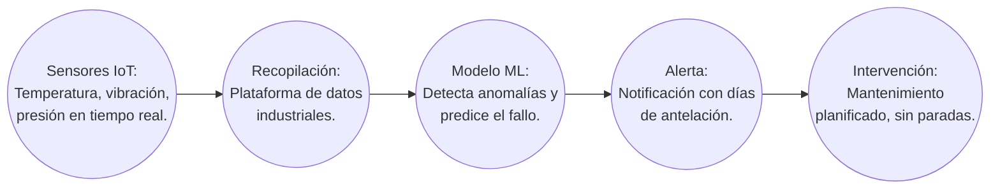
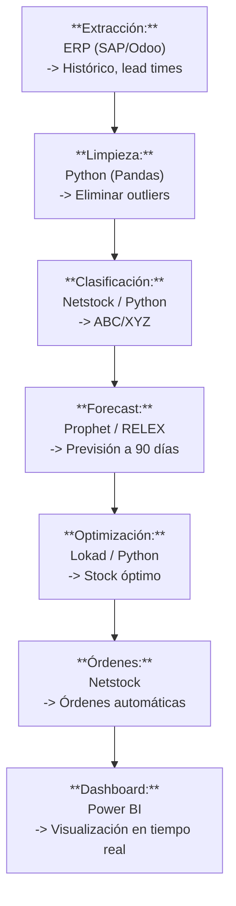

# Documento: IA_EN_SUPPLY_CHAIN_Y_OPERACIONES.pdf

## Fuente

Parseado con LlamaCloud y almacenado para recuperación RAG.

## Markdown

# IA EN SUPPLY CHAIN Y OPERACIONES

## La Cadena de Suministro Resiliente y Predictiva

Desarrollo Avanzado de Sistemas Multiagente

**Instructor**: Rubén Juárez Cádiz

---

# ¿Qué aprenderemos hoy?

1. El Bullwhip Effect: el caos amplificado

2. De la gestión reactiva a la predictiva

3. Gestión de inventario dinámica con IA

4. Mantenimiento predictivo: cero paradas no planificadas

5. Netstock: optimización de inventario con IA

6. Lokad: enfoque cuantitativo probabilístico

7. RELEX Solutions: previsión de demanda en retail

8. Caso práctico: Optimización de Inventario Inteligente

9. El flujo completo: de los datos a la orden de compra

10. Resultados y métricas de impacto

11. Entregable y criterios de evaluación

12. Próximos pasos y recursos

---

# El **Bullwhip Effect** amplifica pequeñas variaciones de demanda en caos productivo; la IA estabiliza la cadena cruzando datos internos con señales externas

## El Bullwhip Effect: El Caos Amplificado

### ¿Qué es el Bullwhip Effect?

Pequeñas variaciones en la demanda del consumidor se amplifican a lo largo de la cadena, generando excesos o roturas de stock.

### Las causas:

* Previsiones basadas solo en histórico
* Pedidos en lote
* Falta de visibilidad en tiempo real
* Promociones que distorsionan la demanda

### El efecto en números
(Variación real vs percibida)

<table>
  <thead>
    <tr>
        <th>Etapa</th>
        <th>Variación Real</th>
        <th>Variación Percibida</th>
    </tr>
  </thead>
  <tbody>
    <tr>
        <td>Consumidor final</td>
<td>+5%</td>
<td>+5%</td>
    </tr>
<tr>
        <td>Minorista</td>
<td>+5%</td>
<td>+15%</td>
    </tr>
<tr>
        <td>Distribuidor</td>
<td>+5%</td>
<td>+40%</td>
    </tr>
<tr>
        <td>Fabricante</td>
<td>+5%</td>
<td>+80%</td>
    </tr>
<tr>
        <td>Proveedor</td>
<td>+5%</td>
<td>+120%</td>
    </tr>
  </tbody>
</table>

### La solución de la IA:

> Cruza datos internos con externos (clima, eventos, tráfico) para previsiones hiper-locales, reduciendo el efecto látigo hasta un 80%.

---

# La IA reemplaza el "stock de seguridad" estático por un modelo probabilístico dinámico que optimiza el inventario en tiempo real
## Gestión de Inventario Dinámica

**El problema del stock de seguridad estático:**
* El modelo tradicional calcula el stock una vez al año basándose en medias. Ignora la estacionalidad, eventos especiales y disrupciones.

> **Los datos que alimentan el modelo IA:**
> * Ventas históricas y demanda en tiempo real
> * Datos externos: clima, eventos, festivos
> * Proveedores: lead times, disrupciones
> * Tendencias: Google Trends, redes sociales

<table>
  <thead>
    <tr>
        <th> </th>
        <th>Tradicional</th>
        <th>AI Dinámico</th>
    </tr>
  </thead>
  <tbody>
    <tr>
        <td>Actualización</td>
<td>Anual (Tradicional)</td>
<td>Diaria/Semanal (IA)</td>
    </tr>
<tr>
        <td>Datos</td>
<td>Histórico interno (Tradicional)</td>
<td>Histórico + Externo + Tiempo real (IA)</td>
    </tr>
<tr>
        <td>Precisión del forecast</td>
<td>±20-30% (Tradicional)</td>
<td>±5-10% (IA)</td>
    </tr>
<tr>
        <td>Capital inmovilizado</td>
<td>Alto (Tradicional)</td>
<td>Optimizado (IA)</td>
    </tr>
<tr>
        <td>Roturas de stock</td>
<td>Frecuentes (Tradicional)</td>
<td>Reducidas un 70% (IA)</td>
    </tr>
  </tbody>
</table>

Desarrollo Avanzado de Sistemas Multiagente
Instructor: Rubén Juárez Cádiz

---

# El mantenimiento predictivo con IA puede reducir las paradas no planificadas hasta un 70% y el coste de mantenimiento hasta un 25%

## Mantenimiento Predictivo

### Tipos de Mantenimiento

<table>
  <tbody>
    <tr>
        <td></td>
<td>**Reactivo:** Se repara cuando se rompe</td>
<td>Coste Alto</td>
    </tr>
<tr>
        <td></td>
<td>**Preventivo:** Se revisa periódicamente</td>
<td>Coste Moderado</td>
    </tr>
<tr>
        <td></td>
<td>**Predictivo (IA):** Se interviene justo antes de fallar</td>
<td>Coste Mínimo</td>
    </tr>
  </tbody>
</table>

### ¿Cómo funciona el mantenimiento predictivo?

### El impacto en números

<table>
  <tbody>
    <tr>
        <td>↓ -70% Paradas no planificadas</td>
<td>↓ -25% Coste de mantenimiento</td>
    </tr>
<tr>
        <td>↑ +20% Vida útil de activos</td>
<td>ROI medio: 10x en 18 meses</td>
    </tr>
  </tbody>
</table>

---

# Netstock se conecta al ERP y clasifica automáticamente el inventario, identificando qué productos generan valor y cuáles acumulan capital muerto

## Netstock: Optimización de Inventario

### ¿Qué es Netstock?

Plataforma de optimización de inventario con IA que se conecta al ERP (SAP, Oracle) y da recomendaciones de compra predictivas.

### Capacidades de Netstock

*    **Clasificación ABC/XYZ:** Por valor y variabilidad
*    **Forecast de demanda:** Histórico + estacionalidad + tendencias
*    **Órdenes sugeridas:** Genera órdenes de compra óptimas
*    **Alertas de exceso:** Identifica "stock muerto"
*    **Alertas de rotura:** Avisa antes del stock cero

### La clasificación ABC/XYZ

<table>
  <thead>
    <tr>
        <th>VALOR</th>
        <th>X (Estable)</th>
        <th>Y (Moderada)</th>
        <th>Z (Errática)</th>
    </tr>
<tr>
        <th>A (Alto)</th>
        <th>A/X: Alto Valor / Demanda Estable</th>
        <th>A/Y: Alto Valor / Demanda Moderada</th>
        <th>A/Z: Alto Valor / Demanda Errática</th>
    </tr>
<tr>
        <th>B (Medio)</th>
        <th>B/X: Valor Medio / Demanda Estable</th>
        <th>B/Y: Valor Medio / Demanda Moderada</th>
        <th>B/Z: Valor Medio / Demanda Errática</th>
    </tr>
<tr>
        <th>C (Bajo)</th>
        <th>C/X: Bajo Valor / Demanda Estable</th>
        <th>C/Y: Bajo Valor / Demanda Moderada</th>
        <th>C/Z: Bajo Valor / Demanda Errática</th>
    </tr>
  </thead>
</table>

---

# Lokad y RELEX representan los dos enfoques más avanzados de la IA en supply chain: la optimización financiera probabilística y la previsión de demanda hiper-local

### Lokad y RELEX Solutions

## Lokad: Enfoque Cuantitativo Probabilístico

- Distribución de probabilidades, no un único número

- Calcula el coste financiero de cada decisión

- "¿Cuánto cuesta quedarse sin stock vs. almacenar de más?"

- Ideal para: Manufactura, B2B, demanda errática

## RELEX Solutions: Previsión de Demanda en Retail

- Previsión a nivel de SKU x tienda x día (hiper-local)

- Integra datos externos: clima, eventos, promociones

- Optimiza desde distribución hasta estantería

- Reduce desperdicio alimentario hasta un 30%

### La diferencia clave:

-  **Lokad: Optimización financiera** (Decisiones bajo incertidumbre)

-  **RELEX: Previsión de demanda** (Volumen y granularidad)

---

# Un modelo de optimización de inventario con IA puede reducir el capital inmovilizado un 30% y las roturas de stock un 70%

## Caso Práctico: Optimización de Inventario

## El pipeline de optimización

### El reto:

Empresa distribuidora con 5.000 SKUs y 3 almacenes necesita optimizar inventario para reducir capital inmovilizado sin aumentar roturas de stock.

### El resultado esperado:

- Capital inmovilizado: **-30%** (de 2M€ a 1.4M€)

- Roturas de stock: **-70%** (de 200 a 60/mes)

- Nivel de servicio: **+15%** (de 85% a 98%)

- Tiempo de compras: **-60%**

---

# El flujo completo de IA en supply chain convierte los datos dispersos en múltiples sistemas en órdenes de compra optimizadas que se generan automáticamente

El Flujo Completo

### [PASO 1: RECOPILACIÓN]

* **Fuentes**: ERP + POS + Proveedores + Datos externos.

* **Descripción**: Integración de datos dispersos de múltiples sistemas en una única plataforma.

### [PASO 2: LIMPIEZA Y NORMALIZACIÓN]

* **Herramientas**: Python (Pandas).

* **Descripción**: Eliminación de valores atípicos (outliers) y normalización de los datos para asegurar su calidad.

### [PASO 3: CLASIFICACIÓN]

* **Herramientas**: Netstock / Python.

* **Descripción**: Segmentación de inventario mediante Clasificación ABC/XYZ para priorizar artículos.

### [PASO 4: FORECAST DE DEMANDA]

* **Herramientas**: Prophet / RELEX.

* **Descripción**: Generación de previsiones de demanda precisas a 30, 60 y 90 días.

### [PASO 5: OPTIMIZACIÓN]

* **Herramientas**: Lokad / Python.

* **Descripción**: Cálculo de los niveles de stock óptimo para minimizar costos y evitar roturas.

### [PASO 6: GENERACIÓN DE ÓRDENES]

* **Herramientas**: Netstock.

* **Descripción**: Creación automática de órdenes de compra optimizadas basadas en los cálculos de IA.

### [PASO 7: MONITORIZACIÓN]

* **Herramientas**: Power BI + Alertas.

* **Descripción**: Visualización en tiempo real del rendimiento de la cadena de suministro y alertas proactivas.

### [PASO 8: RETROALIMENTACIÓN]

* **Proceso**: El modelo de IA aprende continuamente de los resultados para mejorar su precisión y eficiencia en ciclos futuros.

---

# La IA en supply chain no solo reduce costes: <mark>mejora el nivel de servicio</mark>, <mark>reduce el desperdicio</mark> y libera al equipo de operaciones

Resultados y Métricas de Impacto

## El impacto medible de la IA en supply chain:

## El ROI de la IA en supply chain:

Una empresa con **10M€** de inventario que reduce el capital inmovilizado un **30%** libera **3M€** de capital. Con un coste financiero del 5%, el ahorro anual es de

# 150.000€,

sin contar la reducción de roturas de stock y el aumento del nivel de servicio.

### El nuevo perfil del Director de Operaciones:

 Ya no es el gestor de almacenes y transportistas. Es el arquitecto de la cadena de suministro digital, usando datos y modelos predictivos para **anticipar** disrupciones y **optimizar** el flujo de valor. 

---

# Entregable y Criterios

Tu misión: Construir un modelo de optimización de inventario con IA para una empresa ficticia con 100 SKUs.

## Evaluation Criteria

**Dataset (15%)**
100 SKUs con histórico de ventas (12 meses)

15%

**Clasificación ABC/XYZ (25%)**
Clasificación de los 100 SKUs en Python

25%

**Forecast de demanda (25%)**
Modelo Prophet para los top 10 SKUs

25%

**Optimización de stock (20%)**
Cálculo del stock óptimo por SKU

20%

**Dashboard Power BI (15%)**
Visualización del inventario con alertas

15%

## Required Deliverables

* [x] Dataset de 100 SKUs (CSV o Excel)
* [x] Notebook de Python con la clasificación ABC/XYZ
* [x] Notebook de Python con el modelo de forecast (Prophet)
* [x] Documento con el cálculo del stock óptimo
* [x] Captura del dashboard de Power BI con las alertas

## Extensión sugerida

Integrar el modelo con Make para enviar automáticamente las órdenes de compra al proveedor por email.

---

# Próximos Pasos y Recursos

La IA en supply chain es el punto de convergencia entre los datos operativos, la inteligencia financiera y la automatización; el siguiente paso es construir una cadena de suministro autónoma

### ① Próximas herramientas del módulo

* **Python + Prophet**: Modelos de series temporales para forecast de demanda
* **Power BI + Copilot**: Visualización del inventario en tiempo real con alertas
* **Make + ERP**: Automatizar las órdenes de compra

### Recursos recomendados

*  Netstock: netstock.com
*  Lokad: lokad.com
*  RELEX Solutions: relexsolutions.com
*  Prophet (Meta): facebook.github.io/prophet
*  Repositorio del módulo en el aula virtual

> "La cadena de suministro del futuro no reacciona a las disrupciones: las anticipa. No gestiona el inventario: lo optimiza en tiempo real. No espera a que se rompa la máquina: la mantiene antes de que falle. Eso es lo que la IA hace posible: pasar de una cadena reactiva a una cadena cognitiva."
>
> — Rubén Juárez Cádiz

## Texto Plano

IA EN SUPPLY CHAIN Y
   Y
   OPERACIONES
   y
010101110010 10110La Cadena de Suministro Resiliente y Predictiva

   Desarrollo Avanzado de Sistemas Multiagente

   Juárez
   Instructor: Rubén Juárez Cádiz

---

    iQué aprenderemos hoy?
    1. El Bullwhip Effect: el caos amplificado
                                                        2. De la gestión reactiva a la predictiva
               3. Gestión de inventario dinámica con IA
        4. Mantenimiento predictivo: cero paradas no planificadas
         5. Netstock: optimización de inventario con IA
                                                        6. Lokad: enfoque cuantitativo probabilístico
     7. RELEX Solutions: previsión de demanda en retail
        8. Caso práctico: Optimización de Inventario Inteligente
9. El flujo completo: de los datos a la orden de compra
                                                        10. Resultados y métricas de impacto
               11. Entregable y criterios de evaluación
                                                        12. Próximos pasos y recursos

---

  El Bullwhip Effect amplifica pequeñas variaciones de demanda en caos productivo;
  la IA estabiliza la cadena cruzando datos internos con señales externas

      El Bullwhip Effect: E1
      El Caos Amplificado

Qué es el Bullwhip Effect?        El efecto en números                           Proveedor:
 Pequeñas variaciones en la demanda del        (Variación real vs percibida)    +5% -> +120%
 consumidor se amplifican a lo largo de la cadena,
generando excesos o roturas de stock.                                          BOOD

Las causas:                                                                A        6-5%
  causas:                                                                  OD
  Previsiones basadas solo en histórico        RETAIL
  Pedidos en lote
  Falta de visibilidad en tiempo real
  Promociones que distorsionan la demanda  Consumidor final:  Minorista:   Distribuidor: Fabricante: Proveedor:
      +5% -> +5%     +5% -> +15%                                           +5% -> +40%   +5% -> +80% +5% -> +120%

                                       La solución de la IA:
   AI     Cruza datos internos con externos (clima, eventos, tráfico) para
  TTTT  previsiones hiper-locales, reduciendo el efecto látigo hasta un 80%

---

 La IA reemplaza el "stock de seguridad" estático por un modelo
                                                 probabilístico dinámico que optimiza el inventario en tiempo real
                                                                   Gestión de Inventario Dinámica

 El problema del stock de seguridad estático:        Tradicional Al Dinámico
  El modelo tradicional calcula el stock una vez
0101011 al año basándose en medias. Ignora la                       Anual        Diaria/Semanal
  estacionalidad, eventos especiales y           Actualización  (Tradicional)         (IA)
  disrupciones.        Datos                                  Histórico interno Histórico + Externo
                                                                (Tradicional)  + Tiempo real (IA)
 Los datos que alimentan el modelo IA:           Precisión del     ±20-30%    ±5-10%
  •Ventas históricas y demanda en tiempo real       forecast    (Tradicional)  (IA)
   Datos externos: clima, eventos, festivos        Capital           Alto          Optimizado
   Proveedores: lead times, disrupciones        inmovilizado    (Tradicional)         (IA)
   Google                                      OP
                                               yD  Roturas de     Frecuentes Reducidas un 70%
   Tendencias: Google Trends, redes sociales       stock        (Tradicional)         (IA)
   OllllllllI
                                                            Desarrollo Avanzado de Sistemas Multiagente
                                                                   Instructor: Rubén Juárez Cádiz

---

El mantenimiento predictivo con IA puede reducir las paradas no
planificadas hasta un 70% y el coste de mantenimiento hasta un 25%
                               Mantenimiento Predictivo

 Tipos de Mantenimiento        Cómo funciona el mantenimiento predictivo?

 Reactivo: Se repara cuando se rompe Coste Alto

 Preventivo: Se revisa periódicamente Coste Moderado    1     A
                               Sensores loT:                                      Recopilación:
 Predictivo (IA): Se interviene justo Coste Mínimo  Temperatura, vibración,    Plataforma de datos
 antes de fallar                                    presión en tiempo real.       industriales.

 El impacto en numeros         Modelo ML:
                                                                            predice el fallo.
 -70%                      25%                                             Detecta anomalías y
 Paradas no planificadas   Coste de mantenimiento
                           ROI medio:        80
 +20%                      10x                      Alerta:                      Intervención:
 Vida útil de activos      en en 18 meses    Notificación con días               Mantenimiento
                                                 de antelación.            planificado, sin paradas.

---

Netstock se conecta al ERP y clasifica automáticamente el inventario,
       y
identificando qué productos generan valor y cuáles acumulan capital muerto
Netstock: Optimización de Inventario

 Qué es Netstock?        La clasificación ABC/XYZ
 Plataforma de optimización de inventario con IA
 que se conecta al ERP (SAP, Oracle) y da              A/X: Alto   A/Y: Alto A/Z: Alto
 recomendaciones de compra predictivas.        A        Valor /     Valor /     Valor /
                                                        Demanda     Demanda     Demanda
 Capacidades de Netstock                                Estable     Moderada    Errática

  Clasificación ABC/XYZ: Por valor y variabilidad  C B B/X: Valor  B/Y: Valor  B/Z: Valor
                                                        Medio /     Medio /     Medio /
                                                        Demanda     Demanda     Demanda
   Forecast de demanda: Histórico +                     Estable     Moderada    Errática
   estacionalidad + tendencias        C/Y: Bajo
   Órdenes sugeridas: Genera        C/X: Bajo                                  C/Z: Bajo
   órdenes de compra óptimas                         C  Valor Valor             Valor /
                                                        Demanda Demanda         Demanda
                                                        Estable     Moderada    Errática
  Alertas de exceso: Identifica "stock muerto"
                                                           X                       Z
  Alertas de rotura: Avisa antes del stock cero        VARIABILIDAD

---

Lokad y RELEX representan los dos enfoques más avanzados de
la IA en supply chain: la optimización financiera probabilística y
 la previsión de demanda hiper-local
 Lokad y RELEX Solutions

 Lokad: Enfoque Cuantitativo Probabilístico  RELEX Solutions: Previsión de Demanda en Retail

 Distribución de probabilidades, no un único número  Previsión a nivel de SKU x tienda x día (hiper-local)
 Calcula el coste financiero de cada decisión         Integra datos externos: clima, eventos, promociones
 "iCuánto cuesta quedarse sin stock vs. almacenar     Optimiza desde distribución hasta estantería
 "1
 de más?"        - Reduce desperdicio alimentario hasta un 30%
 Ideal para: Manufactura, B2B, demanda errática

             La diferencia clave:
             Lokad: Optimización financiera            RELEX: Previsión de demanda
             (Decisiones bajo incertidumbre)           (Volumen y granularidad)

---

Un modelo de optimización de inventario con IA puede reducir
el capital inmovilizado un 30% y las roturas de stock un 70%
Caso Práctico: Optimización de Inventario  El pipeline de optimización

                                                    Extracción:
 El reto:        ERP (SAP/Od00)
                                             -> Histórico, lead
     distribuidora con 5.000 SKUs y 3      times                    Limpieza:
 Empresa distribuidora
 almacenes necesita
     optimizar inventario para                                      Python (Pandas)
                                                                    -> Eliminar outliers
     capital inmovilizado sin aumentar
 reducir capital
 reducir     N                                   Clasificación:
 roturasde stock.                             Netstock / Python
                                                     -> ABC/XYZ     Forecast:
                                                                    Prophet / RELEX
                                                                    -> Previsión a 90 días
 El resultado esperado:                           Optimización:
                                                 Lokad / Python
 Capital inmovilizado: -30% (de 2M€ a 1.4M€)    -> Stock óptimo     Órdenes:
 Roturas de stock: -70% (de 200 a 60/mes)
     a                                                              Netstock
 - Nivel de servicio: +15% (de 85% a 98%)
 - Tiempo de compras: -60% a98%)                     Dashboard:     -> Órdenes automáticas
                                                       Power Bl
                                -> Visualización en tiempo real

---

El flujo completo de IA en supply chain convierte los datos dispersos en múltiples
sistemas en órdenes de compra optimizadas que se generan automáticamente
El Flujo Completo
                                                                        [PASO 1: RECOPILACION]
                                                                          T.HLOOTTLAR
   [PASO 1: RECOPILACIÓN]                                                 Fuentes: ERP + POS + Proveedores + Datos externos.
                                                                          rueiites. ERr T FOs + Fioveeuores t Datos extenios
ERP + POS + Proveedores +   O                                           •Descripción: Integración de datos dispersos de múltiples sistemas en una única plataforma.
           Datos externos         [PASO 2: LIMPIEZA Y NORMALIZACIÓN]   [PASO 2: LIMPIEZA Y NORMALIZACIÓN]
                                                                       Herramientas: Python (Pandas)
                                  Python (Pandas):                     Descripción: Eliminación de valores atípicos (outliers) y normalización de los datos para asegurar
                                  Eliminar outliers, normalizar          su calidad.
      [PASO CLASIFICACIN]                                              [PASO 3: CLASIFICACIÓN]
                            -                                            Herramientas: Netstock / Python.
       Netstock / Python:    F                                            Henalielltas. Netstock 7 P yulon
    Clasificación ABC/XYZ  EAE                                         Descripción: Segmentación de inventario mediante Clasificación ABC/XYZ para priorizar artículos
                                  [PASO 4: FORECAST DE DEMANDA]         [PASO 4: FORECAST DE DEMANDA]
                                  Prophet / RELEX                        Herramientas: Prophet / RELEX.
                                                                          neramelltas.r     S
                                  Previsión a 30/60/90 días             •Descripción: Generación de previsiones de demanda precisas a 30, 60 y 90 días.
   [PASO 5: OPTIMIZACIÓN]  SIA                                         [PASO 5: OPTIMIZACIÓN]
          Lokad / Python:                                              Herramientas: Lokad / Python.
    Calcular stock óptimo                                              Descripción: Cálculo de los niveles de stock óptimo para minimizar costos y evitar roturas
                                  [PASO 6: GENERACIÓN DE ÓRDENES]      [PASO 6: GENERACIÓN DE ÓRDENES]
                                  Netstock:                               Herramientas: Netstock.
                                                                          Henlalelltas.Netstock.
                                  Ordenes automáticas                  Descripción: Creación automática de órdenes de compra optimizadas basadas en los cálculos de IA.
 [PASO 7: MONITORIZACIÓN]                                              [PASO 7: MONITORIZACIÓN]
      Power BI + Alertas:                                              Herramientas: Power Bl + Alertas.
 Dashboard en tiempo real                                               • Descripción: Visualización en tiempo real del rendimiento de la cadena de suministro y alertas
                                                                          oroaelrvas
                                  [PASO 8: RETROALIMENTACIÓN]             proactivas.
                                                                       [PASO 8: RETROALIMENTACIÓN]
    TET3                          El modelo aprende y mejora           Proceso: El modelo de IA aprende continuamente de los resultados para mejorar su precisión y
                                  continuamente                           eficiencia en ciclos futuros.

---

    La IA en supply chain no solo reduce costes: mejora el nivel de
    servicio, reduce el desperdicio y libera al equipo de operaciones
    Resultados y Métricas de Impacto

    El impacto medible de la IA en supply chain:
    Capital inmovilizado      Roturas de stock supply Nivel de servicio    EI ROI de la IA en supply chain:
                        -30%                   -70%    +15%     Una empresa con10M€de inventario que
        reduce el capital inmovilizado un
    Reducción        Reducción drástica      Mejora significativa      libera 3M€de capital.Con un30%     001
        onun coste
                                                                financiero del 5%,elahorroanuales de
    Desperdicio alimentario     Tiempo del equipo      Paradas no planificadas    150.000€,
                        -30%                   -60%    -70% sin contar la reducción de roturas de stock
    Minimización        Optimización        Prevención      y el aumento del nivel de servicio.
        y

                         El nuevo perfil del Director de Operaciones:
    Ya no es el gestor de almacenes y transportistas. Es el arquitecto de la cadena de suministro digital
usando datos y modelos predictivos para anticipar disrupciones y optimizar el flujo de valor.

---

     Entregable y
     y Criterios
                             Tu misión: Construir un modelo de optimización de inventario con IA
                                           para una empresa ficticia con 100 SKUs.

 Evaluation Criteria                         Required Deliverables
 Dataset (15%)                                Dataset de 100 SKUs (CSV o Excel)
 100 SKUs con histórico de ventas (12 meses)
                          15%                 Notebook de Python con la clasificación
 Clasificación ABC/XYZ (25%)                  ABC/XYZ
 Clasificación de los 100 SKUs en Python      Notebook de Python con el modelo de
                          25%                 forecast (Prophet)
    Forecast de demanda (25%)
 Modelo Prophet para los top 10 SKUs          Documento con el cálculo del stock óptimo
                          25%                 Captura del dashboard de Power BI con las
 Optimización de stock (20%)                  alertas
 Cálculo del stock óptimo por SKU
     20%                                     Extensión sugerida
 Dashboard Power Bl (15%)                    Integrar el modelo con Make para enviar
Visualización del inventario con alertas     automáticamente las órdenes de compra al
                          15%
                                             proveedor por email.

---

 Próximos
                   Pasos yRecursos
 La IA en supply chain es el punto de convergencia entre los datos operativos, la inteligencia
 financiera y la automatización; el siguiente paso es construir una cadena de suministro autónoma

     1 Próximas herramientas del módulo
01010 100101110   Python + Prophet: Modelos de series temporales
                                demanda                            "La cadena de suministro del futuro
                  para forecast de demanda
                   BI + Copilot:
                  Power Bl + Copilot: Visualización del inventario
                          I con alertas                           no reacciona a las disrupciones: las
                  en tiempo real con alertas                       No gestiona el inventario: Io
                  Make + ERP: Automatizar las órdenes de compra    anticipa. No gestiona el inventario: lo
                                                                   optimiza en tiempo real. No espera a
                                                                  que se rompa la máquina: la
                  Recursos recomendados                           mantiene antes de que falle. Eso es
                   Netstock: netstock.com                         lo que la IA hace posible: pasar de
                   Lokad: lokad.com                                una cadena reactiva a una cadena
                   RELEX Solutions: relexsolutions.com            cognitiva." - Rubén Juárez Cádiz
                   Prophet (Meta): facebook.github.io/prophet
                   Repositorio del módulo en el aula virtual