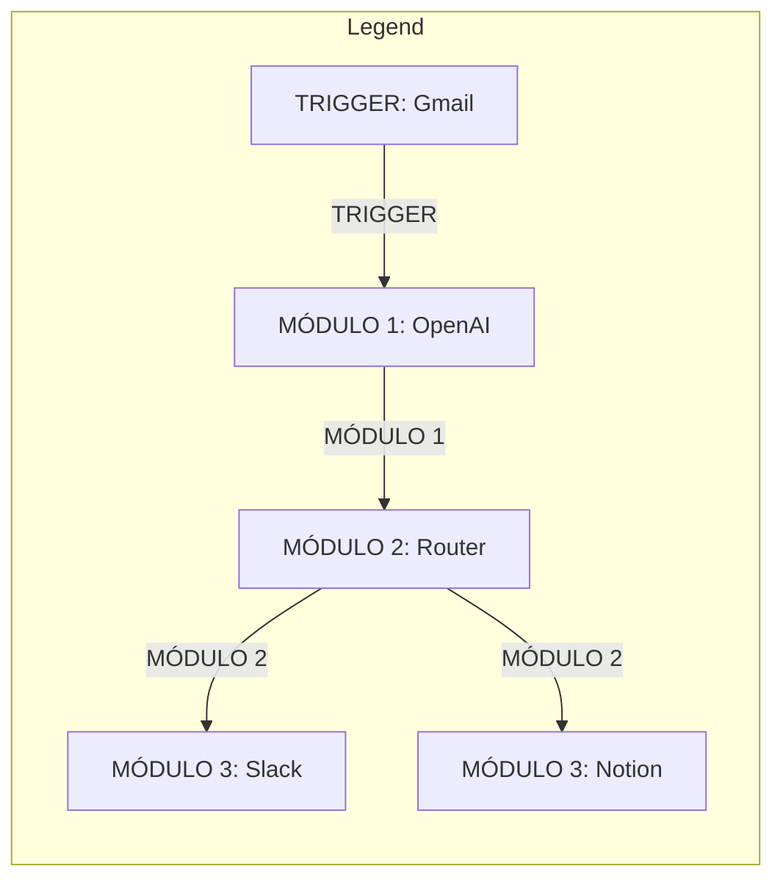
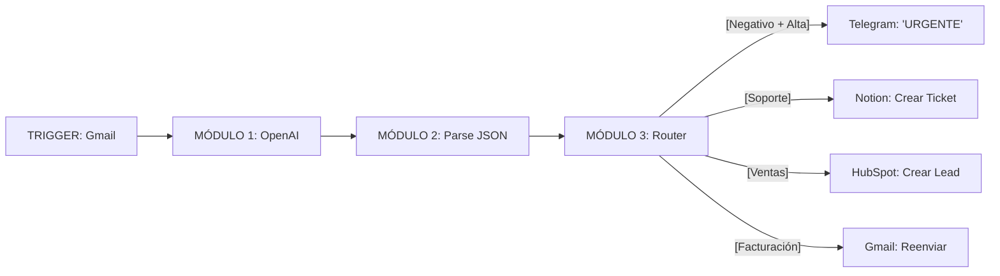

# Documento: MAKE.pdf

## Fuente

Parseado con LlamaCloud y almacenado para recuperación RAG.

## Markdown


# MAKE (antes Integromat)

## El cerebro automatizado y orquestador de la IA

**Módulo:** Desarrollo Avanzado de Sistemas Multiagente

**Instructor:** Rubén Juárez Cádiz

---

# ¿Qué aprenderemos hoy?


1. **¿Por qué Make y no solo código?**

2. **Conectividad masiva: 1500+ apps integradas**

3. **Flujos Visuales (Escenarios): el poder del No-Code**

4. **Make vs. Zapier: más potente y ramificable**

5. **Triggers: lo que inicia el flujo**

6. **Routers y Filtros: los condicionales visuales**

7. **Módulos de IA: OpenAI en medio del flujo**

8. **Caso práctico: Triage de Soporte al Cliente**

9. **El escenario completo paso a paso**

10. **Entregable y criterios de evaluación**

11. **Próximos pasos y recursos**

---

# Conectar 1500 aplicaciones empresariales con IA tomaría meses en código. Make lo hace en horas.

¿Por qué Make y No Solo Código?

**El problema:**

Conectar Gmail, Slack, Notion, etc., con IA mediante código requiere leer APIs, OAuth, y mantenimiento. Semanas por integración.

**El rol de Make:**

Es el 'middleware de la IA'. Conecta agentes de Python (CrewAI, LangGraph) con herramientas del día a día de forma desatendida.

## Comparativa: Código Python vs. Make

<table>
  <thead>
    <tr>
        <th> </th>
        <th>Código Python</th>
        <th>Make</th>
    </tr>
  </thead>
  <tbody>
    <tr>
        <td>Tiempo:</td>
<td>Días/semanas</td>
<td>Horas</td>
    </tr>
<tr>
        <td>Apps:</td>
<td>Ilimitadas (con esfuerzo)</td>
<td>1500+ listas</td>
    </tr>
<tr>
        <td>Mantenimiento:</td>
<td>Alto</td>
<td>Automático</td>
    </tr>
<tr>
        <td>Visibilidad:</td>
<td>Ninguna (logs)</td>
<td>Visual en tiempo real</td>
    </tr>
<tr>
        <td>Curva de aprendizaje:</td>
<td>Alta</td>
<td>Baja-Media</td>
    </tr>
  </tbody>
</table>


---


02122206:4894C0698 c8-8121500

# Un Escenario de Make es un diagrama visual que muestra exactamente cómo viaja la información

## Flujos Visuales: Los Escenarios de Make

## Make vs. Zapier

### Key Points:

* **¿Qué es un Escenario?:** La unidad de trabajo en Make. Un flujo visual donde cada módulo representa una acción.

* **Anatomía de un Escenario:** [TRIGGER: Gmail] -> [MÓDULO 1: OpenAI] -> [MÓDULO 2: Router] -> [MÓDULO 3: Slack/Notion]

<table>
  <thead>
    <tr>
        <th>Característica</th>
        <th>Make</th>
        <th>Zapier</th>
    </tr>
  </thead>
  <tbody>
    <tr>
        <td>Flujos ramificados</td>
<td>(Sí, Routers)</td>
<td>(No, lineal)</td>
    </tr>
<tr>
        <td>Iteradores y arrays</td>
<td>(Completo)</td>
<td>(Limitado)</td>
    </tr>
<tr>
        <td>Precio/operaciones</td>
<td>(Más barato)</td>
<td>(Más caro)</td>
    </tr>
<tr>
        <td>Complejidad máxima</td>
<td>(Alta)</td>
<td>(Media)</td>
    </tr>
<tr>
        <td>Módulos de IA</td>
<td>(Avanzados)</td>
<td>(Básicos)</td>
    </tr>
  </tbody>
</table>



---

# El **Trigger** es el evento que despierta al agente. Sin él, el flujo no existe.

Triggers: Lo que Inicia el Flujo

## ¿Qué es un **Trigger**?

El módulo inicial de cualquier Escenario. Define el evento que activa toda la cadena.

Los Triggers más importantes para IA:

*  **Watch Emails** (Gmail/Outlook) → Procesar correos entrantes
*  **Watch New Rows** (Google Sheets) → Procesar datos nuevos
*  **Webhook** (Cualquier app) → Recibir datos en tiempo real
*  **Watch Messages** (Slack/Telegram) → Procesar mensajes
*  **Schedule** (Make) → Ejecutar a una hora fija

### El Webhook: El Trigger más poderoso.

Una URL única que recibe datos de cualquier app (Python, Glide, CrewAI) y dispara el flujo instantáneamente.

Es el puente entre el código y Make.

---

# Los Routers convierten un flujo lineal en un árbol de decisiones inteligente
## Routers y Filtros: Los Condicionales Visuales

* **¿Qué es un Router?:** Módulo que divide el flujo en caminos paralelos. Cada camino tiene un Filtro.

* El **Router** en acción:


* **Operadores de Filtro:**
    * **equal to:** Igualdad exacta
    * **contains:** Contiene texto
    * **greater than:** Mayor que
    * **exists:** El campo no está vacío

> **La combinación ganadora:**
> **Router + Filtros + Módulos de IA**
> **= Triage automático.**

---

# Los Módulos de IA de Make convierten cualquier flujo empresarial en un proceso inteligente

## Módulos de IA: OpenAI en Medio del Flujo

### [Configuración del módulo OpenAI]

#### Módulo: OpenAI → Create a Chat Completion

* **Model**: gpt-4o-mini

* **System Message**: "Eres un clasificador de emails de soporte. Responde SIEMPRE en formato JSON válido."

* **User Message**: {{1.body.text}} (El email del Trigger)

* **Max Tokens**: 200

### [El prompt de clasificación]

```json
"Lee este email de cliente. Devuelve un JSON con:
{
  'sentimiento': 'Positivo' | 'Negativo' | 'Neutro',
  'departamento': 'Ventas' | 'Soporte' | 'Facturación',
  'urgencia': 'Alta' | 'Media' | 'Baja',
  'resumen': 'Una frase con el problema principal'
}"
```

### [El resultado que Make procesa]

```json
{
  "sentimiento": "Negativo",
  "departamento": "Soporte",
  "urgencia": "Alta",
  "resumen": "El cliente no puede acceder a su cuenta desde ayer"
}
```

---

# Un escenario de Make clasifica correos con IA y los deriva automáticamente al departamento correcto

## Caso Práctico: Triage de Soporte al Cliente


### El reto:

Clasificar automáticamente los correos entrantes de clientes, analizar su sentimiento y derivarlos al departamento correcto, sin intervención humana.

### El resultado:

Cada correo es procesado en menos de 30 segundos, clasificado por IA y derivado automáticamente.



---

# Construir el escenario de triage en Make toma menos de 45 minutos la primera vez

## Configuración Paso a Paso


### Paso 1: Crear el Escenario
- Añadir módulo: Gmail -> Watch Emails (Carpeta INBOX)


### Paso 2: Añadir el módulo de OpenAI
- Añadir módulo: OpenAI -> Create a Chat Completion
- Conectar cuenta (API Key) y configurar prompt con `{{1.body.text}}`


### Paso 3: Parsear el JSON
- Añadir módulo: JSON -> Parse JSON
- Fuente: `{{2.choices[].message.content}}`


### Paso 4: Añadir el Router y los Filtros
- Añadir módulo: Router
- Crear 4 rutas con filtros y conectar a destinos (Telegram, Notion, etc.)


### Paso 5: Activar el Escenario
- Clic en "ON" -> El escenario corre en segundo plano


---

# El **dashboard** de **Make** muestra en tiempo real cada ejecución, cada **dato** y cada **error** del escenario

## El Dashboard en Vivo

<table>
  <tbody>
    <tr>
        <td>Operaciones</td>
<td>Número de módulos ejecutados</td>
<td>Controla el coste</td>
    </tr>
<tr>
        <td>Historial</td>
<td>Log de cada ejecución</td>
<td>Depuración y auditoría</td>
    </tr>
<tr>
        <td>Tiempo de ejecución</td>
<td>Duración de cada run</td>
<td>Optimización</td>
    </tr>
<tr>
        <td>Errores</td>
<td>Módulos que fallaron</td>
<td>Fiabilidad</td>
    </tr>
<tr>
        <td>Datos procesados</td>
<td>Volumen de información</td>
<td>Capacidad</td>
    </tr>
  </tbody>
</table>


### : El historial de ejecución:

Cada vez que llega un email, Make registra:

*  El email original recibido (Trigger)
*  El JSON devuelto por OpenAI (Módulo 1)
*  El camino del Router tomado (Módulo 2)
* \> El resultado final (Módulo 3)

> **La función "Run Once":**
>
> Permite ejecutar el escenario manualmente con datos reales para probar el flujo antes de activarlo en producción.

---

# Entregable y Criterios

Tu misión: Un escenario de Make que clasifica correos reales con IA en tiempo real

##  Criterios de Evaluación

Trigger configurado (15%): Gmail Watch Emails funcional

 15%

Módulo OpenAI (25%): Prompt de clasificación con JSON

 25%

Parser JSON (15%): Extracción correcta de campos

 15%

Router + Filtros (25%): Al menos 3 rutas con filtros

 25%

Acciones finales (20%): Telegram/Slack + Notion/Trello

 20%

##  Entregables Requeridos

*   [ ] 1. Captura del escenario completo en Make (vista de diagrama)
*   [ ] 2. Captura del historial de ejecución con al menos 3 emails procesados
*   [ ] 3. Captura del ticket creado en Notion y la alerta enviada en Telegram/Slack
*   [ ] 4. El prompt de OpenAI documentado en un archivo `prompt_triage.txt`

###  Extensión Sugerida

Añadir un módulo de Gmail al final que envíe una respuesta automática al cliente confirmando la recepción de su solicitud, personalizada con el resumen generado por la IA.

---

# Próximos Pasos y Recursos

Make es el orquestador. El siguiente paso es conectarlo con los agentes de Python para crear sistemas híbridos.

Próximas herramientas del módulo:


*   **Make + Webhooks + CrewAI**: Disparar un agente de Python desde Make y recibir el resultado
*   **Make + LangSmith**: Monitorizar las llamadas a OpenAI hechas desde Make
*   **Make + Supabase**: Almacenar todos los datos procesados en una base de datos relacional

> *Un agente de IA que solo vive en la terminal de un desarrollador no tiene impacto en el negocio. Make es el puente que lleva la inteligencia de tus agentes al corazón de los procesos empresariales, sin pedir permiso al departamento de IT.*
>
> — Rubén Juárez Cádiz

## Recursos recomendados:

*    **Plataforma Make**: make.com (plan gratuito: 1000 operaciones/mes)
*    **Documentación oficial**: help.make.com
*    **Repositorio del módulo en el aula virtual**

## Texto Plano

62122c86:4464388c8 60:0133300

                     00c83780638d
                     1ec010500921           08c3211
                     63071788887780         E=n00020(00;0N30
                     6dea788380010
                     2328100                Conxes:
                                            c2scoet
                     C6d462000386           pewnen:
                     67e96996162            CC00:F84450:CCKEF4868
                     270002707              code:2300
  509066  Noidec     64u0763367160          veck:0001
58861770  50d8d8     68817088U4
                     826b527


    MAKE(antes Integromat)
    El cerebro automatizado y orquestador de la IA


    82621
    086a


    Módulo: Desarrollo Avanzado de Sistemas Multiagente


    Instructor: Rubén Juárez Cádiz

---

Qué aprenderemos hoy?
                        Por qué Make y no solo código?       8008700100018
                                                             10001000002
                                                             62e/1/98887780
    2. Conectividad masiva: 1500+ apps integradas
Flujos Visuales (Escenarios): el poder del No-Code           100
                                                             4Make vs. Zapier: más potente y ramificable
                      Triggers: lo que inicia el flujo
                                                          6. Routers y Filtros: los condicionales visuales
              Módulos de IA: OpenAl en medio del flujo
                                                          8. Caso práctico: Triage de Soporte al Cliente
                  9. El escenario completo paso a paso
    0. Entregable y criterios de evaluación
                         11. Próximos pasos y recursos

---

Conectar 1500 aplicaciones empresariales con IA tomaría
meses en código. Make lo hace en horas.
Por qué Make y No Solo Código?                                    Comparativa: Código Python vs. Make
El problema:                     El rol de Make:                      Código Python
Conectar Gmail, Slack, Notion,   Es el 'middleware de la IA'.                                     Make
etc., con IA mediante código      Conecta agentes de Python
requiere leer APIs, OAuth, y      (CrewAl, LangGraph) con        Tiempo:          Días/semanas    Horas
mantenimiento. Semanas            herramientas del día a día
por integración.                  de forma desatendida.          Apps:            llimitadas
                                                                                  (con esfuerzo)  1500+ listas
                                                                 Mantenimiento:   Alto            Automático

                                                                  Visibilidad:    Ninguna(logs)   Visual en
                                                                                                  tiempo real

</>                                                               Curva de
                                                                  aprendizaje:   600 Alta      ool Baja-Media
Agentes de Python             MAKE        N
(CrewAl, LangGraph)  (Middleware de la IA)

---

Un Escenario de Make es un diagrama                 02122206:4894C0698     c8-8121500
visual que muestra exactamente cómo
viaja inriaja la información          6880000000880
                                      430049809
 Flujos Visuales: Los Escenarios de Make 608038 08c        Make vs. Zapier

 Key Points:                                                                        Make      Zapier
                                                                               (Sí, Routers,  Limitado, Más
  iQué es un Escenario?: La unidad de trabajo en Make. Un    Característica    Completo, Más   (No, lineal,
  flujo visual donde cada módulo representa una acción.                        barato, Alta,   caro, Media,
                                                                                 Avanzados       Básicos)
  Anatomía de un Escenario: [TRIGGER: Gmail] -> [MÓDULO 1:
  OpenAI] -> [MóDULO 2: Router] -> [MóDULO 3: Slack/Notion]  Flujos ramificados   (Sí, Routers)  (No, lineal)

                                                            Iteradores y arrays   (Completo)     (Limitado)

                                                    Precio/operaciones     (Más barato)            (Más caro)
                                                MODULO 3:
                                                      Slack    Complejidad máxima (Alta)      (Media)

  TRIGGER:      MÓDULO 1:  MÓDULO 2:                      N                                     (Básicos)
   Gmail      OpenAl      Router                              Módulos de IA     (Avanzados)

                                                MÓDULO 3:
                                                    Notion

---

El Trigger     el evento que despierta al
        res
        es
agente. Sin
    Sin él, el flujo
agente.     él, el flujo no
        existe.
        Triggers: Lo que Inicia el Flujo                          <2xcer
                                                                  cod019044EB:CCREF4
                                                                  coda:1300
 iQuées unTrigger?
 El módulo inicial de cualquier Escenario.
Define el evento que activa toda la cadena.
 Los Triggers más importantes para IA:
    Watch Emails (Gmail/Outlook) → Procesar correos entrantes

 B  Watch New Rows (Google Sheets) → Procesar datos nuevos   El Webhook: El Trigger más poderoso.
    Webhook (Cualquier app) → Recibir datos en tiempo real   Una URL única que recibe datos de
                                                             cualquier app (Python, Glide, CrewAl)
    Watch Messages (Slack/Telegram) → Procesar mensajes               Glide,
                                                             y dispara el flujo instantáneamente.
    Schedule (Make) → Ejecutar a una hora fija        O      Es el
                                                             Es el puente entre el código y Make.

---

    Los Routers convierten un flujo lineal en un
árbol de decisiones inteligente                       0818)
                                                  ...380C27111.92911
Routers y Filtros: Los Condicionales Visuales     E-ne8020(00:a0a4Z42>
y                                                 E3SS0

iQuées
    s un
el flujo     un Router?: Módulo que divide     Operadores de Filtro:
     tieneun Filtro.                             i! contains: Contiene texto
caminoen caminosparalelos. Cada                  i! equal to: Igualdad exacta

El Router en acción:                             i! greater than: Mayor que
                                                 exists: El campo no está vacío
    [Filtro: Negativo]     [Slack]

    X                                            La combinaciónganadora:
                                                      de IA
[OpenAl]  Router     [Filtro: Soporte] [Notion]  Router + Filtros + Módulos de
                                                 = Triage automático.

    [Filtro: Ventas] [HubSpot]
C000□∞00000
04M00080000008009

---

    Los Módulos de IA de Make convierten cualquier flujo
          empresarial en un proceso inteligente
                                    Módulos de IA: OpenAl en Medio del Flujo

                   [Configuración del módulo OpenAl]

Módulo:
    Módulo: OpenAl → Create a Chat Completion
     : gpt-4o-mini
 Model:               →    a                               [El resultado que Make procesa]
    Model: gpt-4o-mini
      Message:
 System
     System Message: "Eres un clasificador de emails de
     soporte.
     soporte. Responde SIEMPRE en formato JSON válido."    'sentimiento'    "Negativo"
     User Message: {{1.body.text}} (El email del Trigger)
                    {{1                 Trigger)           "departamento'ᴵᴵ  'Soporte"
    Max Tokens: 200                                        "urgencia "Alta
                                                           "resumen  "El cliente no puede acceder a su
      [El prompt de clasificación]        cuenta desde ayer"
    "Lee este emailde cliente. Devuelve un JSON con:
     sentimiento':     'Positivo' 'Negativo 'Neutro'
     departamento       'Ventas Soporte     Facturación',
     'urgencia': 'Alta     'Media   'Baja'
     resumen': 'Una frase con elproblema principal'

---

Un escenario de Make clasifica correos con IA y los
deriva automáticamente al departamento correcto
                                                68e0768d000
Caso Práctico: Triage de Soporte al Cliente     9336100           C3gcOp
                                                Ccd46/00036       epmipo
                                                6700800b262      code:00449
                                                77bud2707        code:3300
                                                66u0700367100     :0001
El reto:
 reto:                           [TRIGGER:      608170400
                                     Gmail      6700527      [Negativo + Alta]   Telegram:
 Clasificar automáticamente los                 064067                           URGENTE
correos entrantes de clientes,
analizar su sentimiento y derivarlos                [Soporte]
al departamento correcto, sin                                                    Notion:
 intervención humana.           [MÓDULO 1:                                       Crear Ticket
                                    OpenAl
El resultado:                                   [MÓDULO 3:            8 HubSpot:
Cada correo es procesado en                     Router      [Ventas]             Crear Lead
menos de 30 segundos,
 clasificado por IA y derivado  [MÓDULO 2:    {}
 automáticamente.               Parse JSON          [Facturación]                Gmail:
                                                                                 Reenviar

---

Construir el escenario de triage en Make toma
menos de 45 minutos la primera vez
Configuración Paso a Paso
  a

 Paso 1: Crear el Escenario
  1:                                                                      ON
  módulo:
  - Añadir módulo: Gmail -> Watch Emails (Carpeta INBOX)

 Paso 2: Añadir el módulo de OpenAl        Telegram
  Añadir módulo: OpenAl -> Create a Chat Completion
      ->
  Conectar cuenta (APl Key) y configurar prompt con {{1.body.text}}
 Paso 3: Parsear el JSON        Notion
  - Añadir módulo: JSON -> Parse JSON
  - Fuente: {2.choices[].message.content}}                             Gmail  OpenAl  Router

X Paso 4: Añadir el Router y los Filtros        Google Sheets
  Añadir módulo: Router
  - Crear 4 rutas con filtros y conectar a destinos (Telegram, Notion, etc.)
 Paso 5: Activar el Escenario
 - Clic en "ON" -> El escenario corre en segundo plano

---

EIdashboard de Make muestra en tiempo real cada
ejecución, cadadato y cada error del escenario
El Dashboard en Vivo

                                                                            Executions:              Errors:                   Avg. Time:    Data Processed:
 Operaciones           Número de módulos         Controla el coste          12,450                   12                        1.2s          150 MB
                       ejecutados                    Execution Log                                                              Error Rates

 Historial              Log de cada ejecución   Depuración y        Search..
                                                                      83:04AM Excciulined og nidion U
                                                 auditoría

 Tiempo de ejecución   Duración de cada run     Optimización                                                                    Router graph:
                                                                                                     Execution Time Distribtion
 Errores               Módulos que fallaron     Fiabilidad

 Datos procesados       Volumen de información   Capacidad

: El historial de ejecución:
 Cada vez que llega un email, Make registra:                          La función "Run Once":
  D El email original recibido (Trigger)                              Permite ejecutar el escenario manualmente
  5 El JSON devuelto por OpenAl (Módulo 1)                            con datos reales para probar el flujo antes de
  2 El camino del Router tomado (Módulo 2)                            activarlo en producción.
      El resultado final (Módulo 3)

---

    ey
Entregable     y Criterios
Tu misión: Un escenario de Make que clasifica correos reales con IA en tiempo real

B Criterios de Evaluación                                      Entregables Requeridos
Trigger configurado (15%): Gmail Watch Emails funcional         1. Captura del escenario completo en Make (vista de
                                                        15%     diagrama)
Módulo OpenAl (25%): Prompt de clasificación con JSON           2. Captura del historial de ejecución con al menos 3
                                                               emails procesados
                                                        25%     3. Captura del ticket creado en Notion y la alerta
                                                                enviada en Telegram/Slack
Parser JSON (15%): Extracción correcta de campos                4. El prompt de OpenAl documentado en un archivo
                                                        15%     prompt_triage.txt
Router + Filtros (25%): Al menos 3 rutas con filtros    25%     Extensión Sugerida

Acciones finales (20%): Telegram/Slack + Notion/Trello           Añadir un módulo de Gmail al final que envíe una respuesta
    automática al cliente confirmando la recepción de su
                                                        20%     solicitud, personalizada con el resumen generado por la IA.

---

Próximos Pasos y Recursos
Make es el orquestador. El siguiente paso es conectarlo con los agentes de Python para crear sistemas híbridos.

Próximas herramientas del módulo:        Make + Webhooks + CrewAl        -6

                                     Disparar un agente de Python desde
                                     Make y recibir el resultado             Un agente de IA que solo
                                                                             vive en la terminal de un

     +                               Make + LangSmith                        desarrollador no tiene
MAKE        angSmith                 Monitorizar las llamadas a OpenAl
                                     hechas desde Make                       impacto en el negocio.
                                                                             Make es el puente que lleva
                                     Make + Supabase                        la inteligencia de tus
                                     Almacenar todos los datos procesados   agentes al corazón de los
                                     en una base de datos relacional        procesos empresariales,

Recursos recomendados:                                                      sin pedir permiso al
                                                                            departamento de IT.
 Plataforma Make: make.com (plan gratuito: 1000 operaciones/mes)             — Rubén Juárez Cádiz
 Documentación oficial: help.make.com
 Repositorio del módulo en el aula virtual