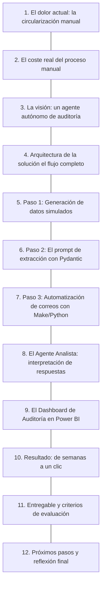
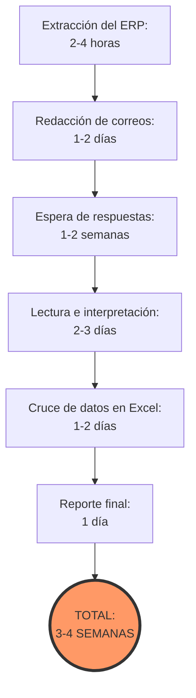
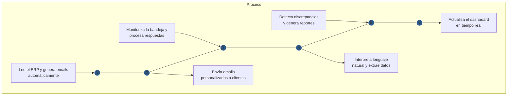
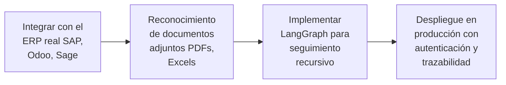

# Documento: MASTERCLASS_EL_CASO_PRÁCTICO.pdf

## Fuente

Parseado con LlamaCloud y almacenado para recuperación RAG.

## Markdown

# MASTERCLASS: EL CASO PRÁCTICO

## Auditoría y Circularización Financiera Automatizada


**Module**: Desarrollo Avanzado de Sistemas Multiagente

**Instructor**: Rubén Juárez Cádiz

---

# ¿Qué aprenderemos hoy?



1. **El dolor actual: la circularización manual**
2. **El coste real del proceso manual**
3. **La visión: un agente autónomo de auditoría**
4. **Arquitectura de la solución (el flujo completo)**
5. **Paso 1: Generación de datos simulados**
6. **Paso 2: El prompt de extracción con Pydantic**
7. **Paso 3: Automatización de correos con Make/Python**
8. **El Agente Analista: interpretación de respuestas**
9. **El Dashboard de Auditoría en Power BI**
10. **Resultado: de semanas a un clic**
11. **Entregable y criterios de evaluación**
12. **Próximos pasos y reflexión final**

Module: Desarrollo Avanzado de Sistemas Multiagente | Instructor: Rubén Juárez Cádiz


---

# La circularización manual consume semanas de trabajo del equipo de auditoría; un proceso crítico para la integridad financiera que la IA puede automatizar completamente

## El Dolor Actual: La Circularización Manual

### ¿Qué es la circularización?

En una auditoría financiera, hay que enviar cartas o emails a los clientes para que confirmen que la deuda que aparece en el ERP del auditado coincide con sus propios libros contables.

### El proceso manual actual



### El problema de los formatos

<table>
    <tr>
        <th></th>
        <th></th>
        <th></th>
    </tr>
<tr>
        <td>Sí, coincide</td>
<td>No, falta una factura</td>
<td>Adjunto Excel</td>
    </tr>
</table>

Las respuestas llegan en formatos completamente distintos. La IA puede interpretar todos estos formatos.

---

# Un agente autónomo de auditoría puede reducir el proceso de circularización de 3-4 semanas a menos de 24 horas

## La Visión: Un Agente Autónomo de Auditoría

### La visión del sistema:



### Las herramientas del stack:

<table>
    <tr>
        <th>Herramienta</th>
        <th>Función</th>
    </tr>
<tr>
        <td> **Python**</td>
<td>Extracción y orquestación</td>
    </tr>
<tr>
        <td> **Pydantic**</td>
<td>Esquema de datos estructurados</td>
    </tr>
<tr>
        <td> **OpenAI API**</td>
<td>Interpretación de lenguaje natural</td>
    </tr>
<tr>
        <td> **Make**</td>
<td>Automatización de emails</td>
    </tr>
<tr>
        <td> **Power BI**</td>
<td>Dashboard en tiempo real.</td>
    </tr>
</table>


---

# La arquitectura del agente de auditoría combina <mark>extracción de datos, orquestación de comunicaciones y análisis de lenguaje natural en un flujo completamente automatizado</mark>

## Arquitectura de la Solución


* **Key Points: El flujo completo:**

    * **[PASO 1: LECTURA DE DATOS]**
      Python lee el ERP Export (CSV/Excel)

    * **[PASO 2: GENERACIÓN DE EMAILS]**
      Make + OpenAI redacta email personalizado

    * **[PASO 3: ENVÍO AUTOMATIZADO]**
      Make envía por Gmail/Outlook

    * **[PASO 4: MONITORIZACIÓN]**
      Make monitoriza la bandeja de entrada

    * **[PASO 5: EL AGENTE ANALISTA]**
      OpenAI + Pydantic extrae datos estructurados (JSON)

    * **[PASO 6: ALMACENAMIENTO]**
      Guardado en Google Sheets / Base de datos

    * **[PASO 7: VISUALIZACIÓN]**
      Power BI actualiza el dashboard en tiempo real

---

# El primer paso es crear el dataset de trabajo: un CSV con los clientes, sus correos y los saldos pendientes que el agente usará para generar los emails

Paso 1: Generación de Datos Simulados

### El CSV maestro (ERP Export)

<table>
  <thead>
    <tr>
        <th>cliente_id</th>
        <th>nombre_empresa</th>
        <th>email_contacto</th>
        <th>saldo_erp</th>
        <th>moneda</th>
    </tr>
  </thead>
  <tbody>
    <tr>
        <td>C001</td>
<td>Empresa Alpha S.L.</td>
<td>alumno1@email.com</td>
<td>12.500,00</td>
<td>EUR</td>
    </tr>
<tr>
        <td>C002</td>
<td>Beta Distribuciones</td>
<td>alumno2@email.com</td>
<td>8.750,00</td>
<td>EUR</td>
    </tr>
<tr>
        <td>C003</td>
<td>Gamma Tech S.A.</td>
<td>alumno3@email.com</td>
<td>23.100,00</td>
<td>EUR</td>
    </tr>
  </tbody>
</table>

### El email de circularización generado por IA

**Asunto:** Confirmación de Saldo Pendiente - Auditoría Financiera 2024

Estimado/a <mark>[Nombre del contacto]</mark>,

En el marco de nuestra auditoría financiera anual, necesitamos confirmar el saldo pendiente de pago a fecha 31/12/2024.

Según nuestros registros, el saldo pendiente de su empresa es de: <mark>12.500,00 EUR</mark>

Por favor, confirme si este importe coincide con sus registros contables. En caso de discrepancia, indique el importe correcto y el motivo.

---

# Pydantic obliga a la IA a devolver siempre la misma estructura de datos, independientemente de cómo esté redactada la respuesta del cliente

## Paso 2: El Prompt de Extracción con Pydantic

### El modelo Pydantic:

```python
class RespuestaCircularizacion(Base Model):
    cliente_id: str
    saldo_confirmado: float
    estado: Literal["conforme", "discrepancia", "sin_respuesta"]
    motivo_discrepancia: str | None = None
    requiere_seguimiento: bool
```

### El prompt de extracción:

Eres un auditor financiero experto. Lee el siguiente email de respuesta de un cliente y extrae los datos estructurados.

Email del cliente: 'Hola, vuestro saldo dice 5.000€ pero yo tengo anotado 4.500€ porque devolvimos material en diciembre que no se ha procesado aún.'

Devuelve los datos en el esquema definido.

### El output estructurado:

```json
{
  "cliente_id": "C004",
  "saldo_confirmado": 4500.00,
  "estado": "discrepancia",
  "motivo_discrepancia": "Devolución de material en diciembre pendiente de procesar",
  "requiere_seguimiento": true
}
```

Module: Desarrollo Avanzado de Sistemas Multiagente
Instructor: Rubén Juárez Cádiz


---

# Make actúa como el sistema nervioso del agente: envía los emails, monitoriza las respuestas y activa el análisis de IA automáticamente

Paso 3: Automatización con Make y Python

## El escenario de Make:

*  **Watch Rows** → Detecta nuevas filas en el CSV

*  **Create Completion** → Genera el email personalizado

*  **Send Email** → Envía el email al cliente

*  **Watch Emails** → Monitoriza la bandeja de entrada

*  **Create Completion** → Analiza la respuesta con Pydantic

*  **Update Row** → Actualiza el estado en el CSV

*  **Send Message** → Notifica discrepancias urgentes

## El código Python alternativo:

```python
import openai
from pydantic import BaseModel

def analizar_respuesta(email_texto: str) -> RespuestaCircularizacion:
    response = openai.beta.chat.completions.parse(
        model="gpt-4o",
        messages=[
            {"role": "system", "content": "Eres un auditor financiero experto."},
            {"role": "user", "content": f"Analiza este email: {email_texto}"}
        ],
        response_format=RespuestaCircularizacion,
    )
    return response.choices[0].message.parsed
```

---

# El dashboard de Power BI convierte los datos estructurados del agente en un cuadro de mando de auditoría en tiempo real

## El Dashboard de Auditoría en Power BI

### Las métricas del dashboard

<table>
  <thead>
    <tr>
        <th>Cliente</th>
        <th>Descripción</th>
    </tr>
  </thead>
  <tbody>
    <tr>
        <td>Empresa Alpha (3.500€)</td>
<td>Devoluciones pendientes de procesar</td>
    </tr>
<tr>
        <td>Cliente Beta (2.100€)</td>
<td>Factura duplicada en sistema</td>
    </tr>
<tr>
        <td>Cliente Gamma (1.200€)</td>
<td>Descuento comercial no aplicado</td>
    </tr>
<tr>
        <td>Otros (1.450€)</td>
<td>Varios motivos menores</td>
    </tr>
  </tbody>
</table>

<!-- Chart type identification: Bar chart showing the number of cases by discrepancy amount ranges.
Structure: X-axis represents amount ranges (Importe), Y-axis represents number of cases (Número de casos).
Value reading strategy: Values are labeled on top of each bar.
Caption: Gráfico de Barras: Discrepancias por importe -->
**Gráfico de Barras: Discrepancias por importe**

<table>
  <tbody>
    <tr>
        <td>Importe</td>
<td>Número de casos</td>
    </tr>
<tr>
        <td>500 - 1.500€</td>
<td>53.000</td>
    </tr>
<tr>
        <td>2.000 - 3.000€</td>
<td>50.590</td>
    </tr>
<tr>
        <td>3.500 - 4.500€</td>
<td>2.100</td>
    </tr>
<tr>
        <td>5.000 - 6.000€</td>
<td>1.300</td>
    </tr>
<tr>
        <td>8.000 - 9.000€</td>
<td>1.200</td>
    </tr>
<tr>
        <td>10.001 - 10.000€</td>
<td>1.405</td>
    </tr>
<tr>
        <td>12.003 - 13.000€</td>
<td>770</td>
    </tr>
<tr>
        <td>&lt;10.000€</td>
<td>2</td>
    </tr>
  </tbody>
</table>

**€8.250**
Monto total en discrepancia (€)

**65%**
% de respuestas recibidas

### El Smart Narrative de Power BI Copilot

A fecha de hoy, el **65%** de los clientes han respondido. El **80%** confirma el saldo. El **20%** presenta discrepancias por un total de **8.250€**. La discrepancia más relevante es **Empresa Alpha (3.500€)** por devoluciones pendientes de procesar.

Se recomienda priorizar el seguimiento con 3 clientes que no han respondido y tienen saldos superiores a 10.000€.

---

# El agente de circularización transforma un proceso que consumía 3-4 semanas de trabajo en un flujo automatizado que se completa en menos de 24 horas

## Resultado: De Semanas a un Clic

### La comparativa definitiva

<table>
  <thead>
    <tr>
        <th>MANUAL</th>
        <th>IA</th>
    </tr>
  </thead>
  <tbody>
    <tr>
        <td>Extracción del ERP: 2-4 horas</td>
<td>2 minutos</td>
    </tr>
<tr>
        <td>Redacción de emails: 1-2 días</td>
<td>5 minutos</td>
    </tr>
<tr>
        <td>Envío de emails: 2-3 horas</td>
<td>Inmediato</td>
    </tr>
<tr>
        <td>Lectura de respuestas: 2-3 días</td>
<td>Inmediato</td>
    </tr>
<tr>
        <td>Extracción de datos: 1-2 días</td>
<td>Segundos</td>
    </tr>
<tr>
        <td>Dashboard de resultados: 1 día</td>
<td>Tiempo real</td>
    </tr>
<tr>
        <td>TOTAL: 3-4 semanas</td>
<td>TOTAL: &lt; 24 horas</td>
    </tr>
  </tbody>
</table>

### El impacto en el negocio

*    **Reducción de costes:** -70% en horas de trabajo manual

*    **Trazabilidad total:** Cada decisión queda registrada

*    **Escalabilidad:** Funciona para 10 o 10.000 clientes

*    **Calidad:** Cero errores de transcripción humana

---

# ENTREGABLE Y CRITERIOS

**Tu misión:** Construir el agente de circularización financiera completo, desde el CSV hasta el dashboard de Power BI.

## CRITERIOS DE EVALUACIÓN

<table>
  <thead>
    <tr>
        <th>Criterio</th>
        <th>Porcentaje</th>
        <th>Progreso</th>
        <th>Total</th>
    </tr>
  </thead>
  <tbody>
    <tr>
        <td>**Dataset (CSV)**<br/>10 clientes con saldos y emails de alumnos</td>
<td>10%</td>
<td></td>
<td>10%</td>
    </tr>
<tr>
        <td>**Modelo Pydantic**<br/>Esquema de datos estructurados correcto</td>
<td>20%</td>
<td></td>
<td>20%</td>
    </tr>
<tr>
        <td>**Prompt de extracción**<br/>Extrae correctamente los 4 campos</td>
<td>25%</td>
<td></td>
<td>25%</td>
    </tr>
<tr>
        <td>**Automatización Make/Python**<br/>Envío y recepción de emails funcional</td>
<td>25%</td>
<td></td>
<td>25%</td>
    </tr>
<tr>
        <td>**Dashboard Power BI**<br/>3 visualizaciones + Smart Narrative</td>
<td>20%</td>
<td></td>
<td>20%</td>
    </tr>
  </tbody>
</table>

## ENTREGABLES REQUERIDOS

*   [x] 1. CSV con los 10 clientes simulados
*   [x] 2. Código Python con el modelo Pydantic y el prompt de extracción
*   [x] 3. Captura del escenario de Make configurado
*   [x] 4. Capturas de los emails enviados y recibidos
*   [x] 5. Captura del dashboard de Power BI con los resultados reales

***

##  EXTENSIÓN SUGERIDA

Añadir un módulo de seguimiento automático: si un cliente no responde en 48 horas, Make envía automáticamente un recordatorio.

---

# PRÓXIMOS PASOS Y REFLEXIÓN FINAL

Este caso práctico demuestra que la IA no reemplaza al auditor: le libera del trabajo mecánico para que se enfoque en el juicio profesional

## LO QUE HEMOS CONSTRUIDO:

- Un agente autónomo de circularización financiera.

- Un pipeline completo: ERP -> IA -> Email -> Análisis -> Dashboard.

- Demostración de que Python + Pydantic + OpenAI + Make + Power BI transforman la auditoría.

## EL SIGUIENTE NIVEL:



> "Este sistema no hace la auditoría. Hace el trabajo mecánico de la auditoría. El auditor sigue siendo el responsable de interpretar los resultados, aplicar el juicio profesional y firmar el informe. La diferencia es que ahora tiene los datos perfectamente organizados en segundos, no en semanas. Eso es lo que significa usar la IA como herramienta, no como sustituto." — Rubén Juárez Cádiz

"

## Texto Plano

CASO PRACTICO
MASTERCLASS: EL CASO

Auditoría y Circularización Financiera Automatizada
y

                    dita lace_neight   'Kyemery';
                     sscoy_sua_spam     TG2R;
                     sccoy_som_stam
                     sscoy_som_oext

                     Edoorcated x= A'ster   Bot "Ey "FumoSoor
                    atteroeccy.axitnt()
                    seto-merp + venute()
                    menults == remoPoint&ArrsateId, module);
                    if (Escolement  'Socletamat'&& Seolvement
                     oberetery     enderters.strap(()
                     oetornetry.sctmrex(;
                    teteerear

optto


Module: Desarrollo Avanzado de Sistemas Multiagente

Instructor: Rubén Juárez Cádiz

---

    Qué aprenderemos hoy?

    1. El dolor actual: la circularización manual
                                                           El coste real del proceso manual
                                                           2.
3. La visión: un agente autónomo de auditoría
                                                           4.Arquitectura de la solución (el flujo completo)
      5.Paso 1: Generación de datos simulados                  atlercoecy.exttnc()
                                                                                               moduIe);
                                                               eanPoint8ArrrateId              mo
                                                           6.Paso 2: El prompt de extracción con Pydantic
   7. Paso 3: Automatización de correos con Make/Python      C
                                                           8." El Agente Analista: interpretación de respuestas
    9. El Dashboard de Auditoría en Power Bl
                                                           10. Resultado: de semanas a un clic
     11. Entregable y criterios de evaluación
                                                           12. Próximos pasos y reflexión final

    Module: Desarrollo Avanzado de Sistemas Multiagente I Instructor: Rubén Juárez Cádíz

---

   La circularización manual consume semanas de trabajo del
   equipo de auditoría; un proceso crítico para la integridad
   financiera que la IA puede automatizar completamente
       El Dolor Actual: La Circularización Manual

 Qué es la circularización?        El proceso manual actual
 En una auditoría
   auditoría financiera, hay que enviar cartas
o emails a los clientes para que confirmen que la
 O a        Extracción                                           Redacción de   Espera de
deuda que aparece en el ERP
       aparece en el ERP del auditado        del ERP: 2-4        correos: 1-2  respuestas:
coincide con sus propios libros        horas                         días      1-2 semanas
       s libros contables.

                                                                     (Esceleme
                                      000
              El problema de los formatos                        Lectura e
                                                                         e
                                                                 interpretación:
                                                                   2-3 días
                                   X                              días
   Sí, coincide  No, falta una     Adjunto Excel
       factura                                                       TOTAL:
       s Ilegan en formatos                  Cruce de datos en   Reporte final:    3-4
       Las respuestas llegan en formatos
      completamente distintos. La IA puede    Excel: 1-2 días    1 día
   interpretar todos estos formatos.                                 SEMANAS

---

Un agente autónomo de auditoría puede reducir el proceso
                                          de circularización de 3-4 semanas a menos de 24 horas
                                                La Visión: Un Agente Autónomo de Auditoría

                                      sistema:
La visión del sistema:
                                              Las herramientas del stack:
 Lee el ERP y genera emails
            automáticamente                                               Python        - Pydantic
                                          Envía emails                 Extracción y     Esquema de datos
                                          personalizados a clientes    orquestación     estructurados

Monitoriza la bandeja y                                      OpenAI API                 Make
         procesa respuestas    C 3                           OpenAl API                 MI Make
                                                                    Interpretación de   Automatización de

                                      4   Interpreta lenguaje        lenguaje natural    emails
                                          natural y extrae datos

      Detecta discrepancias                                      Power BI
          y genera reportes      5                           Dashboard en
                                              tiempo real.
                                          Actualiza el dashboard
                                          en tiempo real

---

La arquitectura del agente de auditoría combina extracción
de datos, orquestación de comunicaciones y análisis de
lenguaje natural en un flujo completamente automatizado
Arquitectura de la Solución

    [PASO 1: LECTURA DE DATOS]                       Key Points: El flujo completo:
    Python lee el ERP Export (CSV/Excel)                                                       [PASO 1: LECTURA DE DATOS]  secoy
                                                                                                                           SCCOV SO
                                                                                 Python lee el ERP Export (CSV/Excel)

                                                 AMo                                           [PASO 2: GENERACIÓN DE EMAILS]
                                                                                               Make + OpenAl redacta email personalizado
           [PASO 2: GENERACIN DE EMAILS] [PASO 3: ENVÍO AUTOMATIZADO]                          [PASO 3: ENVÍO AUTOMATIZADO]
     Make + OpenAl redacta email personalizado   Make envía por Gmail/Outlook                  Make envía por Gmail/Outlook
                                                                                 [PASO 4: MONITORIZACIÓN]
                                                     Make monitoriza la bandeja de entrada

            [PASO 5: EL AGENTE ANALISTA] [PASO 4: MONITORIZACIÓN]                              [PASO 5: EL AGENTE ANALISTA]
OpenAl + Pydantic extrae datos estructurados (JSON)  Make monitoriza la bandeja de entrada     OpenAl + Pydantic extrae datos estructurados (JSON)
                                                                                               [PASO 6: ALMACENAMIENTO]
M                                                                                              Guardado en Google Sheets / Base de datos

              [PASO 6: ALMACENAMIENTO]           [PASO 7: VISUALIZACIÓN]         [PASO 7: VISUALIZACIÓN]
     Guardado en Google Sheets / Base de datos   Power Bl actualiza el dashboard en tiempo real    Power Bl actualiza el dashboard en tiempo real

---

El primer paso es crear el dataset de trabajo: un CsV con los clientes, sus
correos y los saldos pendientes que el agente usará para generar los emails
Paso 1: Generación de Datos Simulados


                                                             El email de circularización generado por IA
     EI CSV maestro (ERP Export)

                                                                    Asunto: Confirmación de Saldo Pendiente - Auditoría Financiera 2024
 cliente_id nombre_empresa  email_contacto    saldo_erp  moneda     Estimado/a [Nombre del contacto]

 C001   Empresa Alpha S.L.  alumno1@email.com 12.500,00  EUR        En el marco de nuestra auditoría financiera anual, necesitamos
                                                                    confirmar el saldo pendiente de pago a fecha 31/12/2024.
 C002  Beta Distribuciones  alumno2@email.com  8.750,00  EUR        Según nuestros registros, el saldo pendiente de su empresa es de:

 C003     Gamma Tech S.A.   alumno3@email.com 23.100,00  EUR        12.500,00 EUR
                                                                    Por favor, confirme si este importe coincide con sus registros
                                                                    contables. En caso de discrepancia, indique el importe correcto y el
                                                                    motivo.

---

    Pydantic obliga a la IA a devolver siempre la misma estructura de datos,
    independientemente de cómo esté redactada la respuesta del cliente

    Paso 2: El Prompt de Extracción con Pydantic

                                                                                                  TOT"

      El modelo Pydantic:                  El prompt de extracción:                           El output estructurado:

     class RespuestaCircularizacion(Base   Eres un auditor financiero experto. Lee el    A                                      FuncSoor
     Model):                               siguiente email de respuesta de un cliente
      cliente_id: str                      y extrae los datos estructurados.        "cliente_id": "C004",
      saldo_confirmado:float                                                                  "saldo_confirmado": 4500.00,      oduie);
      estado:Literal[ conforme             Email del cliente: 'Hola, vuestro saldo dice       "estado": 'discrepancia'          Seolvemen
     "discrepancia" "sin_respuesta'        5.000€ pero yo tengo anotado 4.500€                "motivo_discrepancia": "Devolución
      motivo_discrepancia: str     None    porque devolvimos material en diciembre      de material endiciembre pendiente
     = None                                que no se ha procesado aun.'        de procesar"
      requiere_seguimiento: bool           Devuelve los datos en el esquema definido.         requiere_seguimiento": true


Module: Desarrollo Avanzado de Sistemas Multiagente

           Instructor: Rubén Juárez Cádiz

---

Make actúa como el sistema nervioso del agente: envía los emails,
monitoriza las respuestas y activa el análisis de IA automáticamente
Paso 3: Automatización con Make y Python

El escenario de Make:        El código Python alternativo:

    Watch Rows → Detecta nuevas filas en el CSV           import openai
                                                          from pydantic import BasoModel
6 Create Completion → Genera el email personalizado       defanalizar_respuesta(email_texto: str) -> RespuestaCircularizacion:
                                                          response = openai.beta.chat.completions.parse(
    Send Email → Envía el email al cliente                 model="gpt-4o",
                                                           messages=[
                                                               {"role": "system", "content": "Eres un auditor financiero experto."}
    Watch Emails → Monitoriza la bandeja de entrada        1,  {"role": "user", "content": f"Analiza este email: {email_texto}"}
                                                           response_format=RespuestaCircularizacion,
 6 Create Completion → Analiza la respuesta con Pydantic  return response.choices[0].message.parsed

 M  Update Row → Actualiza el estado en el CSV

 i Send Message → Notifica discrepancias urgentes

---

El dashboard de Power Bl convierte los datos estructurados del
agente en un cuadro de mando de auditoría en tiempo real

                                El Dashboard de Auditoría                                  en PowerBI
                                                                                           aen

                                    Las métricas del dashboard
Gráfico de Anillo: % Conforme vs Discrepancia vs Pendiente                                 Gráfico de Barras: Discrepancias por importe
Pendiente: 15%                                                     Tabla de Detalle                          4.000
                                Conforme: 65%                 Cliente                  Descripción        53.000    50.590
Discrepancia:                   Discrepancia: 20%
          20%                                                  Empresa Alpha (3.500€)  Devoluciones pendientes
                  Conforme:     Pendiente: 15%                                         de procesar          A3.000  2.100
                  65%                                          Cliente Beta (2.100€)   Factura duplicada en  3.000      1.300
                                                                                       sistema               1.000
                                                                                           Sezivemen
€8.250                          65%                           Cliente Gamma (1.200€)   Descuento comercial no        1.200   140S      oduie);
                                                                                       aplicado        eammnd
                                                                                           015E     20. 5     101
                                                                                           220e     sSE
                                                                                                                    s-e
Monto total en discrepancia (€) % de respuestas recibidas      Otros (1.450€)          Varios motivos menores        1220 -0
                                                                                       A                          Importe


    El Smart Narrative de Power BI Copilot
A fecha de hoy, el 65% de los clientes han respondido. El 80% confirma el saldo. El 20% presenta discrepancias por
un total de 8.250€. La discrepancia más relevante es Empresa Alpha (3.500€) por devoluciones pendientes de
procesar.
Se recomienda priorizar el seguimiento con 3 clientes que no han respondido y tienen saldos superiores a 10.000€.

---

El agente de circularización transforma un proceso que consumía 3-4 semanas
de trabajo en un flujo automatizado que se completa en menos de 24 horas
Resultado: De Semanas a un Clic

  La comparativa definitiva                         El impacto
                                                     impacto en el negocio
              MANUAL           IA
                                                    Reducción de costes:
  Extracción del ERP: 2-4 horas     2 minutos       -70% en horas de trabajo manual     Ino6oor

  Redacción de emails: 1-2 días     5 minutos       Trazabilidad total:        le);

  Envío de emails: 2-3 horas        Inmediato       Cada decisión queda registrada

 Lectura de respuestas: 2-3 días    Inmediato        Escalabilidad:
                                                    Funciona para 10 o 10.000 clientes
  Extracción de datos: 1-2 días      Segundos
                                                     Calidad:
 Dashboard de resultados: 1 día     Tiempo real     Cero errores de transcripción humana

 TOTAL: 3-4 semanas    TOTAL: < 24 horas

---

    ENTREGABLE Y
    Y CRITERIOS
    I

    agente
    Tu misión: Construir el agente de circularización financiera completo,
                                                   Power BI.
                desde el CSV hasta el dashboard de Power Bl.

CRITERIOS DE EVALUACIÓN        ENTREGABLES REQUERIDOS
Dataset (CSV)        10% OI     10%                1. CSV con los 10 clientes simulados
                                                   1.                         TEEP;
10 clientes con saldos y emails de alumnos         2. Código Python con el modelo Pydantic y el  FudeGoor
                                                                          Beternerp=requte()
Modelo Pydantic                       20%  20%     prompt de extracción   renults
                                                                          == PenpPoint&ArrrateI  module);
                                                                                     Souietamat  && Seoivemen
Esquema de datos estructurados correcto            3. Captura del escenario de Make configurado O
                                                   4. Capturas de los emails enviados y recibidos
Prompt de extracción                  25%  25%    4.
Extrae correctamente los 4 campos                 5. Captura del dashboard de Power BI con los
                                    n 25%
Automatización Make/Python            25%  25%     resultados reales
Envío y recepción de emails funcional              EXTENSION SUGERIDA
Dashboard Power BI                    20%  20%     Añadir un módulo de seguimiento automático: si
3 visualizaciones + Smart Narrative                un cliente no responde en 48 horas, Make envía
                                                   automáticamente un recordatorio.

---

                       PASOSY REFLEXIÓN FINAL
     PROXIMOS PASOS Y REFLEXION
                                          Este caso práctico demuestra que la IA no reemplaza al auditor: le libera del trabajo
                                                          mecánico para que se enfoque en el juicio profesional

LO QUE HEMOS CONSTRUIDO:
 - Un agente autónomo de circularización financiera.
 - Un pipeline completo: ERP -> IA -> Email -> Análisis -> Dashboard.
                       ->                                                                            6ZP
- Demostración de que Python + Pydantic + OpenAl + Make + Power BI transforman la auditoría.         TEEP;
                                                                                                     00an

                                                                                atterseecy.mxtint()
 EL SIGUIENTE NIVEL:                                                            eete-cerp = veduls()
                                                                                renuits

Integrar con el        ImplementarC110                    CC Este sistema no hace la auditoría. Hace
ERP real (SAP,         LangGraph para                          el trabajo mecánico de la auditoría. El
 Odoo, Sage)        seguimiento                           AI   auditor sigue siendo el responsable de
                     recursivo                                 interpretar los resultados, aplicar el
                                                                   y
 Ho                I    0-A0              > till               juicio profesional y firmar el informe. La
                                                               diferencia es que ahora tiene los datos
                   Reconocimiento         Despliegue en        datos perfectamente organizados en
                   de documentos     >    producción con       segundos, no en semanas. Eso es lo que
                   adjuntos (PDFs,        autenticación y
                       Excels)            trazabilidad y       significa usar la IA como herramienta, no
                                                               como sustituto.' Rubén Juárez Cádiz       ",