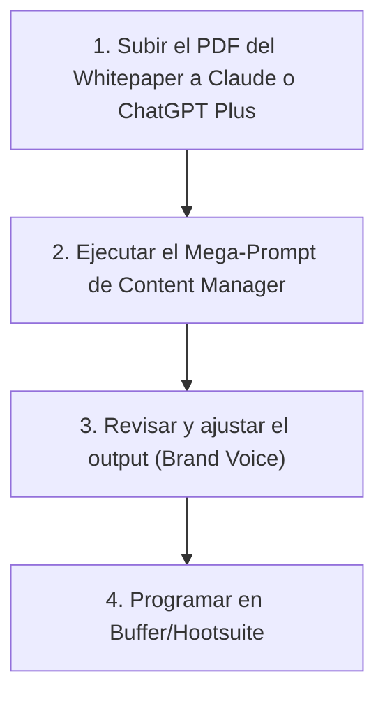
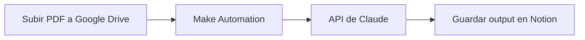

# Documento: PROMPT_ENGINEERING_AVANZADO.pdf

## Fuente

Parseado con LlamaCloud y almacenado para recuperación RAG.

## Markdown

stt steeat generation

# PROMPT ENGINEERING AVANZADO

## El lenguaje de programación del nuevo Marketer


**Module**: Desarrollo Avanzado de Sistemas Multiagente

**Instructor**: Rubén Juárez Cádiz

---


stt steest generation

# ¿Qué aprenderemos hoy?

1. El fin del contenido genérico

2. IA como Director de Estrategia

3. Sistematización: el prompt como plantilla

4. Framework RTF/CREATE

5. Few-Shot Prompting: mostrar, no decir

6. Chain of Thought: obligar a razonar

7. Brand Voice: mantener la identidad

8. Caso práctico: Reciclaje de Contenido

9. El Mega-Prompt de Repurposing

10. Resultados: campaña en 5 minutos

11. Entregable y criterios de evaluación

12. Próximos pasos y recursos

---


stt steeat generation

# Los LLMs sin guía producen contenido predecible y robótico que daña la marca; el prompting avanzado es la diferencia entre un asistente y un Director de Estrategia

## El Fin del Contenido Genérico

### El problema del prompt básico

* "Escribe un post de LinkedIn sobre nuestra empresa"
-> Resultado: tono corporativo, clichés, sin personalidad.

* "Genera ideas de contenido para redes sociales"
-> Resultado: listas genéricas que cualquier competidor podría usar.

* El daño real: el contenido genérico erosiona la confianza y diferenciación de marca.

### La IA mal usada vs. bien usada

<!-- 1. Chart type identification: Comparison table/matrix with arrows showing transition.
2. Structure: Two main columns (IA mal usada, IA bien usada) with 5 rows of comparative attributes.
3. Value reading strategy: Direct transcription of text labels in each cell.
4. Does the chart have a label / caption? Yes, "La IA mal usada vs. bien usada" is the header. -->

<table>
  <thead>
    <tr>
        <th>IA mal usada [ ]</th>
        <th>IA bien usada [x]</th>
    </tr>
  </thead>
  <tbody>
    <tr>
        <td>Mecanógrafo rápido</td>
<td>Director de Estrategia</td>
    </tr>
<tr>
        <td>Escribe más rápido</td>
<td>Piensa más profundo</td>
    </tr>
<tr>
        <td>Contenido genérico</td>
<td>Contenido de marca</td>
    </tr>
<tr>
        <td>Prompt de 10 palabras</td>
<td>Plantilla de software</td>
    </tr>
<tr>
        <td>Resultado de usar una vez</td>
<td>Sistema escalable</td>
    </tr>
  </tbody>
</table>

### La mentalidad correcta

> La IA no está solo para escribir más rápido, sino para pensar más profundo.
> El marketer del futuro no escribe contenido; diseña sistemas de producción de contenido.


---


att steest generation

# El framework RTF convierte un prompt vago en una instrucción de software precisa y repetible

Framework RTF/CREATE


## Por qué funciona el RTF

*   **- Rol:** Activa el 'modo experto' del LLM.

*   **- Tarea:** Elimina la ambigüedad.

*   **- Formato:** Garantiza que el output sea directamente utilizable.

Module: Desarrollo Avanzado de Sistemas Multiagente | Instructor: Rubén Juárez Cádiz


---


att steeat generation

# El Few-Shot Prompting es la técnica más poderosa para transferir el tono de voz de una marca a la IA sin necesidad de fine-tuning
## Few-Shot Prompting: Mostrar, no decir

### ¿Qué es el Few-Shot Prompting?

En lugar de describir cómo debe ser el tono de voz, se le muestran ejemplos reales al LLM. La IA infiere el patrón y lo replica.

**Qué aprende la IA de los ejemplos:**

*  Longitud y ritmo de los párrafos
*  Uso de preguntas retóricas o datos impactantes como hooks
*  Nivel de formalidad y vocabulario específico del sector
*  Estructura del CTA (llamada a la acción)

### Estructura del Few-Shot Prompt:


```text
Aquí tienes 3 posts de LinkedIn de nuestra empresa que generaron más de 500 interacciones:

--- EJEMPLO 1 ---
[Pegar el post completo]

--- EJEMPLO 2 ---
[Pegar el post completo]

--- EJEMPLO 3 ---
[Pegar el post completo]

Analiza la estructura, el tono, el uso de emojis, la longitud de los párrafos y el tipo de hook de apertura. Ahora escribe un nuevo post sobre [TEMA] siguiendo exactamente ese mismo patrón.
```


---


stt steeet generation
{
streesis, 'P(@evalerenenitsaton");

# El **Chain of Thought** obliga a la IA a razonar antes de producir, eliminando las alucinaciones y mejorando la calidad estratégica del output

## Chain of Thought

### ¿Qué es el Chain of Thought (CoT)?

Una técnica que instruye al LLM para que muestre su **proceso de razonamiento paso a paso** antes de dar la respuesta final. Esto reduce **errores** y produce outputs más **estratégicos**.

### Sin CoT vs. Con CoT:

<table>
  <thead>
    <tr>
        <th>Sin CoT</th>
        <th>Con CoT</th>
    </tr>
  </thead>
  <tbody>
    <tr>
        <td></td>
<td></td>
    </tr>
<tr>
        <td>Dame 5 ideas de contenido para LinkedIn</td>
<td>Antes de darme las ideas, analiza:<br/>1) Los 3 principales pain points...<br/>Luego, dame 5 ideas.</td>
    </tr>
<tr>
        <td>Resultado:<br/>Ideas genéricas</td>
<td>Resultado:<br/>Ideas basadas en insight real</td>
    </tr>
  </tbody>
</table>

### El prompt CoT para marketing:

> Antes de escribir el copy del anuncio, necesito que:
>
> 1. Identifiques los 3 principales <span style="color: #ff6b6b">miedos</span> (fears) de **nuestro cliente ideal**.
> 2. Identifiques los 3 principales <span style="color: #51cf66">deseos</span> (desires).
> 3. Elijas el <span style="color: #20c997">ángulo emocional</span> más potente.
>
> **SOLO** después de completar ese análisis, escribe <span style="color: #20c997">3 variantes</span> del headline del anuncio.


---


stt steest generation

# La **Brand Voice** es el activo más frágil de una marca; el **prompting** avanzado es la única forma de preservarla al escalar la producción con IA

Brand Voice con IA

## El problema del Brand Voice con IA


Sin instrucciones específicas, la IA tiende a escribir con un tono "neutro corporativo" que borra la personalidad de la marca. A escala, esto homogeniza el contenido y destruye la diferenciación.

## El truco del "Revisor de Marca"


Después de generar el contenido, añadir un segundo prompt:

> "Ahora actúa como nuestro Director Creativo. Revisa el texto anterior y elimina cualquier palabra o frase que suene a 'contenido de IA genérico'. Devuelve la versión mejorada."


### El Documento de Brand Voice como contexto

**La solución: INSTRUCCIONES DE MARCA (incluir en TODOS los prompts):**

- **Empresa:** [Nombre]

- **Tono:** Directo, irreverente, sin jerga corporativa. Hablamos de tú, nunca de usted.

- **Evitar siempre:** "Solución integral", "Ecosistema", "Sinergia", "Potenciar", "Innovador", "Disruptivo".

- **Usar siempre:** Datos concretos, ejemplos reales, humor sutil.

- **Longitud de frases:** Cortas. Máximo 20 palabras por frase.

- **Estructura:** Hook impactante -> Problema -> Solución -> CTA.


---


stt steeat generation

# Un solo Whitepaper de 20 páginas puede generar un mes de contenido multicanal en 5 minutos con el Mega-Prompt correcto

## Caso Práctico: Content Repurposing

**El reto:**

Maximizar el ROI de un contenido pilar (un Webinar o un Whitepaper de 20 páginas) transformándolo en una campaña multicanal de un mes de duración.

**El problema del Content Repurposing manual:**

<table>
  <thead>
    <tr>
        <th>Content Type</th>
        <th>Manual (Tiempo Estimado)</th>
        <th colspan="2">IA (Tiempo Estimado)</th>
    </tr>
  </thead>
  <tbody>
    <tr>
        <td> 5 hilos de Twitter/X</td>
<td>5 horas ❌</td>
<td>3 minutos ✅</td>
<td></td>
    </tr>
<tr>
        <td> 3 posts de LinkedIn</td>
<td>3 horas ❌</td>
<td>2 minutos ✅</td>
<td></td>
    </tr>
<tr>
        <td> 1 guion de Reel</td>
<td>2 horas ❌</td>
<td>1 minuto ✅</td>
<td></td>
    </tr>
<tr>
        <td> 1 newsletter resumen</td>
<td>2 horas ❌</td>
<td>1 minuto ✅</td>
<td></td>
    </tr>
<tr>
        <td colspan="2">TOTAL:</td>
<td>12 horas ⚠️</td>
<td>7 minutos ✅</td>
    </tr>
  </tbody>
</table>

**El flujo de trabajo:**



Module: Desarrollo Avanzado de Sistemas Multiagente

Instructor: Rubén Juárez Cádiz


---


stt steest generation

# El Mega-Prompt es la plantilla de software que convierte un activo de contenido en una campaña multicanal completa

## El Mega-Prompt de Content Repurposing

### [ROL] & [TAREA]

- **ROL**: Content Manager Senior B2B
- **TAREA**: Transformar Whitepaper en Campaña Multicanal

### [ROL]

Actúa como un Content Manager Senior especializado en marketing B2B para empresas tecnológicas. Tienes acceso al documento adjunto (nuestro Whitepaper).

### [TAREA]

Transforma el contenido de este Whitepaper en una campaña de contenido multicanal para el próximo mes.

[PRODUCE LO SIGUIENTE]

### [PRODUCE LO SIGUIENTE]

1. **TWITTER/X (5 hilos)**
   - Cada hilo: 5 tweets, dato impactante de inicio. Numerados (1/5).

2. **LINKEDIN (3 posts largos)**
   - 300-400 palabras. Hook provocador. Estructura: Problema -> Insight -> Solución -> CTA.

3. **INSTAGRAM/TIKTOK (1 guion de Reel)**
   - 60 seg. Formato: [ESCENA 1 - 0:00-0:10] Texto + Voz.

4. **NEWSLETTER (1 resumen)**
   - 3 subject lines. 400 palabras, tono conversacional.

### [FORMATO FINAL]

- Organiza en secciones con encabezados. Incluye hashtag recomendado.


---


att steest generation
-houseland:("rest/name")

# El Content Repurposing con IA no solo ahorra tiempo: multiplica el alcance de cada activo de contenido y mejora la coherencia de la campaña

## Resultados y Análisis

### Lo que produce el Mega-Prompt:

<table>
  <tbody>
    <tr>
        <td>Twitter/X: 5 hilos (25 tweets)</td>
<td>1 Writer<br/>-&gt; Alcance orgánico + viral</td>
    </tr>
<tr>
        <td>LinkedIn: 3 posts largos</td>
<td>-&gt; Audiencia B2B profesional</td>
    </tr>
<tr>
        <td>Instagram/TikTok: 1 guion de Reel</td>
<td>1 guion de Reel<br/>-&gt; Audiencia joven y visual</td>
    </tr>
<tr>
        <td>Newsletter: 1 email completo</td>
<td>1 email completo<br/>-&gt; Base de datos propia</td>
    </tr>
  </tbody>
</table>

**Total: 30+ piezas en 4 canales simultáneos**

### El ROI del contenido pilar:

<table>
  <thead>
    <tr>
        <th>Sin IA,</th>
        <th>Con IA,</th>
    </tr>
  </thead>
  <tbody>
    <tr>
        <td></td>
<td></td>
    </tr>
<tr>
        <td>1 Whitepaper</td>
<td>1 Whitepaper</td>
    </tr>
<tr>
        <td>-&gt; 1 PDF descargable</td>
<td>-&gt; 30+ piezas</td>
    </tr>
<tr>
        <td>-&gt; Alcance limitado</td>
<td>-&gt; 4 canales</td>
    </tr>
<tr>
        <td> </td>
<td>-&gt; 1 mes de presencia</td>
    </tr>
  </tbody>
</table>

> **La clave del éxito:** El output de la IA es el 80% del trabajo. El 20% restante es la revisión humana para asegurar el Brand Voice y añadir los matices que solo el equipo conoce. La IA no reemplaza al marketer; lo convierte en un director de orquesta.

59


---


stt steest generation

# ENTREGABLE Y CRITERIOS

**Tu misión:** Aplicar el Mega-Prompt de Content Repurposing a un activo real de tu empresa o sector y presentar el resultado.

## Evaluation Criteria

<table>
  <thead>
    <tr>
        <th>Criteria</th>
        <th>Description</th>
        <th>Weight</th>
    </tr>
  </thead>
  <tbody>
    <tr>
        <td>Framework RTF (20%)</td>
<td>Prompt estructurado con Rol, Tarea y Formato</td>
<td>20%</td>
    </tr>
<tr>
        <td>Few-Shot (20%)</td>
<td>Al menos 2 ejemplos de Brand Voice incluidos</td>
<td>20%</td>
    </tr>
<tr>
        <td>Chain of Thought (20%)</td>
<td>Análisis previo antes del output final</td>
<td>20%</td>
    </tr>
<tr>
        <td>Mega-Prompt (25%)</td>
<td>Campaña multicanal completa generada</td>
<td>25%</td>
    </tr>
<tr>
        <td>Revisión de Marca (15%)</td>
<td>Output revisado y ajustado al Brand Voice</td>
<td>15%</td>
    </tr>
  </tbody>
</table>

## Required Deliverables

*   [x] **1. El prompt completo utilizado** (documentado en un archivo .txt o .md)

*   [x] **2. El output completo generado por la IA** (sin editar)

*   [x] **3. La versión final revisada y ajustada al Brand Voice**

*   [x] **4. Un párrafo de reflexión:** ¿Qué cambiarías del prompt para mejorar el resultado?

## Extensión sugerida: Automatizar con Make




---


stt steeat generation

# Próximos Pasos y Recursos

El *Prompt Engineering* es la base. El siguiente paso es automatizar estos prompts dentro de agentes de IA que los ejecuten sin intervención humana.


**PROMPTING + LANGCHAIN**
Convertir los prompts en cadenas automatizadas con memoria y herramientas

**PROMPTING + CREWAI**
Asignar los prompts a agentes especializados (Investigador, Redactor, Auditor)

**PROMPTING + MAKE**
Disparar los Mega-Prompts automáticamente desde eventos (nuevo PDF, nuevo formulario)

> El marketer que sabe programar *prompts* tiene la ventaja competitiva del desarrollador de los años 90: puede construir en horas lo que otros tardan semanas. Y a diferencia del código, los *prompts* no requieren compilar.
>
> > — Rubén Juárez Cádiz

### RECURSOS RECOMENDADOS

*  Guía oficial de OpenAI: platform.openai.com/docs/guides/prompt-engineering

*  Anthropic Prompt Library: docs.anthropic.com/en/prompt-library

*  Repositorio del módulo en el aula virtual

## Texto Plano

stt steeat generation


PROMPT ENGINEERING AVANZADO
El lenguaje de programación del nuevo Marketer


A


otor

Module: Desarrollo Avanzado de Sistemas Multiagente

Instructor: Rubén Juárez Cádiz

---

                                              sct steest generation

    Qué aprenderemos hoy?

1. El fin del contenido genérico              7. Brand Voice: mantener la identidad

2. IA como Director de Estrategia             8. Caso práctico: Reciclaje de Contenido

3. Sistematización: el prompt como plantilla  9. El Mega-Prompt de Repurposing
                                              9

4. Framework RTF/CREATE
4.                                           10. Resultados: campaña en 5 minutos

5. Few-Shot Prompting: mostrar, no decir     11. Entregable y criterios de evaluación  ton
                                                  rua

6. Chain of Thought: obligar a razonar
6.                                           12. Próximos pasos y recursos

---

                     stt steeat generation

                                      singuía        y
     Los LLMs sin guía producen contenido predecible y robótico
     quedaña la marca; el prompting avanzado es la diferencia
         entre un asistente y un Director de Estrategia
                     y
                    El Fin del Contenido Genérico
     El problema del promptbásico        La IA mal usada vs. bien usada
         post de        IA mal usada                                                        IA bien usada
                 "Escribe un post de Linkedln sobre nuestra empresa
                                   clichés,sin personalidad.  Mecanógrafo rápido           DirectordeEstrategia
     Resultado: tono corporativo, clichés, sin personalidad.

     "Genera ideas de contenido para redes sociales'          Escribe más rapido            Piensa más profundo
     Resultado: listas genéricas que cualquier competidor     Contenido genérico              Contenidode marca
     podría
     podría usar.

     El daño real: el contenido genérico erosiona la        Prompt de 10 palabras         Plantilla de software
     confianza y diferenciación de marca.        Resultado de usar una vez                  Sistema escalable   ten
                                                                                                                reat

                     La mentalidad correcta                                                                     on
                 La IA no está solo para escribir más rápido,
C                La lA no está solo para escribir más rápido, sino para pensar más profundo.
         El marketer del futuro no escribe contenido; diseña sistemas de producción de contenido.
C

---

                                               att steest generation

EI framework RTF convierte unpromptvagoen
una instrucción de softwareprecisay repetible
                                               y
Framework RTF/CREATE

O  [ROL]                                                                  quéfunciona el RTF
   "Actúa
    "Actúa como un CMO experto en SaaS     Por qué
    B2B con 15 años de experiencia..."                                                el RTF
                                           - Rol: Activa el 'modo experto'
    [TAREA]                                del LLM.
   "Redacta una secuencia de 3 emails de
        3
   nurturing para leads..."                - Tarea: Elimina la ambigüedad.

                                                                                             nton
    [FORMATO]                              - Formato: Garantiza que el                       reat
    "Devuélvelo en una tabla con 4         output sea directamente utilizable.
        4
        #     Cuerpo,
    columnas: Email #, Asunto, Cuerpo, CTA"

        Module: Desarrollo Avanzado de Sistemas Multiagente | Instructor: Rubén Juárez Cádiz

---

                                                     att steeat generation

 El Few-Shot Prompting es la técnica más poderosa para transferir
 el tono de voz de una marca a la lA sin necesidad de fine-tuning
         a la IA sin necesidad de fine-tuning
 Few    t Prompting:
 Few-Shot Prompting: Mostrar, no decir

iQué
 Qué es el Few-Shot Prompting?        Estructura del Few-Shot Prompt:
En lugar
     de cómo
 En lugar de describir cómo debe ser el tono de
 voz, se le muestran ejemplos reales al LLM. La
 IA infiere el patrón y lo replica.             Aquí tienes 3 posts de LinkedIn de nuestra empresa que
                                                generaron más de 500 interacciones:
 Qué aprende la IA de los ejemplos:              EJEMPLO 1 --
                                                [Pegar el post completo]
     Longitud y ritmo de los párrafos            EJEMPLO 2 ---

     Uso de preguntas retóricas o datos         [Pegar el post completo]
     impactantes como hooks                      EJEMPLO 3 ---                                                 aton
                                                [Pegar el post completo]                                       reat
                                                                                                       okrreiso
     Nivel de formalidad y vocabulario          Analiza la estructura, el tono, el uso de emojis, la   on trsas
     específico del sector                      longitud de los párrafos y el tipo de hook de apertura.
                                                Ahora escribe un nuevo post sobre [TEMA] siguiendo
     Estructura del CTA (llamada a la acción)   exactamente ese mismo patrón.

---

                                                                             stt steeet generation
                                                                             streesis, 'P(@evalerenenitsaton");
 El Chain of Thought obliga a la IA a razonar antes de producir, eliminando
 las alucinaciones y mejorando la calidad estratégica del output
Chain of Thought

 Qué es el Chain of Thought (CoT)?        El prompt CoT para marketing:
 Una técnica que instruye al LLM para que muestre su proceso
 de razonamiento paso a paso antes de dar la respuesta final.
     a
Esto reduce errores y produce outputs más estratégicos.                      del
     V                                                            Antes de escribir el copy del anuncio,
                                                                          que:
 Sin CoT vs. Con CoT:                                             necesito que:
                                                                   1.        3
    Sin CoT                  Con CoT                               1. Identifiques los 3 principales miedos
                                                                         (fears)
                                                                         (fears) de nuestro cliente ideal.
                                                                  2. Identifiques los 3 principales deseos
                                                                   2.
                                                                         (desires).
                                                                  3. Elijas     ángulo emocional más potente.
 Dame 5 ideas de contenido   Antes de darme las ideas, analiza:    3.    Elijas elangulo                       "aton
       para LinkedIn         1) Los 3 principales pain points..   SOL0 después de completar ese análisis,      Creat
                             Luego, dame 5 ideas.                 escribe 3 variantes del headline del
                                                                  anuncio.
 Resultado:                  Resultado:
 Ideas genéricas             Ideas basadas en insight real

---

                                                           stt steest generation

La Brand Voice es el activo más frágil de una marca; el prompting
avanzado es la única forma de preservarla al escalar la producción con IA
Brand Voice con IA

     El problema del Brand Voice con IA        El Documento de Brand Voice como contexto

10   Sin instrucciones específicas, la IA tiende a    La Solución: INSTRUCCIONES DE MARCA
     escribir con un tono "neutro corporativo" que    (incluir en TODOS los prompts):
         Ioorra la
     borra la personalidad de la loorra la
     personalidad de la marca. A escala, esto
         A                                             Empresa: [Nombre]
     homogeniza el contenido y destruye la             Tono: Directo, irreverente, sin jerga
     diferenciación.                                   corporativa. Hablamos de tú, nunca de
                                                       usted.                                AI
                                                       Evitar siempre: "Solución integral",
     El truco del "Revisor de Marca"                   "Ecosistema", "Sinergia", "Potenciar",
                                                       "Innovador", "Disruptivo"        AI
     Después de generar el contenido, añadir          Usar siempre: Datos concretos, ejemplos
     un segundo prompt:                               reales, humor sutil.                        ten
     "Ahora actúa como nuestro Director               Longitud de frases: Cortas. Máximo 20  AI   freat
     Creativo. Revisa el texto anterior y elimina      palabras por frase.
         O                                             Estructura: Hook impactante -> Problema
     cualquier palabra o frase que suene a                      B
     'contenido de IA genérico'. Devuelve la           Solución -> CTA.
     versión mejorada."

---

                                                    stt steeat generation

                               20paginaspuedegenerar
 Un solo Whitepaper de 20 páginas puede generar un mes de
contenido                      5
        multicanal en 5 minutos con el Mega-Prompt correcto
                                                         Caso Práctico: Content Repurposing
El reto:                                            El flujo de trabajo:
 Maximizar el ROl de un contenido pilar (un Webinar o un
 Whitepaper de 20 páginas) transformándolo en una campaña    L
 multicanal de un mes de duración.
                                                              1. Subir el PDF del     2. Ejecutar el
 El problema del Content Repurposing manual                   Whitepaper a Claude
                                                    a                                 Mega-Prompt de
                                                                 o ChatGPT Plus      Content Manager
   Content Type     Manual
        (Tiempo Estimado)      IA (Tiempo Estimado)

  5 hilos de Twitter/X     5 horas             3
                                               3 minutos

  3 posts de Linkedln     3 horas              2
                           3                   2 minutos

   1 guion de Reel        2 horas
                           2                    1 minuto    3. Revisar y ajustar el  4. Programar en    aton

   1 newsletter resumen   2 horas                   output (Brand Voice)             Buffer/Hootsuite   treat
                           2                    1 minuto
                                                                                                        on
                               7
       TOTAL:     12 horas     7 minutos

                                                Module: Desarrollo Avanzado de Sistemas Multiagente
                                                           Instructor: Rubén Juárez Cádiz

---

stt steest generation


                                     El Mega-Prompt es la plantilla de software que convierte un
                                         campana     que
activo de contenido en una campaña multicanal completa

                                                El Mega-Prompt de Content Repurposing

                                                                                 [PRODUCE LO SIGUIENTE]
                                                                                 1.TWITTER/X (5 hilos)
                                     [ROL]        f                                 Cada hilo: 5 tweets, dato impactante de
                                     Actúa como un Content Manager Senior          inicio. Numerados (1/5).
[ROL] &                                  LINKEDIN (3 posts largos)i
TAREA]                               especializado en marketing B2B para        2.  300-400 palabras. Hook provocador.
[ROL] & [TAREA]
- ROL: Content Manager Senior B2B    empresas tecnológicas. Tienes acceso al        Estructura: Problema -> Insight ->
- TAREA: Transformar Whitepaper en   documento adjunto (nuestro Whitepaper).        Solución -> CTA.
Campaña Multicanal                   [TAREA]                                    3.INSTAGRAM/TIKTOK (1 guion de Reel)
                                     Transforma el contenido de este               - 60 seg. Formato: [ESCENA 1 - 0:00-0:10]
                                     Whitepaper en una campaña de contenido      4. Texto + Voz.
                                     multicanal para el próximo mes.               NEWSLETTER (1 resumen)
                                                                                   - 3 subject lines. 400 palabras, tono    aten
                                     [PRODUCE LO SIGUIENTE]                         conversacional.                         froat

                                                                                [FORMATO FINAL]
                                                                                  Organiza en secciones con encabezados.
                                                                                  Incluye hashtag recomendado.

---

                                                      att steest generation
                                                      -houseland:("rest/name")
El Content Repurposing con IA no solo ahorra tiempo: multiplica el
alcance de cada activo de contenido y mejora la coherencia de la campaña
Resultados y Análisis

Lo que produce el Mega-Prompt:                                 El ROI del contenido pilar:

    Twitter/X:           1 Witer                      Sin IA,                Con IA,
                          1
    5 hilos (25 tweets)   ->Alcance orgánico + viral

in  LinkedIn:              Audiencia B2B
    3 posts largos       profesional                  1 Whitepaper            1 Whitepaper

    Instagram/TikTok:     1 guion de Reel             -> 1 PDF descargable   -> 30+ piezas
    1 guion de Reel      -> Audiencia joven y visual  -> Alcance limitado    -> 4 canales
                                                                             -> 1 mes de presencia
                                                                                 araston
    Newsletter:           1 email completo      G6
    1 email completo     -> Base de datos propia      La clave del éxito: El output de la IA es el 80% del trabajo. El
                                                      20% restante es la revisión humana para asegurar el Brand
Total: 30+ piezas en 4 canales simultáneos            Voice y añadir los matices que solo el equipo conoce. La lA no
                                                      reemplaza al marketer; lo convierte en un director de orquesta.
                                                                                 59

---

                                                        stt steest generation

    ENTREGABLE Y CRITERIOS
    Y
Tu misión: Aplicar el Mega-Prompt de Content Repurposing a un activo real de tu
                                                          a
                 empresa o sector y presentar el resultado.
Evaluation Criteria                               Required Deliverables
Framework RTF(20%):Prompt estructurado              1. El prompt completo utilizado (documentado en
con Rol, Tarea
y Formato                                  20%      un archivo .txt o .md)

Few-Shot (20%): Al menos 2 ejemplos de             2. El output completo generado por la IA (sin
Brand Voice incluidos                               editar)
                                           20%      3. La versión final revisada y ajustada al Brand
Chain of Thought (20%): Análisis previo            Voice
antes del output final                             4. Un párrafo de reflexión: iQué cambiarías del
                                           20%      prompt para mejorar el resultado?
Mega-Prompt (25%): Campaña multicanal                                                               nten
completa generada                          25%    Extensión sugerida: Automatizar con Make          troat

Revisión de Marca (15%): Output revisado y          Subir PDF                 Guardar
ajustado al Brand Voice                              a Google  Make       API de    Notion
                                           15%        Drive Automation    Claude  output en

---

stt steeat generation


PróximosPasos yRecursos

Prompt        es la
El Prompt Engineering es la base. El siguiente paso es automatizar estos prompts dentro de
     de IA
agentes de IA que los ejecuten sin intervención humana.

ER     >>>                                                                    El marketer que sabe

PROMPTING     6                           8                                 programar prompts tiene

                                          8                                la ventaja competitiva del
                                              desarrollador de los años
  PROMPTING + LANGCHAIN      PROMPTING + CREWAI          PROMPTING + MAKE     90: puedeconstruir
 Convertir los prompts en  Asignar los prompts a        Disparar los Mega-        en
  cadenas automatizadas    agentes especializados    Prompts automáticamente  horaslo que
      con memoria y       (Investigador, Redactor,  desde eventos (nuevo PDF,    que otrostardan
       herramientas               Auditor)              nuevo formulario)     semanas. Y a diferencia     ton
                                              , los prompts
RECURSOS RECOMENDADOS                         del código, los                                        no   reat
                                                                                                   s no
 Guía oficial de OpenAl: platform.openai.com/docs/guides/prompt-engineeriang  requieren compilar.
 Anthropic Prompt Library: docs.anthropic.com/en/prompt-library        — Rubén Juárez Cádiz
                                                                                            JuárezCádiz
 Repositorio del módulo en el aula virtual